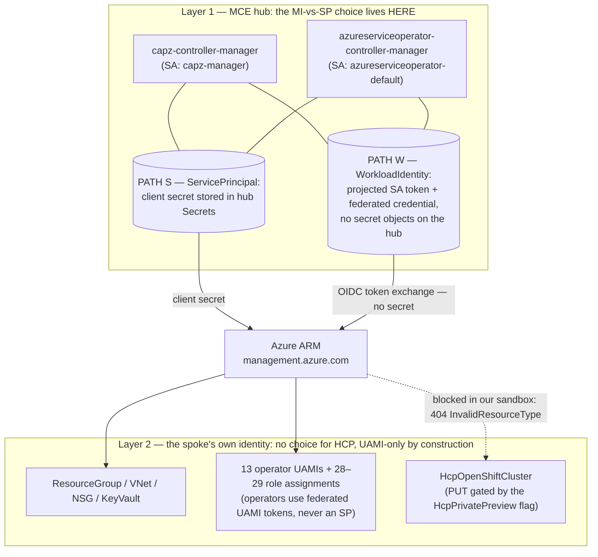

# Identity models explained: service principals, managed identities, and workload identity

**What this covers / what you need before starting.** This is the concepts doc — zero commands. It explains the three Azure identity ideas this whole repo turns on (service principals, user-assigned managed identities, and workload-identity federation) in OpenShift terms, then lays out the two-layer picture that makes the rest of the docs make sense: who authenticates to *create* a cluster versus who the *cluster's own operators* authenticate as afterward. You need nothing installed to read this. If you already know Entra ID cold, skim the two-layer section and the comparison table and move on to the runbooks; everything here was proven live on 2026-08-18 in a disposable Azure sandbox, and the observed evidence is quoted inline and linked from [`../evidence/`](../evidence/). The full command-by-command record lives in [the master plan-and-results doc](../reference/full-plan-and-results.md).

## Caveats first

- **The MI-vs-SP choice for classic ARO is made once, at create time, and cannot be changed.** There is no migration in either direction. A cluster created with a service principal stays a service-principal cluster until you rebuild it. This is the single most important operational fact in this repo.
- **Managed identities for classic ARO went GA on 2026-02-02.** The CLI floor is azure-cli 2.84.0. Anything older doesn't have the flags.
- **ARO-HCP (the hosted-control-plane flavor) is a gated private preview.** Its API offers no service-principal option at all — and in our sandbox the final cluster create was rejected by ARM because the preview feature flag wasn't approved. That boundary is documented honestly in the Track 2 docs; nothing here pretends otherwise.
- One known MI limitation we confirmed live: the default **Azure File StorageClass is absent** on a managed-identity cluster (the Files CSI driver wants storage-account shared keys). If you depend on RWX Azure File volumes out of the box, plan for it.

## A service principal is a bot account with a password

If you've never touched Entra ID (the thing formerly called Azure Active Directory — Azure's tenant-wide user directory), here's the mapping to what you know: an Entra **tenant** is like your cluster's OAuth server and user database, but for the whole company's Azure estate. Humans are users in it. Software gets **service principals**.

Creating one is actually two objects plus a credential:

1. An **app registration** — the "definition" of the bot: a name and an `appId` (a UUID Azure calls the *client ID*). Think of it like defining a ClusterRole: it exists, but nothing is running as it yet.
2. A **service principal** — the instantiation of that app inside your tenant, the thing role assignments actually bind to. Closest OpenShift analogy: a ServiceAccount. (Yes, it's confusing that the whole bundle is colloquially called "a service principal.")
3. A **client secret** — a password. A literal string. Whoever holds it *is* the bot.

The password is the problem, and it's a problem in three places at once:

- **It lives inside the cluster.** On a classic SP-based ARO cluster, every cloud-touching operator (machine-api, ingress, image-registry, CSI drivers...) reads its Azure credentials from a Kubernetes secret that contains the client secret. In our run, dumping the key names of the SP cluster's machine-api credential secret returned `azure_client_id`, **`azure_client_secret`**, `azure_region`, `azure_resource_prefix`, `azure_resourcegroup`, `azure_subscription_id`, `azure_tenant_id` (evidence: [`aro-spoke-a-machine-api-cred-keys.json`](../evidence/aro-spoke-a-machine-api-cred-keys.json)). Anyone who can read secrets in those namespaces can read your Azure password.
- **It lives in your automation.** The same string is in whatever created the cluster: your pipeline variables, your Terraform state, your sandbox credentials file. Two copies, minimum, forever.
- **It expires.** Client secrets have an expiry date — typically one year. When it lapses, the *running cluster's* cloud operators start getting `401 invalid_client` from Azure. Nodes can't scale, load balancers can't reconcile, disks can't attach. The cluster doesn't die, but everything that needs the cloud does, until someone rotates the secret and refreshes the cluster's copy. In our run, the SP cluster we built on 2026-08-18 got a secret expiring `2027-08-17T18:36:18Z` ([`a-sp-secret-expiry.txt`](../evidence/a-sp-secret-expiry.txt)) — a countdown clock we would own, with self-managed monitoring, for the life of the cluster.

That's the SP model: one bot, one password, Contributor-level rights on the cluster's resource group, and a rotation duty that never goes away.

## A managed identity is an identity with no password — because Azure holds the keys

A **user-assigned managed identity** (UAMI) is an Azure-native identity object. It has a client ID like an SP does, and role assignments bind to it the same way. The difference is the credential: there isn't one you can see. Azure backs the identity with a certificate that Azure itself issues, stores, and auto-rotates (90-day cert, rolled at day 45). No human ever sees a password because no password exists. There is nothing to leak, nothing to put in a pipeline variable, and nothing to expire on you.

"User-assigned" just means it's a standalone resource you create and attach to things, as opposed to a "system-assigned" identity that's welded to a single VM. For ARO's purposes, everything is user-assigned.

A managed-identity classic ARO cluster uses **9 of them**: 8 per-operator identities (in our run the platform-workload-identity keys were `aro-operator`, `cloud-controller-manager`, `cloud-network-config`, `disk-csi-driver`, `file-csi-driver`, `image-registry`, `ingress`, `machine-api` — see [`identity-summary-aro-spoke-b.json`](../evidence/identity-summary-aro-spoke-b.json)) plus 1 cluster identity that the ARO resource provider itself uses. Each gets a *narrow* built-in role scoped to exactly the subnets, vnet, or identities it needs — **20 role assignments** we pre-created in under 3 minutes of setup, instead of one Contributor grant on the whole resource group.

The obvious question: if a pod inside the cluster can't hold a password, how does it prove to Azure that it's `machine-api`? That's workload identity.

## Workload identity: Entra learns to trust your cluster's service-account tokens

Here's the anchor. Every pod in your cluster already gets a **projected service-account token** — a short-lived JWT, signed by the cluster, stating "I am `system:serviceaccount:<namespace>:<name>`". Your own API server accepts these because it trusts its own signing keys. Other systems can accept them too, if they can fetch the cluster's public keys — which is exactly what the cluster's **OIDC issuer** publishes (`/.well-known/openid-configuration` plus a JWKS endpoint). This is the same machinery behind OpenShift's bound service-account tokens; nothing exotic yet.

**Workload identity means Azure accepts the pod's projected service-account token the same way your API server does — because we told Entra to trust the cluster's OIDC issuer.** The telling is a small Azure object called a **federated identity credential** (FIC), attached to a managed identity. It says, in effect:

> "If a JWT arrives signed by issuer `https://<this cluster's issuer>`, with subject `system:serviceaccount:openshift-machine-api:machine-api-controllers` and the agreed audience, treat the bearer as the `machine-api` managed identity."

The pod then does a token *exchange*: it presents its SA token to Entra and gets back a normal Azure access token for that identity. No secret was involved at any step — the "credential" is the cluster's signing key, which the cluster already had, plus Azure's trust in the issuer.

You can see the real thing from our run. The FIC the ARO resource provider created on the `machine-api` identity ([`fic-machine-api.json`](../evidence/fic-machine-api.json)) reads:

```json
{
  "issuer": "https://eastus.oic.aro.azure.com/64dc69e4-d083-49fc-9569-ebece1dd1408/3daaa256-9628-4bf6-a438-988f1b34ed3f",
  "subject": "system:serviceaccount:openshift-machine-api:machine-api-controllers",
  "audiences": ["openshift"]
}
```

Issuer, subject, audience — that's the whole trust statement. (The audience is just a string both sides agree on; ARO's RP uses `openshift` for the in-cluster operators, while the hub-controller federation in Track 2 uses Azure's generic `api://AzureADTokenExchange`. Same mechanism either way.) The RP created **12** of these FICs across the 8 operator identities, automatically, at cluster create.

And in-cluster, the credential secrets change shape accordingly. The MI cluster's machine-api credential secret contains `azure_client_id`, **`azure_federated_token_file`**, `azure_region`, `azure_subscription_id`, `azure_tenant_id` — and **no client secret key at all** ([`aro-spoke-b-machine-api-cred-keys.json`](../evidence/aro-spoke-b-machine-api-cred-keys.json)). The "credential" is a file path to the pod's projected token. A `pod-identity-webhook` deployment (present only on the MI cluster) injects the projection and env vars so operators pick it up without knowing any of this.

### The free part: ARO hosts a public issuer for you

For federation to work, Entra must be able to *fetch* the issuer's public keys over the internet. Your cluster's default in-cluster issuer URL isn't reachable from Azure, so generic workload-identity setups make you host the OIDC discovery documents yourself (typically in a storage account) and re-point `serviceAccountIssuer` — fiddly, and risky on a live cluster. **ARO MIWI clusters skip all of that: the platform gives the cluster a public, Azure-hosted OIDC issuer automatically.** The shape is:

```
https://eastus.oic.aro.azure.com/<tenant-id>/<uuid>
```

In our run the MI cluster's `serviceAccountIssuer` came back as `https://eastus.oic.aro.azure.com/64dc69e4-d083-49fc-9569-ebece1dd1408/3daaa256-9628-4bf6-a438-988f1b34ed3f`, and it serves a real `/.well-known/openid-configuration` with a `jwks_uri` ([`track2-h5-issuer.txt`](../evidence/track2-h5-issuer.txt)). The SP cluster, by contrast, kept the default in-cluster issuer. This hosted issuer is what makes the whole model practical — and it's also what let Track 2 federate *hub controllers* against this same cluster later, with zero issuer surgery.

## The two layers — read this twice

Almost every confusion we've seen about "MI vs SP for ARO" comes from mixing up two separate questions. Untangle them and the whole repo falls into place.

**Layer 1: who is the thing DOING the creating?** Something has to call Azure Resource Manager (ARM — Azure's API server for cloud resources, at `management.azure.com`) to build the cluster.

- *Classic ARO:* that's **you**, via `az` CLI, logged in as whatever your automation uses — in a sandbox, typically a service principal handed to you. This identity needs broad rights during the create and matters only while creation runs.
- *ARO-HCP:* that's **software on your MCE hub** — the CAPZ and ASO controllers (Cluster API Provider Azure, and Azure Service Operator, which is roughly "an operator whose CRDs are Azure resources"). Those controllers need standing ARM credentials, and *that* is where the real MI-vs-SP decision lives for HCP: give them a client secret in a hub Secret (PATH S), or federate their service accounts to two hub UAMIs and go secretless (PATH W). We proved both paths produce identical Azure results; PATH W's proof that no secret exists anywhere on the hub is in [`track2-h5-secretless-proof.txt`](../evidence/track2-h5-secretless-proof.txt) — the `aso-credential` secret holds only `AZURE_CLIENT_ID`, `AZURE_SUBSCRIPTION_ID`, `AZURE_TENANT_ID`, and the SP-path `cluster-identity-secret` simply doesn't exist.

**Layer 2: who do the CLUSTER's own operators authenticate as, day 2 and forever?**

- *Classic ARO:* your choice, at create time only — one SP with a password, or 9 UAMIs with workload identity.
- *ARO-HCP:* **no choice exists.** The API's `operatorsAuthentication` block contains exactly one model: user-assigned identities. Every HCP spoke gets **13 UAMIs** (9 control-plane, 3 data-plane, 1 service-managed identity) and **28 role assignments** (29 with the integration subnet). There is no SP field to even argue about. The MI-vs-SP question doesn't get answered at this layer — it gets deleted.

Diagram of the two layers as they exist in the HCP flow (adapted from [Part 0 of the master doc](../reference/full-plan-and-results.md)):



For classic ARO the same two-layer split applies, just simpler: layer 1 is your `az` session, layer 2 is the SP-or-9-MIs choice. Track 1 built one cluster each way on the same day (SP cluster in ~40 min; MI cluster in ~65 min, with the 9-identity + 20-role-assignment setup taking under 3 minutes) and diffed everything observable. Track 2 then reused the MI cluster as the hub — its public issuer is what made PATH W free.

## Blast radius and rotation, in plain words

| | Service principal | Managed identities + workload identity |
|---|---|---|
| What the credential is | A password string, held by the cluster *and* by you | An Azure-managed certificate nobody ever sees |
| Where it can leak from | Cluster secrets, pipeline vars, Terraform state, laptops, the sandbox credentials file | Nowhere — there is no exportable secret material |
| What one compromise buys | Everything the SP can do: Contributor on the cluster resource group, from anywhere on the internet, until you notice and rotate | One operator's narrow role on specific subnets/vnet/identities; the attacker also needs a valid SA token from *inside* your cluster |
| Expiry behavior | Secret lapses (~1 year) and cloud operations break with `401 invalid_client` until a human rotates it | Nothing expires on you; Azure rolls the cert on its own schedule |
| Your standing duty | Track the expiry date, monitor for it, run the credential-refresh procedure annually, keep the two copies in sync | None. That's the point |
| Setup cost | One SP, a handful of role assignments | 9 identities + 20 scoped role assignments (classic) or 13 + 28–29 (HCP) — scripted, <3 min in our run |
| Known trade-off | The expiry outage class | No default Azure File StorageClass |

The punchline: **the SP model's password is a liability you own forever — every copy of it, every day, until the cluster dies.** The MI model doesn't shrink that liability; it deletes the entire class of problem. There's no secret to leak, no expiry to monitor, no rotation runbook to forget, and the blast radius of any single compromised operator drops from "the resource group" to "that operator's few scoped roles." You pay for it once, at create time, with a few minutes of identity setup — and since there's no migration path, create time is the only chance you get.

Next: the Track 1 runbook in this repo walks the actual classic-ARO build of both cluster flavors, and the Track 2 docs walk the MCE-hub HCP flow up to the preview gate. Start from the [repo README](../README.md) for the reading order, or go straight to the [master plan-and-results document](../reference/full-plan-and-results.md) for every command and gate.
