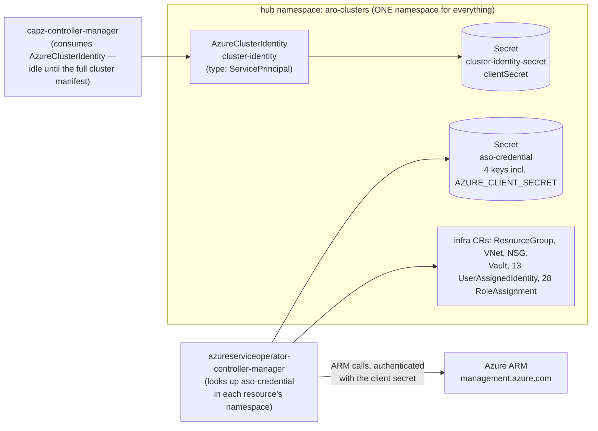

# PATH S: provisioning an ARO-HCP spoke's Azure footprint with a service-principal hub credential

**What this covers / what you need before starting.** This doc takes the MCE hub you built in [03-hub-mce-setup.md](03-hub-mce-setup.md) and gives it its first way to talk to Azure: a service-principal credential — the path Marek Veber's `cluster-api-installer` docs actually document. We then use it to provision a full ARO-HCP spoke Azure footprint declaratively: a resource group, network, KeyVault, **13 user-assigned managed identities, and 28 role assignments**, all created by controllers on the hub reconciling Kubernetes CRs against real public Azure. You need: the hub from doc 03 (MCE 2.11.4, CAPZ/ASO controllers running 1/1 in `multicluster-engine`), the `az`, `oc`, `git`, and `jq` binaries, an Azure service principal with the rights described below (read the role trap first — it is not "Contributor"), and the concepts from [01-identity-models-explained.md](01-identity-models-explained.md) — especially the two-layer picture, because this doc is where layer 1 (the hub's credential) creates layer 2 (the spoke's identities). The secretless alternative to this doc is [05-hcp-spoke-workload-identity.md](05-hcp-spoke-workload-identity.md); the final cluster PUT that sits on top of this footprint is [06-the-preview-gate.md](06-the-preview-gate.md). Everything here ran live on 2026-08-18; observed outputs are quoted from [`../evidence/`](../evidence/) and the full command record is in [the master plan-and-results doc](../reference/full-plan-and-results.md).

## Caveats first

- **Unsupported, dev preview.** Same status as doc 03: the MCE ARO/CAPZ path is unpublished dev preview. No support cases. Sandbox subscriptions only.
- **The role trap, up front:** the generated manifests embed **28 `Microsoft.Authorization/roleAssignments` writes**, and **plain Contributor cannot create role assignments**. The upstream doc's example — `az ad sp create-for-rbac --role Contributor` — produces a credential that sails through the resource group, network, KeyVault, and all 13 identities, then silently stalls on every single role assignment. It fails late and confusingly. You need **Owner**, **User Access Administrator**, or **Role Based Access Control Administrator** on the scope. Details below.
- **This path puts a client secret on your hub.** Two Kubernetes Secrets in the cluster namespace will contain the SP's password. That's the whole trade this doc makes, and it's why [05-hcp-spoke-workload-identity.md](05-hcp-spoke-workload-identity.md) exists — the workload-identity path got the identical Azure outcome with zero secret material on the hub.
- **This doc stops before the cluster itself.** We apply the credential and the infrastructure manifest only. The third generated file, `aro-aso.yaml`, contains the `HcpOpenShiftCluster` — the resource type that's behind the approval-gated `HcpPrivatePreview` feature flag. In our sandbox that PUT gets a typed `404 InvalidResourceType` from ARM. We do that on purpose, later, in [06-the-preview-gate.md](06-the-preview-gate.md). Everything in *this* doc uses only GA Azure resource types and works in a normal subscription.
- **The namespace pitfall is real and documented.** ASO looks up its credential Secret *per namespace*. The upstream doc's example creates the Secret in `default` while the cluster resources live in `aro-clusters` — a published known issue (ACM-30244). The fix is a rule, stated below: everything for one spoke lives in one namespace.
- **Deleting these CRs deletes real Azure resources.** `oc delete -f is.yaml` (or deleting the `ResourceGroup` CR) cascade-deletes the actual Azure resource group and everything in it. In our run that took about 90 seconds per spoke. It's the intended cleanup mechanism — just never point it at a resource group you want to keep.

## The credential plumbing, in human terms

There are **two controllers on the hub that call Azure, and they find their credentials in two completely different ways.** If you remember one thing from this doc, make it this — the single most common failure on this path is wiring up one consumer and forgetting the other, or putting the credential in the wrong namespace.

**Consumer 1: CAPZ** (`capz-controller-manager`). CAPZ finds its credential through a CR: an `AzureClusterIdentity`. Think of it as a kubeconfig in CRD form — a pointer object that says "authenticate as this client ID in this tenant, and the password is in that Secret over there." For PATH S it looks like this (this is the rendered shape from the repo's `credentials-sp-template.yaml`):

```yaml
apiVersion: infrastructure.cluster.x-k8s.io/v1beta1
kind: AzureClusterIdentity
metadata:
  name: cluster-identity
spec:
  type: ServicePrincipal          # the SP-with-a-password model
  tenantID: "<tenant GUID>"
  clientID: "<the SP's appId>"
  clientSecret:                   # pointer to the Secret holding the password
    name: cluster-identity-secret
    namespace: <same namespace>
  allowedNamespaces: {}
```

Cluster CRs reference this identity by name (`AROControlPlane.spec.identityRef`), and CAPZ reads the password out of `cluster-identity-secret` when it needs to call ARM. One honest note: in the infra-only stage this doc runs, CAPZ never actually makes an Azure call — the infrastructure manifest is pure ASO resources. The `AzureClusterIdentity` gets applied now so it's in place when the full cluster manifest (doc 06) references it.

**Consumer 2: ASO** (`azureserviceoperator-controller-manager` — the Azure Service Operator, the thing that turns Kubernetes CRs like `ResourceGroup` and `RoleAssignment` into real ARM calls). ASO does **not** use the `AzureClusterIdentity`. It uses a naming convention: when ASO reconciles a resource, it looks for a Secret **literally named `aso-credential` in the same namespace as that resource**. Not a reference, not a CR — a magic name, resolved per namespace. For PATH S that Secret has four keys: `AZURE_SUBSCRIPTION_ID`, `AZURE_TENANT_ID`, `AZURE_CLIENT_ID`, and `AZURE_CLIENT_SECRET` — and the presence of `AZURE_CLIENT_SECRET` is what tells ASO to authenticate as an SP with a password.



**This is THE pitfall on this path.** Because the lookup is namespace-scoped, the credential and the resources have to be roommates. The upstream doc's example creates `aso-credential` in the `default` namespace while the provisioning happens in `aro-clusters` — ASO then finds no credential for the resources it's reconciling, and you get authentication failures that look like the credential is wrong when it's actually just in the wrong place (this exact mismatch is published as a known issue, ACM-30244). So, the rule, stated once and enforced everywhere below:

> **The namespace rule:** the `AzureClusterIdentity`, the `cluster-identity-secret`, the `aso-credential` Secret, and **all** cluster and infrastructure CRs for a given spoke live in the **same namespace**. We use `aro-clusters` for everything in this doc, and we pass it explicitly to the generator so nothing lands in `default`.

The upside of the per-namespace lookup, once you know about it: it's also the isolation mechanism. Different namespaces can carry different `aso-credential` Secrets, which is exactly how doc 05 runs a secretless credential in a second namespace on the same hub, side by side with this one.

## The role trap: check your SP before you run anything

Everything the generator emits is ordinary Azure resources — except the 28 `RoleAssignment` CRs. Creating a role assignment in Azure is itself a privileged write (`Microsoft.Authorization/roleAssignments/write`), and the **Contributor** built-in role explicitly excludes it. Contributor can create anything and grant nothing.

The failure mode is nasty because it's late: with a Contributor SP, the resource group appears, the vnet and NSG and KeyVault appear, all 13 identities appear — everything looks great for the first minute — and then all 28 `RoleAssignment` CRs sit `Ready: False` forever with `AuthorizationFailed` buried in their status conditions. Nothing at apply time warns you. The upstream doc's own credential example (`az ad sp create-for-rbac --name "aro-hcp-capz-sp" --role "Contributor" --scopes "/subscriptions/<id>"`) walks you straight into this; internally it's masked because Red Hat's own gen.sh path uses an EA custom role with `actions: ["*"]`. This role gap is one of the findings we'd report upstream.

What the hub SP actually needs on the target scope:

| Option | What it is |
|---|---|
| **Owner** | Everything, including role-assignment writes. Big hammer. |
| **User Access Administrator** | Only access management — pair it with Contributor |
| **Role Based Access Control Administrator** | The narrower modern version of UAA — this is what our workload-identity path used in doc 05, paired with Contributor |

Check what your SP can do before you start. First set the credential variables — this doc (and [doc 06](06-the-preview-gate.md), which reuses them) consumes `$CLIENT_ID`, `$CLIENT_SECRET`, and `$SUBSCRIPTION_ID`, and none of them is set by anything earlier in Track 2. Fill them from your sandbox credentials file, the same way doc 02's env block did:

```bash
export SUBSCRIPTION_ID=$(az account show --query id -o tsv)
export CLIENT_ID="<your hub SP's appId, from your sandbox credentials file>"
export CLIENT_SECRET="<the SP's password, from your sandbox credentials file>"   # never echo or commit this
```

After this, `echo $CLIENT_ID` prints a GUID; don't echo the secret. Now list the role assignments on the SP:

```bash
az role assignment list --assignee "$CLIENT_ID" \
  --query '[].{role:roleDefinitionName,scope:scope}' -o table
```

You want one of the three roles above (or a custom role whose `actions` include `Microsoft.Authorization/roleAssignments/write`) at subscription or resource-group scope. In our sandbox run this returned the RHDP-granted `Custom-Owner (Block Billing and Subscription deletion)` at subscription scope with `actions: ["*"]` — wildly over-privileged, which is fine for a disposable sandbox and is itself a data point: PATH S tempts you into one big credential, where doc 05's path handed out two narrow ones.

## Step 1 — clone the repo

Everything below is driven by Marek Veber's `cluster-api-installer` repo, pinned to the exact revision we ran. Clone it:

```bash
export T2=~/aro-hcp-work            # any working directory
export REPO="$T2/cluster-api-installer"
git clone --branch capi-test-rebase https://github.com/marek-veber/cluster-api-installer.git "$REPO"
git -C "$REPO" rev-parse --short HEAD
```

You should see the branch's HEAD revision; in our run this returned `ed240ab` ([`track2-h3-repo-head.txt`](../evidence/track2-h3-repo-head.txt)). If your HEAD differs, diff `scripts/aro-hcp/gen.sh` and the two `credentials-*-template.yaml` files against that revision before trusting this doc's description of them — this is an active dev repo.

Also create the namespace everything will live in (the generator bakes the namespace into the manifests but doesn't create it):

```bash
export NS=aro-clusters
oc get namespace "$NS" >/dev/null 2>&1 || oc create namespace "$NS"
```

You should see `namespace/aro-clusters created` (or silence if it already exists).

## Step 2 — render the manifests with gen.sh in CI mode

The generator is `scripts/aro-hcp/gen.sh`. Out of the box it's built for Red Hat's internal environments: with no special variables set it tries to resolve internal EA subscription names ("ARO SRE Team - INT (EA Subscription 3)") and will even mint an SP for you with an internal custom role — none of which works outside Red Hat's tenant. The escape hatch is **CI mode**: if **all six** of these variables are set, gen.sh makes zero `az` calls, skips all the internal subscription mapping, and just renders templates from what you gave it:

`REGION`, `DEPLOYMENT_ENV`, `AZURE_SUBSCRIPTION_ID`, `AZURE_TENANT_ID`, `AZURE_CLIENT_ID`, `AZURE_CLIENT_SECRET`

Miss any one of them and you get `⚠ NON CI mode - required variables: ...` and the internal code paths. All six present gets you `✓ USING CI mode`.

On top of the six CI triggers, a few more variables shape the output, and two of them carry traps:

- **`GEN_ASO=true`** — renders the infra-only split: `is.yaml` (infrastructure) separate from `aro-aso.yaml` (the gated cluster). This is what lets us stop cleanly at the preview boundary.
- **`NAMESPACE`** — set it explicitly to your one namespace. The generator's default is `default`, which is exactly the ACM-30244 pitfall.
- **`USER`** — a short prefix baked into every identity name. The repo doc requires it be **under 5 characters** — and here's the trap: `USER` is a standard shell variable that already contains your login name. Forget to override it and your username silently becomes the prefix, which can push the KeyVault name over its limit. Set it to something like `hcp`.
- **`CS_CLUSTER_NAME`** — the spoke's name prefix. It becomes the resource group (`<name>-resgroup`) and the KeyVault (`<name>-kv`) — and KeyVault names must be **24 characters or fewer and globally unique across all of Azure**. Keep it short and salt it with something unique to you.
- **`AZURE_TENANT_ID` must be the tenant GUID, not the domain form.** Your credentials file probably has the tenant as `yourcompany.onmicrosoft.com` — that form works fine for `az login`, but the templates render it into `Vault.spec.properties.tenantId`, and the shipped KeyVault CRD enforces a GUID pattern on that field. Feed it the domain form and the `oc apply` of `is.yaml` is rejected at admission. Always derive the GUID: `az account show --query tenantId -o tsv`.
- **`OPERATORS_UAMIS_SUFFIX_FILE`** — gen.sh appends a random 6-hex-char suffix to every identity name for uniqueness, generated once and stored in this file so re-renders are stable. Pin it somewhere you keep (ours: `5254c8`, [`track2-uamis-suffix.txt`](../evidence/track2-uamis-suffix.txt)).
- **`unset OICD_RESOURCE_GROUP`** — that variable (misspelled `OICD_` in the repo, faithfully) is the switch that selects the workload-identity template instead. Make sure it's unset so you get the SP template. (Doc 05 sets it.)

Here's the full render block. The plain-English version: log in, export the six CI-mode variables plus the shaping ones, run gen.sh into an output directory.

```bash
mkdir -p "$T2/gen-sp"
export REGION=eastus                                   # your region
export DEPLOYMENT_ENV=sandbox                          # any label; only feeds naming defaults
export AZURE_SUBSCRIPTION_ID="$SUBSCRIPTION_ID"
export AZURE_TENANT_ID="$(az account show --query tenantId -o tsv)"   # the GUID — never the domain form
export AZURE_CLIENT_ID="$CLIENT_ID"                    # your hub SP's appId — set in the role-trap section above
export AZURE_CLIENT_SECRET="$CLIENT_SECRET"            # also set above, from your sandbox credentials file — never echo or commit this
export GEN_ASO=true                                    # infra-only split: is.yaml vs aro-aso.yaml
export USE_EA=false                                    # skip the Red-Hat-internal ExternalAuth manifest
export NAMESPACE="$NS"                                 # aro-clusters — the namespace rule
export USER=hcp                                        # short prefix, must be < 5 chars
export CS_CLUSTER_NAME=spk1-mylab                      # -> RG spk1-mylab-resgroup, KV spk1-mylab-kv (<= 24 chars, globally unique)
export OCP_VERSION=4.20                                # template default; inert for infra-only resources
export OPERATORS_UAMIS_SUFFIX_FILE="$T2/uamis-suffix.txt"
unset OICD_RESOURCE_GROUP                              # ensures the ServicePrincipal template is selected
bash "$REPO/scripts/aro-hcp/gen.sh" "$T2/gen-sp"
```

What you should see: the CI-mode banner and three files created. In our run (`CS_CLUSTER_NAME=spk1-ftcqh`) the log was ([`track2-h4-gen.log`](../evidence/track2-h4-gen.log)):

```
✓ USING CI mode
ENV=sandbox - AZURE_SUBSCRIPTION_NAME= AZURE_SUBSCRIPTION_ID=8e15b613-d1f9-41a6-a23d-e8b3ce94d6fe, REGION=eastus
AZURE_TENANT_ID=64dc69e4-d083-49fc-9569-ebece1dd1408
AZURE_CLIENT_ID=980772f8-d3f1-44fd-948b-d00ce026079a AZURE_ASO_CLIENT_ID=
creating: /home/anaeem/aro-acm/track2/gen-sp/credentials.yaml
creating: /home/anaeem/aro-acm/track2/gen-sp/is.yaml
creating: /home/anaeem/aro-acm/track2/gen-sp/aro-aso.yaml
```

Confirm the right template was picked. This greps the rendered credential file for the SP identity type:

```bash
grep -q 'type: "ServicePrincipal"' "$T2/gen-sp/credentials.yaml" && echo "SP credential template selected"
```

In our run this printed `SP credential template selected`. If it doesn't, `OICD_RESOURCE_GROUP` leaked into your environment and you rendered the workload-identity variant instead.

### What the three files are

| File | Contents | Do you apply it? |
|---|---|---|
| `credentials.yaml` | The 3 credential objects: `AzureClusterIdentity` (type `ServicePrincipal`), Secret `cluster-identity-secret`, Secret `aso-credential` (4 keys). **Contains your client secret in plaintext.** | Yes — first |
| `is.yaml` | The infrastructure: 1 `ResourceGroup`, 1 `VirtualNetwork`, 1 `NetworkSecurityGroup`, 1 subnet, 1 KeyVault `Vault`, **13 `UserAssignedIdentity`**, **28 `RoleAssignment`** — 46 CRs, all GA Azure resource types | Yes — second |
| `aro-aso.yaml` | The `HcpOpenShiftCluster` + `NodePool` — the resource type behind the approval-gated private preview | **No. Not in this doc.** That PUT is [doc 06](06-the-preview-gate.md)'s job, and in a normal subscription ARM rejects it with `404 InvalidResourceType`. |

## Step 3 — apply the credential and the infrastructure, then destroy the rendered secret

Treat `credentials.yaml` as what it is: a file with your Azure password in it (plaintext `stringData` in one Secret, base64 — which is encoding, not encryption — in the other). Our rule in the run: apply it and shred it inside the same shell, and never write it anywhere that outlives the step. It's regenerable any time by re-running gen.sh.

Apply the credentials first (so ASO finds `aso-credential` the moment it reconciles the first resource), then the infrastructure, then shred:

```bash
oc apply -f "$T2/gen-sp/credentials.yaml"
oc apply -f "$T2/gen-sp/is.yaml"
shred -u "$T2/gen-sp/credentials.yaml" 2>/dev/null || rm -f "$T2/gen-sp/credentials.yaml"
```

What you should see from the first apply — exactly three objects; in our run:

```
azureclusteridentity.infrastructure.cluster.x-k8s.io/cluster-identity created
secret/cluster-identity-secret created
secret/aso-credential created
```

The second apply prints 46 `created` lines. The tail of ours (note the identity names already carrying the pattern we'll unpack below):

```
roleassignment.authorization.azure.com/hcp-spk1-ftcqh-service-managed-identity-5254c8-federatedcredentialsroleid-dpimageregistrymi created
roleassignment.authorization.azure.com/hcp-spk1-ftcqh-service-managed-identity-5254c8-hcpservicemanagedidentityroleid-vnet created
roleassignment.authorization.azure.com/hcp-spk1-ftcqh-service-managed-identity-5254c8-hcpservicemanagedidentityroleid-subnet created
roleassignment.authorization.azure.com/hcp-spk1-ftcqh-service-managed-identity-5254c8-hcpservicemanagedidentityroleid-nsg created
```

If you want to double-check what landed on the hub without exposing values, dump the key *names* of the credential Secret:

```bash
oc get secret aso-credential -n "$NS" -o jsonpath='{.data}' | jq 'keys'
```

In our run this returned the four SP-mode keys ([`track2-h4-aso-credential-keys.json`](../evidence/track2-h4-aso-credential-keys.json)):

```json
[
  "AZURE_CLIENT_ID",
  "AZURE_CLIENT_SECRET",
  "AZURE_SUBSCRIPTION_ID",
  "AZURE_TENANT_ID"
]
```

That `AZURE_CLIENT_SECRET` key is PATH S's signature — and its liability. When you run doc 05, the same check returns three keys and no secret.

## Step 4 — watch it converge (no babysitting required)

Three things to watch, in order: ASO telling you which credential it picked, the CRs going Ready on the hub, and the real resources appearing in Azure.

**First: credential attribution.** ASO emits a Kubernetes event per resource naming exactly which Secret it authenticated with — your proof that the namespace rule held. Catch it early; events expire after about an hour:

```bash
oc get events -n "$NS" -o json \
  | jq -r '.items[] | select(.message | test("aso-credential")) | .message' | sort -u
```

In our run this returned exactly one distinct line ([`track2-h4-credential-events.txt`](../evidence/track2-h4-credential-events.txt)):

```
Using credential from "aro-clusters/aso-credential"
```

If you ever see ASO log `No global credential configured` *without* a matching `Using credential from` event on your resources, that's the namespace pitfall — your `aso-credential` is not where your resources are.

**Second: hub-side readiness.** This counts identities and Ready role assignments:

```bash
printf 'UAMIs: ';     oc get userassignedidentities.managedidentity.azure.com -n "$NS" --no-headers | wc -l
printf 'RAs ready: '; oc get roleassignments.authorization.azure.com -n "$NS" -o json \
  | jq '[.items[] | select(.status.conditions[]? | select(.type=="Ready" and .status=="True"))] | length'
```

Expect 13 and — eventually — 28. "Eventually" is the interesting part. Our first check, about 35 seconds after apply, showed all 13 UAMIs and all 28 `RoleAssignment` CRs present but only **3** of them Ready ([`track2-h4-k8s-ready-first.txt`](../evidence/track2-h4-k8s-ready-first.txt)). That's not a problem — it's Entra propagation: a freshly created identity's principal takes a little while to become visible to the role-assignment API, and any assignment attempted before that fails with `PrincipalNotFound`. In Track 1 we handled that with manual bounded-retry loops around `az role assignment create`. Here, **ASO absorbs it for you**: it retries each failed assignment internally with backoff until the principal materializes. No sleeps, no scripts, no babysitting. Five minutes after apply, the same check read **28** Ready ([`track2-h5-k8s-ready.txt`](../evidence/track2-h5-k8s-ready.txt) — the file covers both paths; the PATH S section is the `aro-clusters` half). That asynchronous absorption is one of the quiet selling points of the declarative route, and it's independent of which credential path you chose.

**Third: Azure-side ground truth.** Don't take the CRs' word for it — ask ARM:

```bash
az group show -n "${CS_CLUSTER_NAME}-resgroup" --query properties.provisioningState -o tsv
printf 'UAMI count: '; az identity list -g "${CS_CLUSTER_NAME}-resgroup" --query 'length(@)' -o tsv
printf 'role assignments in RG scope: '
az role assignment list --all --query "length([?contains(scope, '${CS_CLUSTER_NAME}-resgroup')])" -o tsv
```

In our run this returned `Succeeded`, `13`, and `28` ([`track2-h4-h5-azure-state.txt`](../evidence/track2-h4-h5-azure-state.txt)). The observed timeline, end to end:

| When (after `oc apply -f is.yaml`) | What we saw |
|---|---|
| ~0s | 46 CRs created on the hub |
| ~1 min | Real resource group exists in Azure; all 13 UAMIs and all 28 RoleAssignment CRs present hub-side; 3 assignments Ready |
| ~5 min | **28/28 role assignments Ready**; `az group show` reports `Succeeded`; vnet, NSG, subnet, KeyVault all provisioned |

Total operator effort after the apply: zero.

## What you just built: 13 identities and 28 role assignments, explained

This is layer 2 from [doc 01](01-identity-models-explained.md) — not the hub's credential, but the **future cluster's own identity set**, pre-staged. An ARO-HCP spoke has no service-principal option at all: every one of its cloud-touching operators authenticates as a user-assigned managed identity via workload-identity federation, so the platform requires the full set to exist *before* the cluster is created, and the `HcpOpenShiftCluster` manifest references them by ARM ID. The 13 break down as **9 control-plane identities** (`cp-*` — the operators that will run on Microsoft's side of a hosted control plane: control-plane, cluster-api-azure, cloud-controller-manager, ingress, disk-csi-driver, file-csi-driver, image-registry, cloud-network-config, kms), **3 data-plane identities** (`dp-*` — the same driver roles as seen from your worker nodes: disk-csi-driver, image-registry, file-csi-driver), and **1 service-managed-identity** (SMI) — the odd one out and the clever one: it's the identity **the ARO service itself** will assume to finish the identity wiring later. Its role assignments are *over the other identities*, not over infrastructure: **Reader** on each of the 9 `cp-*` identities, and the **ARO Federated Credential** role on each of the 3 `dp-*` identities — the permission to create federated identity credentials (the issuer/subject/audience trust records from doc 01) *on* those identities. That's how the platform can federate the spoke's operators to its own OIDC issuer at cluster-create time without you granting the ARO RP anything broader. The remaining assignments are narrow operator grants on the network and KeyVault: each `cp-*`/`dp-*` identity gets exactly the built-in role it needs (ARO Cloud Controller Manager, ARO Cluster Ingress Operator, ARO Network Operator, Key Vault Crypto User for kms, and so on) scoped to exactly the subnet, vnet, NSG, or vault it touches. Same least-privilege philosophy as Track 1's 20 assignments, one layer up and five more identities wide.

The compact breakdown of the 28 (this template era has no integration subnet; the newer api-version adds a 29th assignment for it — doc 06 shows that):

| Assignee | Role | Scope | Count |
|---|---|---|---|
| `cp-cluster-api-azure` | ARO HCP Cluster API Provider | subnet | 1 |
| `cp-control-plane` | ARO HCP Control Plane Operator | vnet + NSG | 2 |
| `cp-cloud-controller-manager` | ARO Cloud Controller Manager | subnet + NSG | 2 |
| `cp-ingress` | ARO Cluster Ingress Operator | subnet | 1 |
| `cp-file-csi-driver` | ARO File Storage Operator | subnet + NSG | 2 |
| `dp-file-csi-driver` | ARO File Storage Operator | subnet + NSG | 2 |
| `cp-cloud-network-config` | ARO Network Operator | subnet + vnet | 2 |
| `cp-kms` | Key Vault Crypto User | key vault | 1 |
| service-managed-identity | Reader | each of the 9 `cp-*` identities | 9 |
| service-managed-identity | ARO Federated Credential | each of the 3 `dp-*` identities | 3 |
| service-managed-identity | ARO HCP Service Managed Identity | vnet + NSG + subnet | 3 |
| | | **Total** | **28** |

(If you count carefully: `cp-disk-csi-driver` and `cp-image-registry` get identities but no role assignments in this template era — the corresponding role GUIDs exist in Azure but are left unassigned in both the repo and Microsoft's own demo bicep. One of the loose ends we noted for upstream.)

The identity names follow `${USER}-${CS_CLUSTER_NAME}-<role>-<suffix>` — so with `USER=hcp`, `CS_CLUSTER_NAME=spk1-ftcqh`, and our pinned suffix `5254c8`, the pattern is `hcp-<cluster>-cp-*`, `hcp-<cluster>-dp-*`, and `hcp-<cluster>-service-managed-identity-<suffix>`:

| # | Name | # | Name |
|---|---|---|---|
| 1 | `hcp-spk1-ftcqh-cp-control-plane-5254c8` | 8 | `hcp-spk1-ftcqh-cp-cloud-network-config-5254c8` |
| 2 | `hcp-spk1-ftcqh-cp-cluster-api-azure-5254c8` | 9 | `hcp-spk1-ftcqh-cp-kms-5254c8` |
| 3 | `hcp-spk1-ftcqh-cp-cloud-controller-manager-5254c8` | 10 | `hcp-spk1-ftcqh-dp-disk-csi-driver-5254c8` |
| 4 | `hcp-spk1-ftcqh-cp-ingress-5254c8` | 11 | `hcp-spk1-ftcqh-dp-image-registry-5254c8` |
| 5 | `hcp-spk1-ftcqh-cp-disk-csi-driver-5254c8` | 12 | `hcp-spk1-ftcqh-dp-file-csi-driver-5254c8` |
| 6 | `hcp-spk1-ftcqh-cp-file-csi-driver-5254c8` | 13 | `hcp-spk1-ftcqh-service-managed-identity-5254c8` |
| 7 | `hcp-spk1-ftcqh-cp-image-registry-5254c8` | | |

One implementation detail worth knowing because you'll see it in the CR names: role assignments need each identity's `principalId`, which doesn't exist until Azure creates the identity. The template solves the ordering declaratively — each `UserAssignedIdentity` CR exports its `principalId` into an `identity-map-*` ConfigMap (`operatorSpec.configMaps`), and each `RoleAssignment` CR reads it back via `principalIdFromConfig`. Thirteen identity-map ConfigMaps appear in the namespace alongside the CRs; that's them doing their job, not clutter.

## Where you are now, and what not to do next

You have a complete, real ARO-HCP spoke Azure footprint — resource group, network, KeyVault, 13 identities, 28 scoped role assignments — created and reconciled entirely from CRs on your hub, authenticated by a service-principal secret sitting in two Secrets in `aro-clusters`. Elapsed time in our run: about five minutes, most of it unattended.

Two directions from here:

- **Do not apply `aro-aso.yaml`.** That's the `HcpOpenShiftCluster` PUT, and unless Microsoft has approved the `HcpPrivatePreview` flag on your subscription, ARM will reject it — in our run, with `404 InvalidResourceType` ("The resource type could not be found in the namespace 'Microsoft.RedHatOpenShift' for api version '2024-06-10-preview'"). We drive to that boundary deliberately, with the full CAPI manifest and the template pitfalls you'll hit on the way, in [06-the-preview-gate.md](06-the-preview-gate.md).
- **See what this looks like with zero secrets on the hub.** [05-hcp-spoke-workload-identity.md](05-hcp-spoke-workload-identity.md) reruns this exact provisioning in a sibling namespace with a workload-identity credential — no `AZURE_CLIENT_SECRET`, no `cluster-identity-secret`, same 13 identities and 28/28 Ready. Having just seen the 4-key Secret land on your hub, you'll appreciate the contrast.

When you eventually tear down: delete the CRs (`oc delete -f is.yaml`, then the credential objects), and ASO cascade-deletes the real resource group — everything in it, gone in about 90 seconds in our run. That's the feature. Respect it accordingly.
