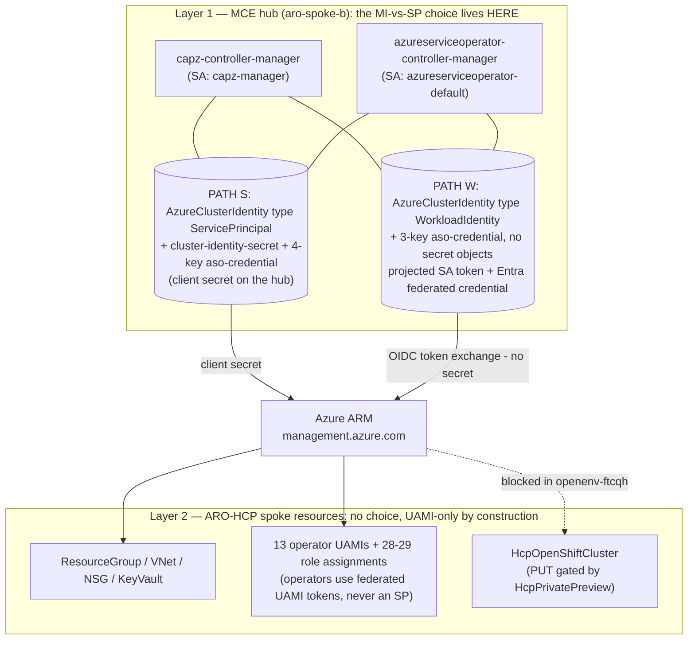

# User-assigned Managed Identities vs Service Principals to create a new ARO cluster spoke — prove-out plan

**Status:** PLAN, for pre-execution review · assembled 2026-08-17 · no provisioning command has been run (read-only recon only)
**Sandbox:** RHDP open environment `openenv-ftcqh` · subscription `8e15b613-d1f9-41a6-a23d-e8b3ce94d6fe` · tenant `redhat0.onmicrosoft.com` · `eastus`
**Sources:** official Microsoft/Red Hat docs (researched 2026-08-17) · live sandbox recon (2026-08-17) · `marek-veber/cluster-api-installer` @ `capi-test-rebase` (HEAD `ed240ab`)

| Part | Contents | Executable in this sandbox? |
|---|---|---|
| **Part 0** | Executive overview, two-layer identity architecture, go/no-go facts, how the tracks compose, recommendations preview | — (reading) |
| **Part 1 — Track 1** | Classic ARO (`az aro create`): SP cluster `aro-spoke-a` vs managed-identity cluster `aro-spoke-b`, full gated runbook | ✅ fully |
| **Part 2 — Track 2** | ARO-HCP spoke from an MCE hub via CAPI/CAPZ/ASO (Marek Veber's flow): hub-credential PATH S (service principal) vs PATH W (workload identity), infra-only prove-out to the private-preview boundary | ✅ except the final `HcpOpenShiftCluster` PUT (gated preview) |


---

# Execution results — 2026-08-18 (00:30Z–02:35Z)

**The plan was executed end to end. Both headline questions answered with live evidence.** Evidence bundle: `evidence/` + `evidence-20260818T022212Z.tar.gz` (55 KB, 60+ gate files). Every stage below links to its evidence file.

## Track 1 — classic ARO: both clusters built, contrast proven

| Check | `aro-spoke-a` (SP) | `aro-spoke-b` (managed identity) |
|---|---|---|
| Create | Succeeded, ~40 min (4.19.24, D8s/D4s_v3) | Succeeded, ~65 min; **B2→B3 identity+RBAC setup took <3 min** |
| `az aro show` | `servicePrincipalProfile` set; `identity`/`pwi` null | `identity.type: UserAssigned`; all 8 operator keys in `platformWorkloadIdentityProfile`; `spProfile` null |
| Operator cred secrets | contain `azure_client_secret` | contain `azure_federated_token_file`; **no client secret** |
| `pod-identity-webhook` | absent | present (2 replicas) |
| `serviceAccountIssuer` / CCO mode | in-cluster default / default | public `https://eastus.oic.aro.azure.com/…` / `Manual` |
| FICs | n/a | **12 RP-created federated credentials** across the 8 operator identities |
| Secret-expiry liability | secret expires **2027-08-17** (we own rotation) | none — Azure auto-rolls MI certs |
| Azure File SC | present | absent (documented MI limitation, confirmed) |

Gate A0 took the documented **fallback branch** on genuine evidence: the sandbox SP can create Entra *applications* but is denied creating *servicePrincipals* (`Authorization_RequestDenied`) — so cluster A reused the sandbox SP (RHDP's own pattern). All 20 Path-B role assignments landed first-try; `az aro validate` clean on both paths.

## Track 2 — ARO-HCP via CAPZ/MCE: both hub-credential paths proven, gate pinpointed

- **Hub**: `aro-spoke-b` + MCE **2.11.4** (channel `stable-2.11`), HyperShift toggles off, `cluster-api` + `cluster-api-provider-azure-preview` on; `capi/capz/azureserviceoperator-controller-manager` all 1/1 in ~2 min. Token projection **pre-wired as researched** (CAPZ `/var/run/secrets/azure/tokens`, ASO `/var/run/secrets/tokens`, audience `api://AzureADTokenExchange`); SAs `capz-manager` / `azureserviceoperator-default`; CAPZ runs `--feature-gates=…,ARO=true`; ARO+HCP CRDs shipped (only `v1api20240610preview` served).
- **PATH S (SP)**: gen.sh CI mode → `Using credential from "aro-clusters/aso-credential"` → RG `spk1-ftcqh-resgroup` Succeeded, **13 UAMIs, 28/28 RoleAssignments Ready**.
- **PATH W (workload identity)**: hub UAMIs `capz-hub-mi`/`aso-hub-mi`; FICs against the hub issuer for both controller SAs; Contributor + **Role Based Access Control Administrator** (not Owner) on the ASO identity; `type: WorkloadIdentity` + 3-key `aso-credential`. **Identical Azure outcome (13 UAMIs, 28/28 Ready) with zero secrets on the hub.** → The single biggest open question is **answered: MCE 2.11's ASO fork honors the per-namespace secretless workload-identity fallback.**
- **Gated boundary (H6)**: full CAPI manifest applied; all 48 embedded infra resources converged — including the **delegated integration subnet, which ARM accepted** despite the missing preview (a finding). The `HcpOpenShiftCluster` PUT then failed with exactly the predicted class: **`404 InvalidResourceType — "The resource type could not be found in the namespace 'Microsoft.RedHatOpenShift' for api version '2024-06-10-preview'"`**. A typed provider error (not 401) proves the hub credential authenticated; only `HcpPrivatePreview` enablement stands between this hub and a real HCP spoke. H6.4 (feature-flag registration) was **not** run — requires user decision.

## New findings (worth reporting upstream / to Marek)

1. **Template↔CRD api-version mismatch** (`cluster-api-installer` @ `ed240ab`): `aro-template.yaml` authors `platform.vnetIntegrationSubnetReference` and `etcd.…kms.vaultName` — fields not declared in the `v1api20240610preview` schema MCE 2.11 ships → CAPZ `failed to create typed patch object`; the `HcpOpenShiftCluster` is never created. Fix: `ARO_HCP_VERSION=v1api20240610preview` (selects the older template variant); never author against the CRD *storage* version name.
2. **azure-cli 2.84.0 on Python 3.14**: `az ad sp create-for-rbac` / `credential reset` crash client-side (argparse rejects a `%Y` help string). Worked around via Graph `az rest`.
3. **`az aro delete --delete-identities` is incompatible with `--no-wait`** — plan cleanup steps must run it blocking.
4. **`AROMachinePool` deletion webhook** ("must have at least one system pool") blocks `oc delete -f aro.yaml`; the pool needed a finalizer strip after Azure-side deletion completed.
5. RHDP openenv SPs cannot create servicePrincipals or delete applications in `redhat0.onmicrosoft.com`; one **inert orphaned app** (`aro-ftcqh-spoke-a-sp`, appId `add45f0c-ce56-49ff-a91d-31466c088d58` — no SP, no credential) needs tenant-admin deletion.

## Verdict (evidence-backed)

**Managed identities for new classic ARO spokes** (GA, no migration path, zero-rotation, least-privilege, <3 min extra setup); **workload identity for MCE hub controllers** (identical capability to SP with no secret material on the hub — SP only where no public OIDC issuer exists); **ARO-HCP spokes are UAMI-only by construction** — the MI-vs-SP question disappears at that layer.

## Cleanup

**Complete — final gate PASS (02:35Z).** All three spoke RGs cascade-deleted via ASO (~90 s). Both ARO clusters deleted (B via a blocking `--delete-identities` delete; the final gate confirmed `az aro list` empty and 0 identities remaining ~9 min after launch — the per-identity removal output itself wasn't captured in the evidence bundle). Vnets deleted; scoped orphan sweep found nothing; `openenv-ftcqh` contains only the RHDP DNS zone again. Total wall clock, plan-to-clean: **~2 h 05 m** (00:30Z–02:35Z — well under the estimate; creates ran concurrently and deletes were faster than planned). Sole residue: the inert orphaned Entra app noted in findings (tenant-admin action). Evidence archives: `evidence-20260818T022212Z.tar.gz` (pre-teardown), `evidence-final-20260818T023456Z.tar.gz` (with cleanup gates).


---

# Part 0 — Executive overview & decision map

**Document:** User-assigned Managed Identities vs Service Principals to create a new ARO cluster spoke — prove-out plan
**Environment:** Red Hat RHDP Azure open environment `openenv-ftcqh` · subscription `8e15b613-d1f9-41a6-a23d-e8b3ce94d6fe` · tenant `redhat0.onmicrosoft.com` · `eastus`
**Status:** PLAN — for pre-execution review. Facts below come from official-doc research (2026-08-17), live sandbox recon (2026-08-17), and a local clone of `marek-veber/cluster-api-installer` @ `capi-test-rebase` (HEAD `ed240ab`). No provisioning command has been run.

---

## 0.1 The question has two answers, because "a new ARO cluster spoke" has two current meanings

**(i) Classic ARO** (`Microsoft.RedHatOpenShift/openShiftClusters`, GA, 48 regions). Here MI-vs-SP is a **create-time, irreversible cluster-identity choice**: the cluster's own cloud operators authenticate either with one service principal + client secret, or with 9 user-assigned managed identities + workload-identity federation (GA 2026-02-02, CLI ≥ 2.84.0 — [howto-create-openshift-cluster](https://learn.microsoft.com/en-us/azure/openshift/howto-create-openshift-cluster)). **Part 1 (Track 1)** proves both flows by building one cluster of each (`aro-spoke-a` = SP, `aro-spoke-b` = MI) and diffing the credential evidence.

**(ii) ARO-HCP** (`Microsoft.RedHatOpenShift/hcpOpenShiftClusters`, gated **private preview**), provisioned **declaratively from an ACM/MCE hub** via CAPI/CAPZ/ASO per Marek Veber's `cluster-api-installer` docs (`doc/ARO-capz.md`, `doc/ARO-capz-mce.md`; the corresponding official procedure was merged to rhacm-docs as PR [#8616](https://github.com/stolostron/rhacm-docs/pull/8616) and then pulled before publication — the feature ships dark in MCE ≥ 2.11). Here the question inverts:

- **At the spoke layer there is no choice.** The HCP API's `platform.operatorsAuthentication` contains exactly one model — `userAssignedIdentities` — with no SP variant anywhere in the swagger (verified 2024-06-10-preview → 2026-09-01-preview). Every HCP spoke requires **13 UAMIs** (9 control-plane + 3 data-plane + 1 service-managed identity) and ~28–29 role assignments. **UAMI-only by construction.**
- **The real MI-vs-SP decision moves to the HUB:** what credential do the CAPZ and ASO controllers on the MCE hub use to call ARM? **PATH S** — a service-principal client secret stored in hub Secrets; or **PATH W** — **workload identity**: the controllers' projected service-account tokens are federated to two hub UAMIs via Entra federated identity credentials — **secretless**. **Part 2 (Track 2)** proves both hub-credential paths end to end against real Azure, up to the exact boundary where the private preview gate bites.

## 0.2 Two-layer identity architecture



## 0.3 Verified go/no-go facts for sandbox `openenv-ftcqh` (live recon, 2026-08-17)

| Fact | Observed value | Consequence |
|---|---|---|
| `Microsoft.RedHatOpenShift` provider | `Registered`, but manifest exposes **only classic types** (`openShiftClusters` @ `2025-07-25` etc.); **`hcpOpenShiftClusters` absent** | ARM rejects any HCP cluster PUT from this subscription — the type does not exist here |
| AFEC flag `Microsoft.RedHatOpenShift/HcpPrivatePreview` | **`NotRegistered`**; no self-service signup exists anywhere; approval-gated per [preview-features](https://learn.microsoft.com/en-us/azure/azure-resource-manager/management/preview-features) | **NO-GO for the real `HcpOpenShiftCluster` create** — this is the single gated step |
| Classic ARO (`openShiftClusters`) | GA; `4.19.24` available in `eastus`; CLI 2.84.0 with MI flags present | **All of Track 1 is executable today** |
| Sandbox SP role | `Custom-Owner (Block Billing and Subscription deletion)` at subscription scope, `actions: ["*"]` (incl. `roleAssignments/write`) | Track 2's 28 ASO-driven role assignments and PATH W's role grants are executable (write-canary-gated) |
| Quota | DSv3 0/1024, regional 0/3844 | Track 1 fits (with D*s_v3 sizes); Track 2's infra-only stages create **no VMs** at all |
| MCE 2.11 (`cluster-api-provider-azure-preview`) | Ships in `redhat-operators` (RHSA-2026:13853); hub OCP range 4.19–4.22 ([matrix](https://access.redhat.com/articles/7136929)) | Installable on `aro-spoke-b` (4.19.24) — **Track 2 is executable through infra-only**: MCE + toggles + both credential paths + 13 UAMIs + 28 role assignments per path, all against real public ARM |
| The 10 ARO-HCP role-definition GUIDs | All verified to exist as built-in roles in a normal tenant | The 28-role-assignment automation works in this sandbox |

**Bottom line:** everything in this document is executable today **except one PUT**. Track 2 deliberately drives up to that PUT and captures ARM's typed rejection (`NoRegisteredProviderFound` / `InvalidResourceType` / `MissingSubscriptionRegistration`) as evidence of exactly where the preview gate bites — which is itself the sandbox's answer to "can we do HCP here yet".

## 0.4 How the tracks compose

Track 1 runs first. Its **Path B managed-identity cluster `aro-spoke-b` is kept alive and becomes the MCE hub for Track 2** (Track 1's Section 9 deletion of cluster B is deferred until Track 2's H9 completes; H0 spells out the exact deferral). This is not just economy: an MIWI classic-ARO cluster's `serviceAccountIssuer` is a **public, Entra-federated OIDC issuer** (`https://eastus.oic.aro.azure.com/{tenant}/{uuid}` format), which is precisely what hub workload-identity federation needs — so Track 2's PATH W requires **no self-hosted issuer, no storage-account JWKS hosting, and no `serviceAccountIssuer` surgery** (the riskiest steps in the general workload-identity gap list are skipped entirely). It also closes the loop thematically: *the managed-identity spoke from Track 1 becomes the hub whose controllers go secretless in Track 2.*

**The composition adds one prerequisite of its own, front-loaded in 0.6 step 0:** the hub role Track 2 assigns to `aro-spoke-b` makes the Red Hat pull secret **required** (MCE installs from the `redhat-operators` catalog, whose images come from `registry.redhat.io`) — Track 1 standalone treats it as optional and proceeds without one by default. Fetch it **before** Track 1 launches (manual browser step) and pass `--pull-secret @$HOME/pull-secret.txt` at Track 1's B4 create; otherwise the combined run is forced into Track 2 H0.2's post-create merge path, which costs three things: a mid-run manual browser step, an undocumented catalog-propagation wait, and one extra repair step — a cluster created **without** a Red Hat pull secret has the OperatorHub default catalog sources (`redhat-operators`, `certified-operators`) shipped `Disabled: true`, so H0.2 must also re-enable `redhat-operators` on `operatorhub/cluster` (per the pull-secret doc's "Modify the configuration files" follow-up) before its catalog gate can pass.

**Fallback:** any OCP 4.19+ hub whose `oc get authentication cluster` returns a public https issuer serving `/.well-known/openid-configuration` works identically; a hub with the default in-cluster issuer would additionally need the self-hosted-issuer procedure (documented as out-of-scope in H5, with its caveats).

## 0.5 Headline recommendations (preview — each conditional on the evidence gates in Parts 1–2)

1. **Classic ARO spokes → managed identities**, decided **at create time** (GA since 2026-02-02; **no migration path in either direction**, so every new spoke created as SP is a future rebuild). Conditional on Track 1's verdict criteria (Part 1 Section 7).
2. **ARO-HCP spokes → UAMIs are mandatory** at the spoke layer. Not a recommendation — a fact of the API. Plan for 13 UAMIs + ~29 role assignments per spoke as standing automation (Track 2 proves it is fully declarative).
3. **Hub controllers → workload identity over SP secret**, conditional on Track 2's H5 gates (chiefly: the stolostron ASO fork honoring the secretless per-namespace credential — the single biggest Track 2 risk, explicitly gated). Zero secrets on the hub, Azure-rolled certificates, per-controller least privilege.
4. **SP remains only where no public OIDC issuer exists** for the hub (or where the H5 fork gate fails) — and then with a documented secret-expiry monitoring duty.

## 0.6 Reading guide, combined timeline, and what the review will receive

**Structure:** Part 1 = Track 1 (classic ARO, Sections 1–11 — final, previously reviewed). Part 2 = Track 2 (ARO-HCP via MCE, stages H0–H11), which reuses Part 1's Phase 0 execution model (fresh invocation per block, session-setup opener, `--no-wait` + poll gates, bounded retries instead of sleeps, secrets never crossing invocation boundaries, evidence tee'd per gate).

**Execution order:** **Step 0 (manual, browser — before anything else):** download the Red Hat pull secret from <https://console.redhat.com/openshift/install/pull-secret> to `$HOME/pull-secret.txt` on the executor, so Track 1's B4 create can pass `--pull-secret @$HOME/pull-secret.txt` — Track 2 makes it required for the hub (see 0.4), and adding it at create time avoids Track 2 H0.2's slower post-create merge fallback. Then: Track 1 Phase 0 → Sections 4–6 → **modified Section 9** (cluster A may be cleaned; cluster B and its identities/vnet are kept) → Track 2 H0–H9 → resume the deferred remainder of Track 1 Section 9.

| Segment | Wall clock |
|---|---|
| Track 1 (interleaved, per its Section 11) | ≈ 4–5.5 h (+2 h optional day-2 demos) |
| Track 2 on the existing hub (H11) | ≈ 3–5 h |
| **Combined** | **≈ 8–10.5 h** — both tracks carry their own sandbox-lifetime gates (Track 1 Gate 0.0: ≥ 7 h; Track 2 Gate H0.3: ≥ 6 h at its start); plan a sandbox extension or a two-day window with `aro-spoke-b` kept alive between tracks |

**Evidence bundle:** one directory (`$EVIDENCE`), archived off-host before any teardown. Track 1 contributes the identity-profile/FIC/in-cluster credential contrasts; Track 2 contributes `track2-*` files: MCE component states and shipped image tags, token-projection proofs, per-path Azure inventories (13 UAMIs + 28 role assignments each), ASO credential-attribution events, the secretless-hub proof (secret key-dumps with no `AZURE_CLIENT_SECRET`, FIC lists), and the captured ARM preview-gate rejection. Every verdict criterion in both tracks names the file that proves it.

---

# Part 1 — Track 1 runbook: classic ARO — service-principal cluster vs managed-identity cluster

**Environment:** Red Hat RHDP Azure open environment `openenv-ftcqh` · subscription `8e15b613-d1f9-41a6-a23d-e8b3ce94d6fe` (pool-01-391) · tenant `redhat0.onmicrosoft.com` · region `eastus`
**Status:** PLAN — for pre-execution review. No command below has been run except the read-only recon cited throughout.
**Author's inputs:** official Microsoft/Red Hat doc research (2026-08-17) + live sandbox recon (2026-08-17). Where they conflict, the conflict is flagged inline with ⚠️.

---

## 1. Objective & context

We are standing up ARO clusters as **spokes**: future state is a hub-and-spoke topology where an ACM hub (elsewhere) imports these clusters as managed spokes. Identity model choice (MI vs SP) is a **create-time, irreversible** decision — "An existing cluster that uses a service principal can't be migrated to use a managed identity" ([howto-create-openshift-cluster](https://learn.microsoft.com/en-us/azure/openshift/howto-create-openshift-cluster)) — so we must prove the managed-identity flow works end-to-end in our tooling before standardizing on it for new spokes.

**What we're proving:**

1. **Path A (baseline):** classic service-principal ARO cluster creates successfully in this sandbox with the documented flow.
2. **Path B (candidate):** managed-identity/workload-identity ARO cluster creates successfully with the 9 user-assigned MIs, the documented least-privilege role assignments, and no customer-held secret.
3. The observable differences (credential material in-cluster, Azure-side identity profile, rotation burden) match the docs, and neither model changes anything relevant to hub-spoke networking or ACM import.

**Success criteria:**

- Both clusters reach `provisioningState: Succeeded` and serve their consoles/APIs.
- Path B's `az aro show` shows `identity.type: UserAssigned` + a populated `platformWorkloadIdentityProfile`; Path A's shows `servicePrincipalProfile`.
- In-cluster: Path B operator credential secrets contain `azure_client_id` + `azure_federated_token_file` and **no** `azure_client_secret`; Path A's contain a client secret. `pod-identity-webhook` runs on Path B.
- Federated identity credentials exist on each Path B operator identity, created by the RP (visible via `az identity federated-credential list`).
- Evidence bundle captured for review (Section 6) and archived off-host (Section 9 step 0).

**Non-goals:** private cluster / UDR egress, BYO NSG, ACM hub install, Terraform. Noted in Day-2 (Section 8) where relevant.

---

## 2. Executive comparison (MI vs SP)

| Dimension | Service Principal (classic) | User-assigned Managed Identity + Workload Identity |
|---|---|---|
| GA status | GA since ARO launch; **no deprecation announced** | Public preview Apr 2025; **GA Feb 2, 2026** (CLI); portal flow GA Apr 2026 |
| Microsoft/Red Hat steer | Supported; portal no longer defaults to it | **Portal default**; positioned as best practice ("short-lived tokens rather than long-lived credentials") |
| Credential material | 1 Entra app + SP, client secret held by cluster & customer | 9 UAMIs; OIDC federated tokens; **no customer-held secret** |
| Secret expiry | Secret expires in ~1 year → cluster cloud ops break (401 `invalid_client`) until rotated | None; MI cert auto-rolled by Azure (90-day expiry, rolled at 45) |
| Rotation burden | Annual: `az aro update --refresh-credentials` (up to 2 h) + self-managed expiry monitoring | Zero by design; `az aro update` (bare) reconciles FICs if ever broken |
| Blast radius | One SP with **Contributor on the cluster RG** = every permission the cluster has | Per-operator built-in roles scoped to subnets/vnet/identities only |
| Azure object count | 1 SP, ~1–4 role assignments | 9 identities, **~20 pre-created role assignments** (28 total incl. RP-created, 4.19 subnet-scoped) |
| Entra prereq for installer | Rights to create app registrations (member user / Application administrator) | Rights to create UAMIs + role assignments; **no app-registration rights needed** |
| CLI floor | 2.67.0 | **2.84.0** ([MI how-to](https://learn.microsoft.com/en-us/azure/openshift/howto-create-openshift-cluster)) |
| Migration | — | **No in-place migration either direction**; new cluster required |
| Known limitation | Expiry outage class | Default Azure File StorageClass disabled (Files CSI needs shared keys) |
| Cost | Free | Free (watch 4,000 role-assignments/subscription limit at scale) |

**Prose:** MI removes an entire outage class (expired SP secrets) and shrinks blast radius from Contributor-on-RG to per-operator subnet/vnet roles, at the cost of ~9 identities + ~20 role assignments of one-time setup, all scriptable. Identity choice does **not** change hub-spoke networking or ACM import (ACM imports ARO via kubeconfig/token only — see Section 8). Expectation going in: recommend MI for new spokes unless Path B surfaces a sandbox-specific blocker.

---

## 3. Preconditions & environment facts (from live recon, 2026-08-17)

| Fact | Value | Consequence |
|---|---|---|
| Region / RG | `eastus` / `openenv-ftcqh` (contains **only** DNS zone `ftcqh.azure.redhatworkshops.io`) | Greenfield; all vnets/identities must be created by this plan |
| Login SP | `980772f8-d3f1-44fd-948b-d00ce026079a`, role `Custom-Owner (Block Billing and Subscription deletion)` at **subscription scope**, `actions: ["*"]`, notActions only billing/locks/cancel | Can create vnets, MIs, **and role assignments** (`Microsoft.Authorization/roleAssignments/write` not excluded) — satisfies both flows' "Contributor + User Access Administrator" requirement |
| Graph access | Read confirmed (`az ad sp show` works); **writes untested** | App-registration creation for Path A's dedicated SP is unverified → Gate A0 with fallback |
| Azure CLI | **2.84.0**, no extensions; `az aro` MI flags present but marked `[Preview]` | Meets the documented 2.84.0 floor for MI. ⚠️ **OPEN QUESTION:** docs call 2.84.0 "fully supported" for MI while the CLI stamps the flags `[Preview]` — treat as cosmetic lag; warning output is captured concretely via the tee'd create-launch logs (Sections 4/5) |
| Quota | Regional vCPU 0/3844; **DSv3 0/1024**; **DSv5/Dv5 0/10** | **BLOCKER if defaulted:** `az aro create` defaults (`Standard_D8s_v5`/`Standard_D4s_v5`) exceed the 10-vCPU DSv5 cap. **Workaround (mandatory):** `--master-vm-size Standard_D8s_v3 --worker-vm-size Standard_D4s_v3` |
| ARO versions in eastus | 4.18.26 … **4.19.24** … 4.21.22 | Pin `4.19.24` for both paths (MI role table documented "as of OpenShift 4.19") |
| Providers | RedHatOpenShift, ManagedIdentity, Network, Compute, Storage, Authorization all **Registered** | No registration steps needed |
| ARO RP first-party SP | Present: `Azure Red Hat OpenShift RP`, appId `f1dd0a37-89c6-4e07-bcd1-ffd3d43d8875` | Path B's First Party Network assignment target exists |
| Existing clusters | None | Clean slate |
| `az aro delete --delete-identities` | **Confirmed present** in 2.84.0 (`[Preview]`) — verified against live CLI help while writing this plan | Path B cleanup can use it (manual fallback also given) |
| Credentials file | `/home/anaeem/aro-acm/aro` exports `GUID, CLIENT_ID, PASSWORD, TENANT, SUBSCRIPTION, RESOURCEGROUP`; **contains a live `curl \| bash` CLI-installer line** | **Never `source` it.** Use `eval "$(grep '^export' ...)"` only |
| RHDP's own quickstart (in that file) | Uses the **sandbox SP as the cluster SP** and legacy flags (`--service-endpoints`, `--disable-private-link-service-network-policies`) | Legacy flags are omitted per current docs (June 2023 removed service-endpoint dependency; RP's First Party Network role handles PLS policies). RHDP precedent legitimizes the Path A fallback of reusing the sandbox SP |

**Known risk (not a confirmed blocker):** recon inferred write capability from the role definition only. A management-group Azure Policy or deny assignment could still block writes. Phase 0 runs a cheap write canary before anything expensive.

### Phase 0 — session setup, gates, write canary

**Execution-model rules (read before running anything):**

- **Executor-harness constraints (this sandbox) — these define the whole execution model:** every Bash invocation starts **fresh** (no env vars, functions, or shell state persist between invocations); foreground commands are killed at **10 minutes**; bare `sleep` is blocked. There is **no long-lived shell**. Consequences drawn throughout the plan:
  - **Every phase block below is a self-contained invocation** that opens by running the session-setup block (creds, login, exports, `OPERATOR_IDS`, `state.env` re-hydration, run-record hookup). Blocks are sized so their worst case — including any retry budget — stays under the 10-minute cap; where a block combines a retry budget with real work, the budget is explicitly trimmed (see A2+A3).
  - Every long-running operation (both `az aro create`s, both `az aro delete`s) is launched `--no-wait` and completed via a **poll gate** — a one-line status command, each poll its own fresh invocation, repeated until the expected state. Never a blocking wait.
- **Propagation rule (used throughout, replaces all fixed sleeps):** after creating an Entra principal (SP or MI), the first dependent command may fail with `PrincipalNotFound`. Do not sleep: re-run the failed command at ~30 s intervals, up to 10 tries (~5 min), then treat as a real failure. **Budget note:** any invocation containing a propagation retry must keep retry-budget + remaining work under 10 minutes; blocks where this matters carry a trimmed budget inline.
- **State between invocations:** non-secret cross-phase state persists **only via files**: `$EVIDENCE/state.env` (written at Gate A0, re-sourced by every session setup) and `$EVIDENCE/identity-principals.tsv` (written at B2). `OPERATOR_IDS` is a bash array (arrays cannot be exported in any case) — it is defined fresh in every session-setup run, never assumed inherited.
- **Secret handling (no secret ever crosses an invocation boundary — by design, not by luck):** secrets are materialized inside the single invocation that consumes them and die with it. Cluster A's client secret is **not** the one `create-for-rbac` returns — that one is never even captured (A0 extracts only the appId). Instead, the A2+A3 invocation mints the real secret in place: dedicated branch via `az ad sp credential reset --id "$CLUSTER_A_CLIENT_ID"` (default mode — replaces the discarded, unused initial secret); fallback branch via `$PASSWORD`, re-derivable in any invocation from the credentials file. If the A2+A3 invocation dies before the create launches, re-run the whole block — it mints another secret; nothing is stranded and no unplanned recovery is needed. (**Never** run `credential reset` after A3 launches: the cluster stores the secret it was created with.)
- **Run record (verdict criterion 1 is verified against this):** the session-setup block routes every invocation's full trace (`set -x` with timestamps) into `$EVIDENCE/run-transcript.log`, appending across invocations. Commands whose **arguments or assignments contain a secret** must be wrapped in `trace_off` / `trace_on` (defined in session setup) so the transcript never contains secret material — the plan marks every such spot. Additionally, every gate's output is tee'd to its own `$EVIDENCE` file so the evidence bundle shows each gate passed without needing to grep the transcript.

```bash
# --- Session setup (MUST open EVERY invocation — there is no persistent shell) ---
# The credentials file contains a live `curl | bash` installer — NEVER `source` it.
eval "$(grep '^export' /home/anaeem/aro-acm/aro)"   # GUID, CLIENT_ID, PASSWORD, TENANT, SUBSCRIPTION, RESOURCEGROUP
# RULE: never echo/print $PASSWORD or any client secret anywhere in this run.

# Login runs BEFORE the run-record hookup below, deliberately: its argv contains $PASSWORD and must not be traced.
az login --service-principal -u "$CLIENT_ID" -p "$PASSWORD" --tenant "$TENANT" --output none
az account set --subscription "$SUBSCRIPTION"

export LOCATION=eastus
export SUBSCRIPTION_ID=$(az account show --query id -o tsv)   # expect 8e15b613-d1f9-41a6-a23d-e8b3ce94d6fe
export VERSION=4.19.24
export MASTER_SIZE=Standard_D8s_v3    # DSv5 family is quota-capped at 10 vCPUs in this sandbox
export WORKER_SIZE=Standard_D4s_v3
export EVIDENCE=/home/anaeem/aro-acm/evidence
mkdir -p "$EVIDENCE"

# --- Run record: every invocation appends its full command trace to one transcript ---
# (verdict criterion 1 — "no assignment commands beyond B3" — is checked against this file)
export PS4='+[$(date -u +%H:%M:%SZ)] '
exec > >(tee -a "$EVIDENCE/run-transcript.log") 2>&1
trace_off() { { set +x; } 2>/dev/null; }   # wrap any command/assignment whose text contains a secret
trace_on()  { set -x; }
set -x

# Path A names/CIDRs
export CLUSTER_A=aro-spoke-a
export VNET_A=aro-spoke-a-vnet      # 10.0.0.0/22
# Path B names/CIDRs (separate vnet so both clusters can coexist)
export CLUSTER_B=aro-spoke-b
export VNET_B=aro-spoke-b-vnet      # 10.1.0.0/22

# The 8 operator-identity names (bash array — MUST be defined per invocation; export does not propagate arrays)
OPERATOR_IDS=(cloud-controller-manager ingress machine-api disk-csi-driver \
              cloud-network-config image-registry file-csi-driver aro-operator)

# Re-hydrate non-secret cross-phase state written by earlier invocations
# (A_SP_DEDICATED, CLUSTER_A_CLIENT_ID, A0_ORPHAN_APP_ID — state.env contains no secrets)
[ -f "$EVIDENCE/state.env" ] && source "$EVIDENCE/state.env"
```

```bash
# --- Gate 0.0: sandbox lifetime (MANUAL, do first) ---
# Confirm in the RHDP portal that >= 7 hours remain on openenv-ftcqh before committing to the two
# ~50-minute creates. If less: extend the sandbox or abort — the run cannot be paused once creates start.
```

```bash
# --- Gate 0.1: environment sanity (all read-only; output tee'd to evidence) ---
{
  az version --query '"azure-cli"' -o tsv                          # expect 2.84.0
  az group show -n "$RESOURCEGROUP" --query location -o tsv        # expect eastus
  az aro list -g "$RESOURCEGROUP" -o table                         # expect empty
  az aro get-versions --location "$LOCATION" -o tsv | grep -x "$VERSION"   # expect 4.19.24 present
  az vm list-usage --location "$LOCATION" \
    --query "[?contains(name.value,'standardDSv3Family')].{limit:limit,cur:currentValue}" -o table  # expect limit 1024
  # Public IP / load balancer headroom (two concurrent public clusters need several public IPs + LBs each;
  # expect >= 10 free PublicIPAddresses and >= 6 free LoadBalancers — shortfall here is a stop, fix via quota request
  # BEFORE any create, not 45 minutes into one):
  az network list-usages --location "$LOCATION" \
    --query "[?contains(name.value,'PublicIPAddresses') || contains(name.value,'LoadBalancers')].{n:name.value,cur:currentValue,limit:limit}" -o table
  az ad sp list --display-name "Azure Red Hat OpenShift RP" --query '[0].id' -o tsv  # expect a GUID (RP SP object id)
  for p in Microsoft.RedHatOpenShift Microsoft.ManagedIdentity Microsoft.Network \
           Microsoft.Compute Microsoft.Storage Microsoft.Authorization; do
    printf '%s: ' "$p"; az provider show -n "$p" --query registrationState -o tsv   # all: Registered
  done
} |& tee "$EVIDENCE/gate-0.1-env-sanity.txt"
```

```bash
# --- Gate 0.2: WRITE CANARY (proves MI creation + role-assignment write actually work; output tee'd) ---
{
  az identity create -g "$RESOURCEGROUP" -n smoke-canary -o none
  CANARY_OID=$(az identity show -g "$RESOURCEGROUP" -n smoke-canary --query principalId -o tsv)
  # Propagation rule applies: if the next command fails with PrincipalNotFound, re-run it at ~30 s
  # intervals (max 10 tries) — no sleeps.
  az role assignment create --assignee-object-id "$CANARY_OID" --assignee-principal-type ServicePrincipal \
    --role Reader --scope "/subscriptions/$SUBSCRIPTION_ID/resourceGroups/$RESOURCEGROUP" -o none
  # GATE: both commands succeed → proceed. Any AuthorizationFailed here = hard stop; escalate to RHDP.
  az role assignment delete --assignee "$CANARY_OID" --role Reader \
    --scope "/subscriptions/$SUBSCRIPTION_ID/resourceGroups/$RESOURCEGROUP"
  az identity delete -g "$RESOURCEGROUP" -n smoke-canary
  echo "GATE 0.2 PASS: identity create + role-assignment write + cleanup all succeeded"
} |& tee "$EVIDENCE/gate-0.2-write-canary.txt"
```

**Executor tooling prereqs:** `jq`, and the `oc` CLI (`curl -sL https://mirror.openshift.com/pub/openshift-v4/clients/ocp/stable/openshift-client-linux.tar.gz | tar xz -C ~/bin oc` or equivalent) for Section 6. Optional: an OCP pull secret at `$HOME/pull-secret.txt` (RHDP's file references this path); both creates work without it — OperatorHub content will be reduced. ⚠️ OPEN QUESTION: whether the executor has a pull secret available; plan proceeds without one by default.

---

## 4. Path A — baseline: service-principal cluster (`aro-spoke-a`)

Flow per the current quickstart ([create-cluster](https://learn.microsoft.com/en-us/azure/openshift/create-cluster)) and [howto-create-service-principal](https://learn.microsoft.com/en-us/azure/openshift/howto-create-service-principal). Note we deliberately **omit** `--service-endpoints` and the private-link-policies step that appear in RHDP's bundled example — the current quickstart dropped both (service-endpoint dependency removed June 2023; the RP handles master-subnet PLS policies).

### A0 — cluster service principal (gate with fallback; own invocation)

Docs prefer a dedicated SP with Contributor on the cluster RG ("Service principals must be unique per Azure Red Hat OpenShift cluster"). Whether our sandbox SP can create Entra apps is **untested** (Graph writes unverified in recon), so this gate tries and falls back — but it must classify failures correctly, because `az ad sp create-for-rbac` is really three operations (app create + SP create + role assignment): a partial failure can orphan a **tenant-level** Entra app that RHDP's subscription teardown will never remove.

Note the secret story: the password `create-for-rbac` generates is **never captured** (`--query appId` extracts only the app id). The real cluster secret is minted inside the A2+A3 invocation via `az ad sp credential reset` — see the Phase 0 secret-handling rule.

```bash
# --- Gate A0: try to create a dedicated cluster SP; classify failures; fall back to the sandbox SP ---
: > "$EVIDENCE/a0-sp-object-id.txt"   # 4b-sweep allowlist entry; stays empty if no run-created SP survives
if CLUSTER_A_CLIENT_ID=$(az ad sp create-for-rbac --name "aro-${GUID}-spoke-a-sp" --role Contributor \
      --scopes "/subscriptions/$SUBSCRIPTION_ID/resourceGroups/$RESOURCEGROUP" \
      --query appId -o tsv 2>"$EVIDENCE/a0-sp-create.err"); then
  export CLUSTER_A_CLIENT_ID
  export A_SP_DEDICATED=true
  # Propagation rule applies to this Graph read of the just-created SP (retry per Phase 0 rule):
  az ad sp show --id "$CLUSTER_A_CLIENT_ID" --query id -o tsv > "$EVIDENCE/a0-sp-object-id.txt"
  echo "Dedicated cluster SP created: $CLUSTER_A_CLIENT_ID (initial secret intentionally discarded — A2+A3 mints its own)"
else
  # --- Failure classification: do NOT equate "create-for-rbac failed" with "no Graph write rights" ---
  # (a) Orphan check: the app may exist even though the command exited nonzero (SP-create error,
  #     role-assignment propagation timeout, throttling). An orphaned app lives in tenant
  #     redhat0.onmicrosoft.com with a live secret — subscription teardown will NOT remove it.
  ORPHAN_APP_ID=$(az ad app list --display-name "aro-${GUID}-spoke-a-sp" --query '[0].appId' -o tsv)
  if [ -n "$ORPHAN_APP_ID" ]; then
    echo "$ORPHAN_APP_ID" > "$EVIDENCE/a0-orphan-app-id.txt"
    # Record any partially created SP object id for the 4b sweep (its RG-scope Contributor
    # assignment may exist if create-for-rbac died after the role-assignment step):
    az ad sp list --filter "appId eq '$ORPHAN_APP_ID'" --query '[0].id' -o tsv >> "$EVIDENCE/a0-sp-object-id.txt"
    if az ad app delete --id "$ORPHAN_APP_ID"; then
      echo "Orphaned partial app $ORPHAN_APP_ID deleted immediately."
      rm -f "$EVIDENCE/a0-orphan-app-id.txt"; : > "$EVIDENCE/a0-sp-object-id.txt"; ORPHAN_APP_ID=""
    else
      echo "WARN: orphaned app $ORPHAN_APP_ID could NOT be deleted now — cleanup step 4 MUST delete it (recorded in a0-orphan-app-id.txt and state.env)."
    fi
  fi
  # (b) Classification gate: fall back ONLY on a confirmed Graph authorization failure.
  if grep -qiE 'Authorization_RequestDenied|Insufficient privileges|403' "$EVIDENCE/a0-sp-create.err"; then
    echo "FALLBACK: sandbox SP lacks Graph app-creation rights (confirmed authorization error in a0-sp-create.err)."
    echo "Reusing sandbox SP as cluster SP — RHDP's own quickstart does exactly this; uniqueness rule OK (no other ARO cluster uses it)."
    export CLUSTER_A_CLIENT_ID="$CLIENT_ID"
    export A_SP_DEDICATED=false
  else
    echo "A0 failed for a NON-authorization reason (throttling / propagation / partial create — see a0-sp-create.err)."
    echo "Do NOT fall back on this evidence: re-run this Gate A0 invocation per the propagation rule (max 10 tries total across re-runs)."
    echo "Take the fallback only if a genuine Graph authorization error appears, or — after retries exhaust with"
    echo "non-authorization errors — as an explicit, recorded decision (keep a0-sp-create.err in the bundle either way)."
    exit 1   # stop this invocation; re-run the block (the orphan check above makes re-runs safe)
  fi
fi
# Persist NON-SECRET state for all later invocations (cleanup and evidence steps branch on these):
{ echo "export A_SP_DEDICATED=$A_SP_DEDICATED"
  echo "export CLUSTER_A_CLIENT_ID=$CLUSTER_A_CLIENT_ID"
  echo "export A0_ORPHAN_APP_ID=${ORPHAN_APP_ID:-}"
} > "$EVIDENCE/state.env"
```

*Reviewer note:* the fallback SP is wildly over-privileged (subscription-wide Custom-Owner) — acceptable in a disposable sandbox, and itself a data point for the blast-radius comparison. A0 persists only the client ID and flags; **no secret leaves this invocation** — the cluster secret is minted inside the A2+A3 invocation (Phase 0 secret-handling rule), so a killed invocation anywhere in Path A strands nothing.

### A1 — network (own invocation)

```bash
az network vnet create -g "$RESOURCEGROUP" -n "$VNET_A" --address-prefixes 10.0.0.0/22 -o none
az network vnet subnet create -g "$RESOURCEGROUP" --vnet-name "$VNET_A" -n master-subnet --address-prefixes 10.0.0.0/23 -o none
az network vnet subnet create -g "$RESOURCEGROUP" --vnet-name "$VNET_A" -n worker-subnet --address-prefixes 10.0.2.0/23 -o none
# GATE A1: two subnets exist, correct prefixes (output tee'd to evidence).
# Note: newer network API versions store subnets created with --address-prefixes under the plural
# `addressPrefixes` array and leave singular `addressPrefix` null — query BOTH and gate on either
# showing the expected CIDR (a blank `p` column with a populated `ps` column is healthy).
az network vnet subnet list -g "$RESOURCEGROUP" --vnet-name "$VNET_A" \
  --query '[].{n:name,p:addressPrefix,ps:addressPrefixes}' -o table | tee "$EVIDENCE/gate-a1-subnets.txt"
```

### A2+A3 — pre-flight validation + create launch (ONE invocation; provisioning ~35–50 min after launch)

This block mints the cluster secret, validates, and launches the create — all inside a single invocation, so the secret never crosses an invocation boundary. Worst-case wall clock is kept under the 10-minute cap by trimming the propagation-retry budget (below). If the invocation dies at any point **before the create launches**, re-run the whole block — it mints a fresh secret and is safe to repeat.

```bash
# --- Materialize the cluster secret IN PLACE (trace_off: assignments would otherwise be traced with values) ---
trace_off
if [ "$A_SP_DEDICATED" = true ]; then
  # Default reset mode replaces the discarded create-for-rbac secret — exactly what we want.
  # NEVER run this again after A3 launches (the cluster stores the secret it was created with).
  CLUSTER_A_CLIENT_SECRET=$(az ad sp credential reset --id "$CLUSTER_A_CLIENT_ID" --query password -o tsv)
else
  CLUSTER_A_CLIENT_SECRET="$PASSWORD"
fi
trace_on

# --- A2: pre-flight validation (trace_off: --client-secret is in the argv) ---
trace_off
az aro validate -g "$RESOURCEGROUP" -n "$CLUSTER_A" \
  --vnet "$VNET_A" --master-subnet master-subnet --worker-subnet worker-subnet \
  --version "$VERSION" \
  --client-id "$CLUSTER_A_CLIENT_ID" --client-secret "$CLUSTER_A_CLIENT_SECRET" \
  | tee "$EVIDENCE/a2-validate.json"
trace_on
# GATE A2: no failed checks reported. If validate fails with an invalid-client/secret-style error
# immediately after the reset, that is Entra propagation of the freshly minted secret: re-run
# validate at ~30 s intervals, MAX 6 TRIES (~3 min — trimmed from the general 10-try budget so
# reset + validate + launch stays under the 10-minute invocation cap). If exhausted, exit and
# re-run this ENTIRE block (safe pre-create: it just mints another secret). Fix real findings first.

# --- A3: create launch (trace_off: --client-secret in argv; output still lands in the tee'd log + transcript) ---
date -u +'%Y-%m-%dT%H:%M:%SZ A3-launch' | tee -a "$EVIDENCE/a-create-timing.txt"
trace_off
az aro create -g "$RESOURCEGROUP" -n "$CLUSTER_A" \
  --vnet "$VNET_A" --master-subnet master-subnet --worker-subnet worker-subnet \
  --version "$VERSION" \
  --master-vm-size "$MASTER_SIZE" --worker-vm-size "$WORKER_SIZE" --worker-count 3 \
  --client-id "$CLUSTER_A_CLIENT_ID" --client-secret "$CLUSTER_A_CLIENT_SECRET" \
  --apiserver-visibility Public --ingress-visibility Public \
  --tags path=A identity=service-principal guid="$GUID" \
  --no-wait |& tee "$EVIDENCE/a-create-launch.log"
trace_on
# Optional if a pull secret exists:  --pull-secret @$HOME/pull-secret.txt
# The tee'd launch log captures the CLI-side [Preview] warnings and the auto role-assignment
# messages — evidence for verdict criterion 1 and the Section 3 open question. --no-wait returns
# immediately; the CLI still performs its client-side permission grants before submitting.
```

What it does: the CLI auto-grants **Network Contributor** on `$VNET_A` to the cluster SP *and* to the first-party `Azure Red Hat OpenShift RP` SP (our caller has `roleAssignments/write`, so this succeeds), then the RP creates the locked managed RG (`aro-*`) with masters/workers/LBs. **Proceed directly to B1–B4 (Section 5) while A provisions.**

```bash
# POLL GATE A3 (each poll a fresh invocation; re-run every 2–5 min until it prints Succeeded,
# ~35–50 min total; on Failed → Section 7 failed-create procedure). Log the final observation:
az aro show -g "$RESOURCEGROUP" -n "$CLUSTER_A" --query provisioningState -o tsv | tee "$EVIDENCE/gate-a3-final-state.txt"
date -u +'%Y-%m-%dT%H:%M:%SZ A3-succeeded' | tee -a "$EVIDENCE/a-create-timing.txt"   # once Succeeded

# GATE A3 (after Succeeded): record the vnet role-assignment list to evidence.
az role assignment list \
  --scope "/subscriptions/$SUBSCRIPTION_ID/resourceGroups/$RESOURCEGROUP/providers/Microsoft.Network/virtualNetworks/$VNET_A" \
  --query '[].{who:principalName,pid:principalId,role:roleDefinitionName}' -o json | tee "$EVIDENCE/a-vnet-role-assignments.json"
# EXPECT (hard requirement): the ARO RP SP holds Network Contributor (or otherwise demonstrably has
# effective network permissions) on the vnet.
# The CLUSTER SP may legitimately show 0–1 direct vnet assignments: the CLI's ensure_resource_permissions()
# is best-effort/conditional, and in BOTH A0 branches the cluster SP already holds broader rights
# (dedicated: Contributor on the RG containing the vnet; fallback: subscription-wide Custom-Owner).
# Do NOT fail this gate on an assignment count — Succeeded provisioning is the functional proof; record actuals.
# Once Succeeded: run Section 6 for cluster A (capture functions with "$CLUSTER_A") — typically while B still provisions.
```

---

## 5. Path B — managed-identity cluster (`aro-spoke-b`)

Flow per [howto-create-openshift-cluster](https://learn.microsoft.com/en-us/azure/openshift/howto-create-openshift-cluster) (MI create doc) and [howto-understand-managed-identities](https://learn.microsoft.com/en-us/azure/openshift/howto-understand-managed-identities) (role/scope table). Separate vnet `10.1.0.0/22` so A and B coexist. **B1–B4 run while A3 provisions** (A3 was launched `--no-wait`). Each of B1, B2, B3, B4 is its own invocation.

**Quota math (both clusters concurrent):** per cluster during install: 3×D8s_v3 masters (24) + 1×D8s_v3 bootstrap (8, transient) + 3×D4s_v3 workers (12) = **44 vCPU peak, 36 steady**. Two clusters peak ≈ 88 vCPU vs DSv3 limit **1024** and regional limit **3844** → coexistence is comfortably safe. **Sequential fallback (only if quota surprises appear):** create A → run the Section 6 captures for A → delete A (`--no-wait` + poll until gone) → then build B.

### B1 — network (own invocation)

```bash
az network vnet create -g "$RESOURCEGROUP" -n "$VNET_B" --address-prefixes 10.1.0.0/22 -o none
az network vnet subnet create -g "$RESOURCEGROUP" --vnet-name "$VNET_B" -n master-subnet --address-prefixes 10.1.0.0/23 -o none
az network vnet subnet create -g "$RESOURCEGROUP" --vnet-name "$VNET_B" -n worker-subnet --address-prefixes 10.1.2.0/23 -o none
# GATE B1: subnets exist with 10.1.0.0/23 and 10.1.2.0/23 (same plural/singular caveat as Gate A1 —
# gate on EITHER p or ps showing the expected CIDR; output tee'd to evidence):
az network vnet subnet list -g "$RESOURCEGROUP" --vnet-name "$VNET_B" \
  --query '[].{n:name,p:addressPrefix,ps:addressPrefixes}' -o table | tee "$EVIDENCE/gate-b1-subnets.txt"
```

### B2 — create the 9 user-assigned managed identities (own invocation)

Names follow the MI doc verbatim (8 operator identities named after their CLI operator keys, plus `aro-cluster`), so reviewers can diff against the official example 1:1. `OPERATOR_IDS` is defined by the session-setup block that opens this invocation (bash array — cannot be exported).

```bash
date -u +'%Y-%m-%dT%H:%M:%SZ B2-start' | tee -a "$EVIDENCE/b-setup-timing.txt"   # verdict criterion 5 timing
for ID in aro-cluster "${OPERATOR_IDS[@]}"; do
  az identity create -g "$RESOURCEGROUP" -n "$ID" -o none
done
# GATE B2: exactly 9 identities (count tee'd to evidence)
az identity list -g "$RESOURCEGROUP" --query 'length(@)' -o tsv | tee "$EVIDENCE/gate-b2-identity-count.txt"   # expect 9
# Record name -> principalId NOW (cleanup step 2 and the scoped sweep need these AFTER the identities
# are deleted, when `az identity show` can no longer resolve them):
az identity list -g "$RESOURCEGROUP" --query "[].[name,principalId]" -o tsv | tee "$EVIDENCE/identity-principals.tsv"
# No fixed sleep: Entra propagation is handled by the propagation rule — if the FIRST B3 assignment
# fails with PrincipalNotFound, re-run it at ~30 s intervals (max 10 tries).
```

### B3 — role assignments (20 total, by GUID; own invocation)

Role GUIDs are exactly those in Microsoft's MI create doc commands; names cross-checked on azadvertizer (official names have **no** "Role" suffix). Scopes per the [role table](https://learn.microsoft.com/en-us/azure/openshift/howto-understand-managed-identities). We use GUIDs, per the docs' own examples.

**Invocation-budget note:** the propagation retry on the first assignment (up to ~5 min) plus 20 assignments (~3–5 min of `az` calls) can brush the 10-minute cap. If this invocation is killed mid-way, simply re-run the whole block: `az role assignment create` for an assignment that already exists fails with a "role assignment already exists" error — treat those as skips, not failures.

| # | Assignee | Role (GUID) | Scope |
|---|---|---|---|
| 1–2 | `cloud-controller-manager` | ARO Cloud Controller Manager `a1f96423-…facd4` | master + worker subnet |
| 3–4 | `ingress` | ARO Cluster Ingress Operator `0336e1d3-…7802c` | master + worker subnet |
| 5–6 | `machine-api` | ARO Machine API Operator `0358943c-…78637` | master + worker subnet |
| 7–8 | `aro-operator` | ARO Service Operator `4436bae4-…f25ee2` | master + worker subnet |
| 9 | `cloud-network-config` | ARO Network Operator `be7a6435-…eff9e8f` | vnet |
| 10 | `image-registry` | ARO Image Registry Operator `8b32b316-…2d08b5` | vnet |
| 11 | `file-csi-driver` | ARO File Storage Operator `0d7aedc0-…0c947e` | vnet |
| — | `disk-csi-driver` | **none pre-create** (managed-RG only; DES only if used) | — |
| 12–19 | `aro-cluster` | ARO Federated Credential `ef318e2a-…96c6a6e` | **each of the 8 operator identities** |
| 20 | `Azure Red Hat OpenShift RP` SP | ARO First Party Network `42f3c60f-…664342` | vnet |

```bash
export SCOPE_VNET_B="/subscriptions/$SUBSCRIPTION_ID/resourceGroups/$RESOURCEGROUP/providers/Microsoft.Network/virtualNetworks/$VNET_B"
export SCOPE_MASTER_B="$SCOPE_VNET_B/subnets/master-subnet"
export SCOPE_WORKER_B="$SCOPE_VNET_B/subnets/worker-subnet"

ROLE_CCM=a1f96423-95ce-4224-ab27-4e3dc72facd4        # Azure Red Hat OpenShift Cloud Controller Manager
ROLE_INGRESS=0336e1d3-7a87-462b-b6db-342b63f7802c    # Azure Red Hat OpenShift Cluster Ingress Operator
ROLE_MACHINE_API=0358943c-7e01-48ba-8889-02cc51d78637 # Azure Red Hat OpenShift Machine API Operator
ROLE_NETWORK=be7a6435-15ae-4171-8f30-4a343eff9e8f    # Azure Red Hat OpenShift Network Operator
ROLE_IMAGE_REG=8b32b316-c2f5-4ddf-b05b-83dacd2d08b5  # Azure Red Hat OpenShift Image Registry Operator
ROLE_FILE_CSI=0d7aedc0-15fd-4a67-a412-efad370c947e   # Azure Red Hat OpenShift File Storage Operator
ROLE_ARO_OP=4436bae4-7702-4c84-919b-c4069ff25ee2     # Azure Red Hat OpenShift Service Operator
ROLE_FED_CRED=ef318e2a-8334-4a05-9e4a-295a196c6a6e   # Azure Red Hat OpenShift Federated Credential
ROLE_FP_NET=42f3c60f-e7b1-46d7-ba56-6de681664342     # Azure Red Hat OpenShift First Party Network

assign() {  # assign <identity-name> <role-guid> <scope>
  az role assignment create \
    --assignee-object-id "$(az identity show -g "$RESOURCEGROUP" -n "$1" --query principalId -o tsv)" \
    --assignee-principal-type ServicePrincipal \
    --role "/subscriptions/$SUBSCRIPTION_ID/providers/Microsoft.Authorization/roleDefinitions/$2" \
    --scope "$3" -o none
}

# 1-8: subnet-scoped operators (master + worker each)
# (Propagation rule: if the FIRST call fails with PrincipalNotFound, retry it per the Phase 0 rule.
#  On a re-run of this block, "already exists" errors are skips — see the invocation-budget note.)
for S in "$SCOPE_MASTER_B" "$SCOPE_WORKER_B"; do
  assign cloud-controller-manager "$ROLE_CCM"        "$S"
  assign ingress                  "$ROLE_INGRESS"    "$S"
  assign machine-api              "$ROLE_MACHINE_API" "$S"
  assign aro-operator             "$ROLE_ARO_OP"     "$S"
done
# 9-11: vnet-scoped operators
assign cloud-network-config "$ROLE_NETWORK"   "$SCOPE_VNET_B"
assign image-registry       "$ROLE_IMAGE_REG" "$SCOPE_VNET_B"
assign file-csi-driver      "$ROLE_FILE_CSI"  "$SCOPE_VNET_B"
# (disk-csi-driver: intentionally no assignment — per the official role table)
# 12-19: cluster identity gets Federated Credential over each operator identity
for OP in "${OPERATOR_IDS[@]}"; do
  assign aro-cluster "$ROLE_FED_CRED" \
    "/subscriptions/$SUBSCRIPTION_ID/resourceGroups/$RESOURCEGROUP/providers/Microsoft.ManagedIdentity/userAssignedIdentities/$OP"
done
# 20: ARO RP first-party SP -> First Party Network on the vnet
az role assignment create \
  --assignee-object-id "$(az ad sp list --display-name 'Azure Red Hat OpenShift RP' --query '[0].id' -o tsv)" \
  --assignee-principal-type ServicePrincipal \
  --role "/subscriptions/$SUBSCRIPTION_ID/providers/Microsoft.Authorization/roleDefinitions/$ROLE_FP_NET" \
  --scope "$SCOPE_VNET_B" -o none
date -u +'%Y-%m-%dT%H:%M:%SZ B3-end' | tee -a "$EVIDENCE/b-setup-timing.txt"   # verdict criterion 5 timing
```

```bash
# GATE B3: assignment counts per scope (direct assignments only; output tee'd to evidence)
{
  az role assignment list --scope "$SCOPE_MASTER_B" --query 'length(@)'   # expect 4
  az role assignment list --scope "$SCOPE_WORKER_B" --query 'length(@)'   # expect 4
  az role assignment list --scope "$SCOPE_VNET_B"   --query 'length(@)'   # expect 4 (3 operators + RP; excludes inherited)
  for OP in "${OPERATOR_IDS[@]}"; do
    printf '%s: ' "$OP"
    az role assignment list \
      --scope "/subscriptions/$SUBSCRIPTION_ID/resourceGroups/$RESOURCEGROUP/providers/Microsoft.ManagedIdentity/userAssignedIdentities/$OP" \
      --query 'length(@)'   # expect 1 each (aro-cluster's Federated Credential role)
  done
} |& tee "$EVIDENCE/gate-b3-assignment-counts.txt"
az role assignment list --all --query "length([?principalName!=''])" > /dev/null  # warm cache; full dump to evidence in Sec.6
```

### B4 — pre-flight validation, then create (own invocation; launch non-blocking; provisioning ~35–50 min)

```bash
# No fixed sleep for RBAC propagation: az aro validate is cheap — run it immediately; if it reports
# missing permissions that Gate B3 shows as present, that is RBAC propagation lag: re-run validate
# every ~2 min (each re-run its own invocation is fine) until clean (treat as a real failure only
# if still failing after ~15 min).
az aro validate -g "$RESOURCEGROUP" -n "$CLUSTER_B" \
  --vnet "$VNET_B" --master-subnet master-subnet --worker-subnet worker-subnet \
  --version "$VERSION" \
  --enable-managed-identity \
  --assign-cluster-identity aro-cluster \
  --assign-platform-workload-identity file-csi-driver file-csi-driver \
  --assign-platform-workload-identity cloud-controller-manager cloud-controller-manager \
  --assign-platform-workload-identity ingress ingress \
  --assign-platform-workload-identity image-registry image-registry \
  --assign-platform-workload-identity machine-api machine-api \
  --assign-platform-workload-identity cloud-network-config cloud-network-config \
  --assign-platform-workload-identity aro-operator aro-operator \
  --assign-platform-workload-identity disk-csi-driver disk-csi-driver \
  | tee "$EVIDENCE/b4-validate.json"
# GATE B4: no failed checks. A persistent permissions failure here almost always means a missing/mis-scoped B3 assignment.
```

```bash
date -u +'%Y-%m-%dT%H:%M:%SZ B-create-launch' | tee -a "$EVIDENCE/b-setup-timing.txt"
az aro create \
  --resource-group "$RESOURCEGROUP" --name "$CLUSTER_B" \
  --vnet "$VNET_B" --master-subnet master-subnet --worker-subnet worker-subnet \
  --version "$VERSION" \
  --master-vm-size "$MASTER_SIZE" --worker-vm-size "$WORKER_SIZE" --worker-count 3 \
  --apiserver-visibility Public --ingress-visibility Public \
  --pod-cidr 10.132.0.0/14 --service-cidr 172.31.0.0/16 \
  --enable-managed-identity \
  --assign-cluster-identity aro-cluster \
  --assign-platform-workload-identity file-csi-driver file-csi-driver \
  --assign-platform-workload-identity cloud-controller-manager cloud-controller-manager \
  --assign-platform-workload-identity ingress ingress \
  --assign-platform-workload-identity image-registry image-registry \
  --assign-platform-workload-identity machine-api machine-api \
  --assign-platform-workload-identity cloud-network-config cloud-network-config \
  --assign-platform-workload-identity aro-operator aro-operator \
  --assign-platform-workload-identity disk-csi-driver disk-csi-driver \
  --tags path=B identity=managed-identity guid="$GUID" \
  --no-wait |& tee "$EVIDENCE/b-create-launch.log"
# Optional if a pull secret exists:  --pull-secret @$HOME/pull-secret.txt
# The tee'd launch log captures the CLI-side [Preview] warnings — evidence for verdict criterion 1
# and Risk #1. While B provisions: run Section 6 for cluster A ONLY (and only after POLL GATE A3
# shows Succeeded). Section 6 for cluster B waits for POLL GATE B5 — never run it against a
# still-provisioning cluster.
```

Notes for reviewers: the `--assign-platform-workload-identity KEY IDENTITY` pairs and order match the official doc example verbatim ([howto-create-openshift-cluster](https://learn.microsoft.com/en-us/azure/openshift/howto-create-openshift-cluster); flags per [az aro reference](https://learn.microsoft.com/en-us/cli/azure/aro)). Non-default `--pod-cidr`/`--service-cidr` are **optional but deliberate**: Path A keeps defaults (`10.128.0.0/14`/`172.30.0.0/16`); giving B distinct CIDRs is free now and mandatory later if these spokes ever join an ACM/Submariner mesh (CIDRs are immutable post-create).

```bash
# POLL GATE B5 (each poll a fresh invocation; re-run every 2–5 min until Succeeded, ~35–50 min;
# on Failed → Section 7 failed-create procedure):
az aro show -g "$RESOURCEGROUP" -n "$CLUSTER_B" --query provisioningState -o tsv | tee "$EVIDENCE/gate-b5-final-state.txt"   # Succeeded
date -u +'%Y-%m-%dT%H:%M:%SZ B-create-succeeded' | tee -a "$EVIDENCE/b-setup-timing.txt"   # once Succeeded
az aro show -g "$RESOURCEGROUP" -n "$CLUSTER_B" --query identity.type -o tsv       # UserAssigned
# Once Succeeded: run Section 6 for cluster B (capture functions with "$CLUSTER_B").
```

---

## 6. Validation & evidence to capture

All evidence lands in `$EVIDENCE` (`/home/anaeem/aro-acm/evidence`) for attachment to the review, and is archived off-host in Section 9 step 0.

**Section 6 is parameterized per cluster and runs TWICE — once per cluster, each run gated on that cluster's own Succeeded state:**

- **For A:** run `capture_azure_evidence "$CLUSTER_A"` then `capture_oc_evidence "$CLUSTER_A"` **after POLL GATE A3 shows Succeeded** — typically while B is still provisioning.
- **For B:** run `capture_azure_evidence "$CLUSTER_B"` then `capture_oc_evidence "$CLUSTER_B"` **after POLL GATE B5 shows Succeeded**.
- **Never** run either function against a cluster that has not reached `Succeeded` (a mid-provisioning capture records wrong evidence — `provisioningState: Creating`, empty `apiserverProfile.url` — and `oc login` against an empty URL fails).
- Paste the function definition and its call **in the same invocation** (functions do not persist between invocations; session setup opens the invocation as always).

### 6.1 Azure-side (parameterized; run per cluster as gated above)

```bash
capture_azure_evidence() {  # capture_azure_evidence <cluster-name> — ONLY after that cluster is Succeeded
  local C=$1
  az aro show -g "$RESOURCEGROUP" -n "$C" -o json > "$EVIDENCE/aro-show-$C.json"
  az aro show -g "$RESOURCEGROUP" -n "$C" \
    --query '{state:provisioningState,version:clusterProfile.version,console:consoleProfile.url,api:apiserverProfile.url,spProfile:servicePrincipalProfile,identity:identity,pwi:platformWorkloadIdentityProfile}' \
    -o json | tee "$EVIDENCE/identity-summary-$C.json"
  # EXPECT: A → servicePrincipalProfile.clientId set; identity/pwi null.
  #         B → identity.type UserAssigned with aro-cluster under userAssignedIdentities;
  #             platformWorkloadIdentityProfile maps all 8 operator keys to resourceId+clientId+objectId; servicePrincipalProfile null.

  if [ "$C" = "$CLUSTER_B" ]; then
    # RP-created federated identity credentials on each operator identity (cheap, decisive MI proof)
    # (`>` truncate, NOT `>>` — on any re-run, append would concatenate two JSON arrays and corrupt the evidence)
    local OP
    for OP in "${OPERATOR_IDS[@]}"; do
      az identity federated-credential list --identity-name "$OP" -g "$RESOURCEGROUP" \
        -o json > "$EVIDENCE/fic-$OP.json"       # expect >=1 FIC referencing the cluster's OIDC issuer
    done
    # Full role-assignment inventory for the comparison section (run once, in the B pass —
    # by then it captures both clusters' assignment sets):
    az role assignment list --all -o json > "$EVIDENCE/role-assignments-all.json"
  fi

  if [ "$C" = "$CLUSTER_A" ]; then
    # The secret-expiry liability, on the record — BOTH A0 branches (Graph READ is recon-confirmed,
    # so this works for the sandbox SP too; no A_SP_DEDICATED guard). Dedicated SP: expect ~1 year out.
    # Fallback (sandbox SP): lifetime may differ from 1 year — record the actual.
    az ad app credential list --id "$CLUSTER_A_CLIENT_ID" \
      --query '[].endDateTime' -o tsv | tee "$EVIDENCE/a-sp-secret-expiry.txt"
  fi
}
capture_azure_evidence "$CLUSTER_A"   # run after Gate A3 Succeeded
# capture_azure_evidence "$CLUSTER_B" # run after Gate B5 Succeeded (separate, later invocation)
```

### 6.2 In-cluster (`oc`) — the credential-mode proof (parameterized; run per cluster as gated above)

```bash
capture_oc_evidence() {  # capture_oc_evidence <cluster-name> — ONLY after that cluster is Succeeded
  local C=$1
  local API KPW
  API=$(az aro show -g "$RESOURCEGROUP" -n "$C" --query apiserverProfile.url -o tsv)
  trace_off   # KPW assignment and oc login argv contain the kubeadmin password — keep out of the transcript
  KPW=$(az aro list-credentials -g "$RESOURCEGROUP" -n "$C" --query kubeadminPassword -o tsv)  # var only; don't echo
  oc login "$API" -u kubeadmin -p "$KPW" --insecure-skip-tls-verify=true
  trace_on

  oc get secret installer-cloud-credentials -n openshift-image-registry -o jsonpath='{.data}' \
    | jq 'keys' | tee "$EVIDENCE/$C-image-registry-cred-keys.json"
  oc get secret azure-cloud-credentials -n openshift-machine-api -o jsonpath='{.data}' \
    | jq 'keys' | tee "$EVIDENCE/$C-machine-api-cred-keys.json"
  oc get pods -n openshift-cloud-credential-operator -o name | tee "$EVIDENCE/$C-cco-pods.txt"
  oc get co --no-headers | awk '$3!="True"||$4!="False"||$5!="False"' | tee "$EVIDENCE/$C-degraded-cos.txt"  # expect empty
  oc get storageclass -o name | tee "$EVIDENCE/$C-storageclasses.txt"
  # CLI-verifiable substitute for the console's "Workload ID" banner (headless-safe):
  oc get authentication cluster -o jsonpath='{.spec.serviceAccountIssuer}{"\n"}' | tee "$EVIDENCE/$C-sa-issuer.txt"
  oc get cloudcredential cluster -o jsonpath='{.spec.credentialsMode}{"\n"}' | tee "$EVIDENCE/$C-cco-mode.txt"
}
capture_oc_evidence "$CLUSTER_A"   # run after Gate A3 Succeeded (same invocation as its capture_azure_evidence run is fine)
# capture_oc_evidence "$CLUSTER_B" # run after Gate B5 Succeeded (separate, later invocation)
```

**Expected contrast (the heart of the prove-out):**

| Check | Path A (SP) | Path B (MI) |
|---|---|---|
| cred secret keys | contain `azure_client_secret` | contain `azure_client_id` + `azure_federated_token_file`, **no** `azure_client_secret` |
| `pod-identity-webhook` pods | absent | present in `openshift-cloud-credential-operator` |
| `authentication` serviceAccountIssuer / CCO credentialsMode | empty/in-cluster default issuer; default credentialsMode | Azure OIDC issuer URL (the same issuer the FICs reference); `Manual` credentialsMode — the same property the console's "uses Microsoft Entra Workload ID" banner reflects |
| Azure Files StorageClass | `azurefile-csi` present | default Azure File SC **disabled** (documented MI limitation — expected, not a failure) |

⚠️ OPEN QUESTION: the oc-level expectations come from generic OCP 4.16+ Entra Workload ID docs, not an ARO-specific page; exact secret names could differ slightly per operator. Record actuals verbatim in evidence rather than forcing them to match.

### 6.3 Console smoke test (optional — human follow-up only)

The executor environment is a headless shell with no browser or screenshot tooling, so console screenshots **cannot be produced by this run**. The 6.2 CLI proxies (`serviceAccountIssuer`, `credentialsMode`, webhook pods) stand as the equivalent evidence. *If* a human with a browser is available before cleanup: open `consoleProfile.url` for each cluster, log in as kubeadmin, screenshot the Overview page (Path B shows the "uses Microsoft Entra Workload ID" banner) → `$EVIDENCE/console-$C.png`. Optional; its absence does not weaken the verdict.

---

## 7. Comparison verdict criteria

Recommend **MI for all new ARO spokes** if all of the following are observed:

1. Path B create succeeds using **only** the 20 documented least-privilege assignments — no ad-hoc extra grants needed mid-flight (verified from `$EVIDENCE/b-create-launch.log` **and** `$EVIDENCE/run-transcript.log` — the Phase 0 run record traces every command executed in every invocation, so "no assignment commands beyond B3" is checkable directly from the evidence bundle).
2. `az aro show` on B shows `UserAssigned` + fully populated `platformWorkloadIdentityProfile`; FICs exist on all 8 operator identities.
3. No `azure_client_secret` anywhere in B's operator credential secrets; `pod-identity-webhook` running; all clusteroperators healthy.
4. Path A evidence shows the liability: the cluster's SP — dedicated **or** sandbox, whichever Gate A0 produced — carries client secret(s) with a finite `endDateTime` that we (not Azure) must monitor and rotate (`$EVIDENCE/a-sp-secret-expiry.txt`). ~1 year is typical for a dedicated SP; the sandbox SP's secret lifetime may differ — **any finite expiry satisfies this criterion**, so it is evaluable in both A0 branches.
5. Path B setup overhead proved scriptable: identities + assignments completed in < ~30 min wall-clock (verified from the `B2-start`/`B3-end` timestamps in `$EVIDENCE/b-setup-timing.txt`).

Recommend **staying on SP** (or deferring) only if: Path B hits a hard failure attributable to the platform (not our config) that Path A avoids; or the `[Preview]`-flagged CLI behavior proves unstable; or an external constraint (e.g., Terraform azurerm MI gap, hashicorp/terraform-provider-azurerm#31691) governs the real pipeline.

**Partial-success rule:** if B fails on a fixable config error, fix and retry once before drawing conclusions; keep the failure evidence.

**Failed-create procedure (applies to A3, the B create, and the one sanctioned retry):** a failed create leaves the cluster in `provisioningState: Failed` plus a partially built managed RG, and the name cannot be reused until it is deleted. On failure: (1) capture `az aro show -g "$RESOURCEGROUP" -n <cluster> -o json > "$EVIDENCE/<cluster>-failed-create.json"`; (2) `az aro delete -g "$RESOURCEGROUP" -n <cluster> --yes --no-wait`, then poll `az aro list -g "$RESOURCEGROUP" -o table` every ~5 min until the row disappears (~30–45 min); (3) confirm the managed RG (`aro-*`) is gone via `az group list -o table`; (4) fix the identified cause and retry once. Keep all failure evidence.

---

## 8. Day-2 notes

- **SP cluster (A):** secret expires ~1 year; rotation via `az aro update --refresh-credentials -n $CLUSTER_A -g $RESOURCEGROUP` (needs `roleAssignments/write`; up to 2 h; [rotation doc](https://learn.microsoft.com/en-us/azure/openshift/howto-service-principal-credential-rotation)). No built-in expiry alerting — you own the monitoring. *Optional demo, timeboxed — **run ONLY if `[ "$A_SP_DEDICATED" = true ]`**: run it once and capture the new `endDateTime`.* **MUST be skipped in the A0 fallback branch:** there the cluster SP *is* the RHDP-owned sandbox login SP (`980772f8-…`), and automated rotation "rotates or creates a new service principal" — rotating it would invalidate the `$PASSWORD` stored in `/home/anaeem/aro-acm/aro`, breaking every subsequent `az login` (and any RHDP tooling using that credential) mid-run, potentially before cleanup. Same protection rationale as the "NEVER delete the sandbox SP" rule in Section 9.
- **MI cluster (B):** no rotation exists or is needed. FIC repair = bare `az aro update -n $CLUSTER_B -g $RESOURCEGROUP` (safe on healthy clusters, up to 2 h — [reconcile doc](https://learn.microsoft.com/en-us/azure/openshift/howto-reconcile-federated-identity-credentials)). Upgrades require `az aro update --upgradeable-to <x.y.z>` first ([upgrade doc](https://learn.microsoft.com/en-us/azure/openshift/howto-upgrade-aro-openshift-cluster)); new OCP versions may introduce new operator identities, added day-2 via `az aro update --assign-platform-workload-identity <key> <identity>` after recreating role assignments **first** ([replace-identity doc](https://learn.microsoft.com/en-us/azure/openshift/howto-replace-cluster-identity)). A deleted identity is recoverable by replacement — no cluster rebuild.
- **ACM spoke note:** ARO is **import-only** in ACM (Create/Destroy = No, RHACM 2.13 support matrix); import uses a kubeconfig/token `auto-import-secret` and installs the klusterlet — **no Azure credential of either kind is involved**, so the MI-vs-SP choice is invisible to ACM. For a future private spoke, the only ACM consideration is klusterlet→hub API reachability (peering/egress); and Submariner would require the distinct pod/service CIDRs we already gave cluster B.

---

## 9. Cleanup (exact order — order matters)

Do **not** delete role assignments or identities before their cluster's delete completes (the RP needs its network/identity permissions during teardown). **Never** delete the DNS zone `ftcqh.azure.redhatworkshops.io` or the RG `openenv-ftcqh` (RHDP-owned). Every cleanup step below is its own invocation; each opens with the Phase 0 session-setup block (which re-sources `$EVIDENCE/state.env` — steps 2 and 4 branch on `A_SP_DEDICATED` / `A0_ORPHAN_APP_ID`).

```bash
# 0. ARCHIVE EVIDENCE OFF-HOST FIRST (the sandbox may expire during the ~1 h teardown):
tar czf "/home/anaeem/aro-acm/evidence-$(date -u +%Y%m%dT%H%M%SZ).tar.gz" -C /home/anaeem/aro-acm evidence
# Copy the tarball off this host NOW (scp to the operator workstation / attach to the review ticket) —
# do not start deletes until the copy is confirmed. Re-archive after step 5 to pick up cleanup gates.
```

```bash
# 1. Delete clusters (each ~30-45 min; launched concurrently, non-blocking)
az aro delete -g "$RESOURCEGROUP" -n "$CLUSTER_A" --yes --no-wait
az aro delete -g "$RESOURCEGROUP" -n "$CLUSTER_B" --yes --delete-identities --no-wait  # [Preview] flag, confirmed present in CLI 2.84.0
# POLL GATE (each poll a fresh invocation; re-run every ~5 min until empty, ~30–45 min):
az aro list -g "$RESOURCEGROUP" -o table   # expect empty; also confirm managed RGs (aro-*) are gone: az group list -o table

# 2. Path B manual fallback IF --delete-identities did not clean up:
#    a) delete the 20 role assignments. Assignees: 8 identity principalIds (the 7 operator identities that
#       received subnet/vnet roles + aro-cluster, which holds the 8 Federated Credential assignments;
#       disk-csi-driver has NO pre-created assignment) + the ARO RP object id. Resolve principalIds from
#       $EVIDENCE/identity-principals.tsv (recorded at B2) — after --delete-identities has removed the
#       identities, `az identity show` can no longer resolve them. Scopes are those in the B3 table; note
#       vnet-, subnet-, and identity-scoped assignments vanish along with their resources in steps 1–3.
#    b) for ID in aro-cluster "${OPERATOR_IDS[@]}"; do az identity delete -g "$RESOURCEGROUP" -n "$ID"; done
az identity list -g "$RESOURCEGROUP" -o table   # gate: empty

# 3. Networks
az network vnet delete -g "$RESOURCEGROUP" -n "$VNET_A"
az network vnet delete -g "$RESOURCEGROUP" -n "$VNET_B"

# 4. Path A dedicated SP AND any A0 orphan. Entra apps are TENANT-level objects (redhat0.onmicrosoft.com) —
#    RHDP's subscription teardown will NOT remove them; this step is the only thing that does.
#    NEVER delete the sandbox SP 980772f8-... (in the fallback branch CLUSTER_A_CLIENT_ID == the sandbox
#    SP's appId — the A_SP_DEDICATED guard is what protects it).
[ "$A_SP_DEDICATED" = true ] && az ad app delete --id "$CLUSTER_A_CLIENT_ID"
[ -n "${A0_ORPHAN_APP_ID:-}" ] && az ad app delete --id "$A0_ORPHAN_APP_ID"   # partial create-for-rbac orphan recorded at Gate A0 (also in a0-orphan-app-id.txt)

# 4b. Orphaned-assignment sweep — SCOPED to this run, allowlisted by recorded principalIds.
# NEVER sweep subscription-wide with `--all` + principalName=='' : principalName is populated by a
# Microsoft Graph lookup at list time, and a Graph throttle/outage blanks it on EVERY row — including
# the sandbox SP's subscription-scope Custom-Owner assignment; deleting that bricks the sandbox's only
# credential. `--all` would also sweep orphans belonging to RHDP pool plumbing, not this run.
cut -f2 "$EVIDENCE/identity-principals.tsv" > "$EVIDENCE/run-principals.txt"
# a0-sp-object-id.txt holds the dedicated SP's object id — or, in the A0 partial-failure case, the
# orphaned SP's object id (Gate A0 appends it there so this sweep covers its stray RG-scope assignment):
[ -s "$EVIDENCE/a0-sp-object-id.txt" ] && cat "$EVIDENCE/a0-sp-object-id.txt" >> "$EVIDENCE/run-principals.txt"
# Only RG-scope assignments can survive as orphans (vnet/subnet/identity-scoped ones died with their
# resources in steps 1–3). List at RG scope, keep only rows whose principalId is in THIS RUN's allowlist
# AND whose scope is the RG itself (never an inherited subscription-scope row), delete by id:
az role assignment list --scope "/subscriptions/$SUBSCRIPTION_ID/resourceGroups/$RESOURCEGROUP" \
  --query "[?contains(scope, 'resourceGroups/$RESOURCEGROUP')].[principalId,id]" -o tsv \
  | grep -F -f "$EVIDENCE/run-principals.txt" | cut -f2 \
  | xargs -r -n1 az role assignment delete --ids
# Fallback ONLY if the allowlist files are missing: within the SAME RG scope (never --all), review rows
# with principalName=='' by hand and delete individually — after explicitly excluding the sandbox SP
# object id and any subscription-scope row.

# 5. Final gate: RG contains only the DNS zone again
az resource list -g "$RESOURCEGROUP" -o table
# Then re-run step 0's tar/copy so the archived bundle includes the cleanup gates.
```

---

## 10. Risks & open questions

1. ⚠️ **CLI `[Preview]` vs docs "fully supported":** CLI 2.84.0 stamps `--enable-managed-identity`/`--assign-*` (and `--delete-identities`, `--upgradeable-to`) as `[Preview]` while the GA doc names 2.84.0 as the supported floor. Mitigation: `az aro validate` gate; all warnings captured in the tee'd create-launch logs (`$EVIDENCE/a-create-launch.log`, `$EVIDENCE/b-create-launch.log`); 2 CLI updates are available if behavior misfires.
2. ⚠️ **Graph write capability untested** — Gate A0's dedicated-SP creation may fail; fallback (sandbox SP as cluster SP) is RHDP's own documented pattern. Gate A0 distinguishes a genuine Graph authorization failure (fallback) from partial/transient failures (retry) and detects + removes any partially created tenant-level app so no orphan with a live secret survives the run (cleanup step 4 is the backstop). The fallback branch remains fully evaluable: secret-expiry evidence (6.1) and verdict criterion 4 work in both branches; the Section 8 rotation demo is hard-skipped in the fallback.
3. ⚠️ **Policy/deny-assignment risk:** recon inferred write rights from the role definition only; Phase 0 write canary de-risks before any 45-minute create.
4. ⚠️ **MI minimum OCP version unpublished:** no first-party doc states a floor; we pin 4.19.24, consistent with the role table's "as of OpenShift 4.19". A "4.16+" claim circulating in third-party material is unverified.
5. ⚠️ **Role name for `42f3c60f-…` ("ARO First Party Network")** rests on azadvertizer, not MS Learn prose — we assign by GUID (as Microsoft's own commands do), so a name mismatch cannot break execution.
6. ⚠️ **oc-level expectations** derive from generic OCP Workload ID docs, not an ARO-specific verification page — record actuals.
7. **RBAC/Entra propagation:** `PrincipalNotFound` right after identity/SP creation is normal; the plan uses bounded retry loops and re-run rules (no fixed sleeps — the executor harness blocks foreground `sleep` and caps invocations at 10 min, which is also why every create/delete is `--no-wait` + poll gate and why every phase block is a self-contained invocation with a trimmed retry budget where needed).
8. **Public IP / LB quota:** now checked up-front in Gate 0.1 (`az network list-usages`) with an expected-headroom note, so a shortfall stops the run *before* a 45-minute create rather than surfacing mid-`az aro create`; fixable via a support/quota request.
9. **Sandbox lifetime:** RHDP open environments expire; Gate 0.0 requires confirming >= 7 h remain before starting (abort/extend otherwise), and Section 9 step 0 archives the evidence bundle off-host *before* teardown begins so nothing is lost if the window closes mid-cleanup.
10. **Pull secret optional:** without one, OperatorHub/Red Hat content is reduced on both clusters equally — comparison unaffected; telemetry field `cloud.openshift.com` is stripped by ARO anyway.
11. **RHDP example drift:** the sandbox's bundled quickstart uses pre-2023 flags (`--service-endpoints`, PLS-policy disable). We follow current official docs instead; if `az aro create` unexpectedly complains about master-subnet private-link policies, the legacy `az network vnet subnet update --disable-private-link-service-network-policies true` remains a harmless, documented remediation.

---

## 11. Execution timeline estimate (wall clock)

There is no persistent shell in this harness — overlap is achieved **across self-contained invocations**: both `az aro create`s (and both deletes) are launched `--no-wait`, and later phase blocks interleave with provisioning via poll gates, each block/poll its own invocation that opens with the session-setup block. State crosses invocations only via `$EVIDENCE/state.env` and `$EVIDENCE/identity-principals.tsv`; **no secret crosses at all** — each secret is minted inside the invocation that consumes it (Phase 0 rules), so a killed invocation never strands credential material.

| Phase | Duration | Overlap mechanism |
|---|---|---|
| 0 — setup, gates (incl. lifetime + PIP/LB checks), write canary | 15 min | — |
| A0–A1 — SP gate (dedicated-or-fallback, orphan-safe), network | 10–15 min | A0 and A1 each their own invocation |
| A2+A3 — mint secret + validate + create launch A (one invocation, `--no-wait`) | invocation < 10 min (trimmed retry budget); provisioning 35–50 min | B1–B4 run during provisioning; A3 poll gate every 2–5 min |
| B1–B4 — network, 9 MIs, 20 role assignments, validate (each its own invocation) | 30–40 min (retry rules, no fixed sleeps) | runs while A provisions |
| B — `az aro create` B (`--no-wait` launch) | launch <1 min; provisioning 35–50 min | Section 6 for cluster A (post-Gate-A3 only) runs during B provisioning; B5 poll gate |
| Validation & evidence — Section 6 run per cluster: A after Gate A3, B after Gate B5 | 45 min | A's pass overlapped with B provisioning |
| Day-2 optional demos (rotation [dedicated-SP branch only] / reconcile) | 0–120 min (skippable) | — |
| Cleanup (evidence archive, 2 concurrent `--no-wait` deletes + poll, orphan-app delete, scoped sweep) | 60–90 min | deletes concurrent |
| **Total** | **≈ 4–5.5 h** with the `--no-wait` interleave (+2 h if day-2 demos run). A fully sequential fallback (~6.5 h) is only for the quota-surprise path in Section 5 — and both harness constraints and Gate 0.0's 7 h window assume the interleaved order. | |

**Execution order (each step a self-contained invocation opening with session setup):** Phase 0 (Gates 0.0–0.2) → A0 → A1 → A2+A3 (one invocation: mint secret, validate, launch `--no-wait`) → B1–B4 while A3 provisions → launch B create (`--no-wait`) → poll A3 to Succeeded → run Section 6 for A (`capture_azure_evidence "$CLUSTER_A"` + `capture_oc_evidence "$CLUSTER_A"`) while B provisions → poll B5 to Succeeded → run Section 6 for B → (optional day-2) → archive evidence off-host → cleanup.

---

# Part 2 — Track 2 runbook: ARO-HCP spoke from an MCE hub — SP vs Workload Identity hub credentials

**Status:** PLAN — for pre-execution review. Commands are copy-pasteable under the Part 1 Phase 0 execution model. Ground truth: local clone of [`marek-veber/cluster-api-installer`](https://github.com/marek-veber/cluster-api-installer) @ branch `capi-test-rebase` (HEAD `ed240ab`); the unpublished rhacm-docs procedure (PR [#8616](https://github.com/stolostron/rhacm-docs/pull/8616)); live sandbox recon 2026-08-17. Where a claim is not verifiable from those sources it carries ⚠️ and a gate instead of an assertion.

**Support level (read first):** the MCE `cluster-api-provider-azure-preview` ARO path is **unpublished / effectively dev-preview** — the official create/prepare/delete docs were merged 2026-03-06 and pulled before publication (deferral marker "save this for 2.17" in `2.16_prod`; still absent from `2.17_prod` as of 2026-08-17; tracking [ACM-30219](https://issues.redhat.com/browse/ACM-30219)); only known-issue sections ([ACM-30244](https://issues.redhat.com/browse/ACM-30244)) are published. This track is a sandbox prove-out, not a production procedure.

**Execution model:** identical to Part 1 Phase 0 — every block below is a self-contained invocation that opens with the **Track 2 session setup** (which itself begins by running Part 1's Phase 0 session-setup block verbatim); no fixed sleeps (bounded retry per the Part 1 propagation rule); long operations are completed via poll gates, each poll its own invocation; non-secret state crosses invocations only via files in `$EVIDENCE`; anything whose argv or assignment contains a secret is wrapped in `trace_off`/`trace_on`, and any generated file containing a secret is applied **and destroyed inside the invocation that rendered it** (see H4/H6 — no secret ever crosses an invocation boundary). The session setup also stamps a one-time `TRACK2-START` marker into the shared run transcript, so Track-2-scoped checks (H8 verdict criterion 6) are evaluated against only Track 2's invocations. Track 2 evidence files use the `track2-` prefix inside Track 1's `$EVIDENCE` directory.

```bash
# --- Track 2 session setup (opens EVERY Track 2 invocation) ---
# STEP 1: run Part 1's Phase 0 session-setup block verbatim (creds file eval, az login,
#         exports, run-record hookup, trace_off/trace_on, state.env re-hydration).
# STEP 2: then continue with the Track 2 additions below.

export HUB_CLUSTER="$CLUSTER_B"                    # aro-spoke-b — Track 1's MI cluster, kept alive as the hub
export HUB_KUBECONFIG=/home/anaeem/aro-acm/track2-hub.kubeconfig  # OUTSIDE $EVIDENCE by design: contains a login token
export KUBECONFIG="$HUB_KUBECONFIG"
export T2=/home/anaeem/aro-acm/track2              # working dir: repo clone + generated manifests (also outside $EVIDENCE)
mkdir -p "$T2"
export REPO="$T2/cluster-api-installer"
export GEN_SP_DIR="$T2/gen-sp" GEN_WI_DIR="$T2/gen-wi" GEN_FULL_DIR="$T2/gen-full"

# Names. Constraint (repo doc/ARO-capz.md): keep USER < 5 chars; KeyVault name "<prefix>-kv" must be
# <= 24 chars AND globally unique -> short prefixes carrying the sandbox GUID.
export NS_SP=aro-clusters                          # PATH S namespace (matches the draft-doc convention)
export NS_WI=aro-clusters-wi                       # PATH W namespace
export CS1="spk1-$GUID"                            # PATH S infra prefix  (spk1-ftcqh)
export CS2="spk2-$GUID"                            # PATH W infra prefix  (spk2-ftcqh)
export CS3="spk3-$GUID"                            # H6 full-manifest prefix (spk3-ftcqh)
export UAMI_CAPZ=capz-hub-mi                       # PATH W hub UAMIs, created in $RESOURCEGROUP (openenv-ftcqh)
export UAMI_ASO=aso-hub-mi
export SUFFIX_FILE="$EVIDENCE/track2-uamis-suffix.txt"  # shared OPERATORS_UAMIS_SUFFIX for every gen.sh run

# Tenant GUID for everything that renders into ASO/CAPZ manifests. $TENANT in the creds file is the
# DOMAIN form (redhat0.onmicrosoft.com) — fine for `az login` and azidentity auth, but the templates
# render Vault.spec.properties.tenantId from AZURE_TENANT_ID (is-template.yaml:78 /
# aro-template.yaml:325), and the shipped Vault CRD enforces a GUID pattern on that field (domain
# form = admission reject; ARM requires a GUID too). gen.sh's WI branch reads a GUID from
# `az identity show`, so using the GUID here also keeps the PATH S vs PATH W artifacts byte-comparable.
# Rule: $AZURE_TENANT_GUID feeds gen.sh (H4/H6); $TENANT is used ONLY for az login.
export AZURE_TENANT_GUID=$(az account show --query tenantId -o tsv)

# Hub login — idempotent; the kubeconfig file persists across invocations
if ! oc whoami >/dev/null 2>&1; then
  API=$(az aro show -g "$RESOURCEGROUP" -n "$HUB_CLUSTER" --query apiserverProfile.url -o tsv)
  trace_off   # kubeadmin password appears in argv — keep out of the transcript
  KPW=$(az aro list-credentials -g "$RESOURCEGROUP" -n "$HUB_CLUSTER" --query kubeadminPassword -o tsv)
  oc login "$API" -u kubeadmin -p "$KPW" --insecure-skip-tls-verify=true
  trace_on
fi

# Re-hydrate Track 2 non-secret state (H2 prior-component record, CRD-version decision, SA names,
# hub-UAMI principal ids). Re-runs may append duplicate export lines — harmless for these keys
# (last value wins); keys that must record PRE-change state carry their own record-once guard (H2.1).
[ -f "$EVIDENCE/track2-state.env" ] && source "$EVIDENCE/track2-state.env"

# One-time Track 2 start marker in the SHARED run transcript (Track 1 appends to the same
# run-transcript.log, and its Gate 0.2 / A0 / B3 role-assignment creates legitimately precede this).
# H8 verdict criterion 6 is evaluated ONLY against transcript lines after the first TRACK2-START line.
if [ ! -f "$EVIDENCE/track2-started.txt" ]; then
  date -u +'TRACK2-START %Y-%m-%dT%H:%M:%SZ' | tee "$EVIDENCE/track2-started.txt"
fi
```

---

## H0 — Preconditions & decisions

**Decision D1 — hub = `aro-spoke-b`.** Track 1's Path B cluster is an MIWI classic-ARO cluster on OCP `4.19.24` — inside MCE 2.11's hub-OCP range 4.19–4.22 ([support matrix](https://access.redhat.com/articles/7136929)) — and its `serviceAccountIssuer` is a public Entra-federated issuer (Track 1 evidence file `aro-spoke-b-sa-issuer.txt`), which is exactly what PATH W's federation needs with zero issuer work. Fallback: any OCP 4.19+ hub with a public issuer serving `/.well-known/openid-configuration`.

**Precondition P1 — Track 1 ordering.** Track 1 must have run through POLL GATE B5 (cluster B `Succeeded`) and its Section 6 capture for B. **Track 1 Section 9 is executed in modified form before Track 2:** step 0 (archive) and the cluster-A parts (step 1's A-delete, step 3's `$VNET_A` delete, step 4/4b for A's SP) may run; **do NOT run** the B-delete in step 1, step 2 (B's identities/assignments), or step 3's `$VNET_B` delete — those are deferred to H9 step 9. The hub must stay alive for all of Track 2.

**Precondition P2 — pull secret (REQUIRED here, optional in Track 1).** MCE installs from the `redhat-operators` catalog, whose images come from `registry.redhat.io`; a cluster created without a Red Hat pull secret has reduced OperatorHub content and cannot pull them. Preferred: pass `--pull-secret @$HOME/pull-secret.txt` at Track 1's B4 create (Track 1 already marks the option, and Part 0's combined execution order now front-loads fetching the file as step 0 — a combined run should rarely need the fallback below). If Track 1 ran without one, add it post-create:

1. **Manual step (browser required — the executor is headless):** download the pull secret from <https://console.redhat.com/openshift/install/pull-secret> and place it at `$HOME/pull-secret.txt` on the executor.
2. Apply via the `oc` procedure — this is the supported ARO path per [howto-add-update-pull-secret](https://learn.microsoft.com/en-us/azure/openshift/howto-add-update-pull-secret). Verified against live CLI 2.84.0 while writing this plan: **`az aro update` has no `--pull-secret` flag**, so there is no az path post-create; the oc route below is the only documented mechanism (no ⚠️ needed on "which is supported" — checked). Note the doc's shape: it is a **merge** (export the current secret, add the new auths, set the result) — never a replace. **The doc also has a required second half on a cluster created without a Red Hat pull secret** ("Modify the configuration files", ms.date 2025-07-08): on such a cluster the Samples Operator is `Removed` and the OperatorHub default sources (`redhat-operators`, `certified-operators`) are `Disabled: true` — merging the secret alone never creates the `redhat-operators` CatalogSource, so the catalog gate below could never pass without step 3 in the block, which re-enables exactly the one source this track needs.

```bash
# --- H0.2: MERGE the pull secret into the hub's existing one (only if Track 1 created B without one) ---
# NEVER `oc set data` the downloaded file directly: that REPLACES the entire .dockerconfigjson, and an
# ARO cluster's existing pull secret carries the arosvc.azurecr.io (ARO service registry) credential
# that platform image pulls — and any machineset scale-out (H1 reviewer note) — depend on. The
# supported procedure (howto-add-update-pull-secret) is export -> add -> set-data; the jq below is
# that merge in one deterministic step (existing entries kept, Red Hat auths added on top):
oc get secret pull-secret -n openshift-config -o template='{{index .data ".dockerconfigjson"}}' \
  | base64 -d > "$T2/pull-existing.json"
jq -s '.[0] * {auths: (.[0].auths + .[1].auths)}' "$T2/pull-existing.json" "$HOME/pull-secret.txt" \
  > "$T2/pull-merged.json"
# GATE H0.2a — refuse to apply unless the merged file STILL carries the ARO service registry AND now
# carries registry.redhat.io (registry names only in evidence — never dump the auth values):
jq -r '.auths | keys[]' "$T2/pull-merged.json" | tee "$EVIDENCE/track2-h0-pullsecret-registries.txt"
if grep -q 'arosvc.azurecr.io' "$EVIDENCE/track2-h0-pullsecret-registries.txt" \
   && grep -q 'registry.redhat.io' "$EVIDENCE/track2-h0-pullsecret-registries.txt"; then
  oc set data secret/pull-secret -n openshift-config --from-file=.dockerconfigjson="$T2/pull-merged.json"
  echo "GATE H0.2a PASS: merged pull secret applied (arosvc.azurecr.io preserved, registry.redhat.io added)"
else
  echo "GATE H0.2a FAIL: arosvc.azurecr.io or registry.redhat.io missing from the merge — NOT applied; inspect both input files"
fi
rm -f "$T2/pull-existing.json" "$T2/pull-merged.json"   # registry tokens: transient files only, outside $EVIDENCE, removed at once

# STEP 3 (REQUIRED on a cluster created without a Red Hat pull secret — the same doc's "Modify the
# configuration files" section): on such a cluster the OperatorHub default sources ship
# Disabled: true, so no redhat-operators CatalogSource object exists in openshift-marketplace at
# all and GATE H0.2b below could NEVER pass by bounded retry. Re-enable it (Disabled true -> false
# on operatorhub/cluster — the doc does this via oc edit; the patch is the same change):
oc get operatorhub cluster -o jsonpath='{range .status.sources[*]}{.name}{" disabled="}{.disabled}{"\n"}{end}' \
  | tee "$EVIDENCE/track2-h0-operatorhub-sources.txt"
oc patch operatorhub cluster --type merge -p '{"spec":{"sources":[{"name":"redhat-operators","disabled":false}]}}'
# Deliberately omitted, not overlooked: certified-operators stays disabled (nothing in this plan
# uses it), and the doc's Samples Operator re-enable (configs.samples managementState) is NOT
# needed for MCE.

# GATE H0.2b (bounded retry: re-run this check every ~60 s, max 20 tries — the newly enabled
# redhat-operators CatalogSource pod pulls its index image once the global pull secret propagates;
# no node reboots are expected on 4.19):
{ oc get catalogsource -n openshift-marketplace
  oc get packagemanifest multicluster-engine -n openshift-marketplace -o name
} |& tee "$EVIDENCE/track2-h0-catalog.txt"     # PASS: packagemanifest.../multicluster-engine printed
```

⚠️ OPEN QUESTION: propagation time from pull-secret update to a healthy `redhat-operators` catalog on ARO is undocumented; the bounded retry above (≤ ~20 min) is the gate. If it exhausts, check `oc get operatorhub cluster -o yaml` FIRST (did the step-3 patch take — is `redhat-operators` still `disabled: true`? does a `redhat-operators` CatalogSource exist in `openshift-marketplace` at all?), and only then inspect `oc get pods -n openshift-marketplace` for `ImagePullBackOff` — with the source disabled or absent there are no catalog pods to inspect, so the pod check alone misdirects.

```bash
# --- GATE H0.1: hub sanity (read-only) ---
{ az aro show -g "$RESOURCEGROUP" -n "$HUB_CLUSTER" --query '{state:provisioningState,ver:clusterProfile.version,identity:identity.type}' -o json
  oc get clusterversion version -o jsonpath='{.status.desired.version}{"\n"}'     # expect 4.19.24
  oc get authentication cluster -o jsonpath='{.spec.serviceAccountIssuer}{"\n"}'  # expect a public https URL (PATH W depends on it)
  oc auth can-i '*' '*' --all-namespaces                                          # expect yes (kubeadmin)
  for t in git jq envsubst oc az; do printf '%s: ' "$t"; command -v "$t"; done
} |& tee "$EVIDENCE/track2-h0-hub-sanity.txt"
```

```bash
# --- GATE H0.3: sandbox lifetime (MANUAL, RHDP portal) ---
# Track 2 adds ~3-5 h on top of Track 1, plus the deferred Track 1 cleanup (~1 h). Confirm >= 6 h
# remain on openenv-ftcqh at this point; extend the sandbox or stop here. The hub cannot be paused.
```

```bash
# --- GATE H0.4: NEW-RESOURCE-GROUP write canary ---
# Track 2's ASO templates create NEW subscription-level resource groups (spk*-resgroup) — a right
# Track 1's Gate 0.2 canary did NOT exercise (it wrote inside openenv-ftcqh). Prove it cheaply first:
{ az group create -n "track2-canary-$GUID" -l "$LOCATION" -o none
  az group delete -n "track2-canary-$GUID" --yes
  echo "GATE H0.4 PASS: subscription-level RG create+delete succeeded"
} |& tee "$EVIDENCE/track2-h0-rg-canary.txt"
# Any AuthorizationFailed/policy denial here = hard stop; escalate to RHDP (an Azure Policy could
# allow writes inside openenv-ftcqh yet deny new RGs).
```

---

## H1 — Install MCE ≥ 2.11 on the hub

MCE 2.11 (ACM 2.16) is the first release shipping the `cluster-api-provider-azure-preview` component (`backplane-2.11`; images in errata RHSA-2026:13853). Install standalone MCE via OLM (standard flow per the MCE install docs in the [ACM 2.16 documentation](https://docs.redhat.com/en/documentation/red_hat_advanced_cluster_management_for_kubernetes/2.16); hub OCP floor per the [MCE 2.11 matrix](https://access.redhat.com/articles/7136929)).

```bash
# --- GATE H1.1: discover the real channel BEFORE subscribing ---
# "stable-2.11" is the expected OLM channel name by MCE convention, but no source file in this plan's
# research names it outright — so gate on the packagemanifest instead of asserting:
oc get packagemanifest multicluster-engine -n openshift-marketplace \
  -o jsonpath='default={.status.defaultChannel}{"\n"}all={range .status.channels[*]}{.name}{" "}{end}{"\n"}' \
  | tee "$EVIDENCE/track2-h1-channels.txt"
# Record the channel ONLY from what the gate just observed — never hardcode it into state:
if grep -qw 'stable-2.11' "$EVIDENCE/track2-h1-channels.txt"; then
  export T2_MCE_CHANNEL=stable-2.11
  grep -q '^export T2_MCE_CHANNEL=' "$EVIDENCE/track2-state.env" 2>/dev/null \
    || echo 'export T2_MCE_CHANNEL=stable-2.11' >> "$EVIDENCE/track2-state.env"
else
  echo "GATE H1.1 DIVERGENCE: stable-2.11 is NOT offered by this catalog — do NOT create the H1.2 Subscription yet."
  echo "Either record an explicitly chosen OFFERED channel as a deliberate, noted decision"
  echo "  (echo 'export T2_MCE_CHANNEL=<observed-channel>' >> \$EVIDENCE/track2-state.env — see the open question below),"
  echo "or stop Track 2 here. H1.2 must not run until T2_MCE_CHANNEL is recorded from an observed value."
fi
# ⚠️ OPEN QUESTION: if a newer stable channel (stable-2.12 / stable-2.17) is offered, it carries a
# newer ASO fork (more HCP api-versions, possibly WI fixes) but an UNVERIFIED hub-OCP floor for our
# 4.19.24 hub — MCE 2.11's 4.19-4.22 range is the only one verified. Default to stable-2.11 when present.
```

```bash
# --- H1.2: OperatorGroup + Subscription + MulticlusterEngine CR ---
oc apply -f - <<EOF
apiVersion: v1
kind: Namespace
metadata:
  name: multicluster-engine
---
apiVersion: operators.coreos.com/v1
kind: OperatorGroup
metadata:
  name: multicluster-engine-og
  namespace: multicluster-engine
spec:
  targetNamespaces:
  - multicluster-engine
---
apiVersion: operators.coreos.com/v1alpha1
kind: Subscription
metadata:
  name: multicluster-engine
  namespace: multicluster-engine
spec:
  channel: ${T2_MCE_CHANNEL}
  installPlanApproval: Automatic
  name: multicluster-engine
  source: redhat-operators
  sourceNamespace: openshift-marketplace
EOF
# POLL GATE H1.2 (fresh invocation per poll, every ~1-2 min, max ~15 min):
oc get csv -n multicluster-engine -o jsonpath='{range .items[*]}{.metadata.name}{" "}{.status.phase}{"\n"}{end}' \
  | tee "$EVIDENCE/track2-h1-csv.txt"          # PASS: multicluster-engine.v2.11.x Succeeded
```

```bash
# --- H1.3: MulticlusterEngine CR (defaults; targetNamespace defaults to multicluster-engine) ---
oc apply -f - <<EOF
apiVersion: multicluster.openshift.io/v1
kind: MultiClusterEngine
metadata:
  name: multiclusterengine
spec: {}
EOF
# POLL GATE H1.3 (every ~2-5 min, max ~25 min):
oc get mce multiclusterengine -o jsonpath='{.status.phase}{"\n"}' | tee "$EVIDENCE/track2-h1-mce-phase.txt"  # PASS: Available
```

*Reviewer note:* the hub's 3×`Standard_D4s_v3` workers should hold standalone MCE plus the three CAPI controllers; if pods sit `Pending` on resources, scale the worker machineset by +1 (quota headroom is ample) — record it if done.

---

## H2 — Component toggles: HyperShift off, CAPI + CAPZ(preview) on; verify token projection

Order is mandatory: MCE ≥ 2.10 enforces HyperShift↔CAPI exclusivity with an admission webhook (`validateComponentExclusivity` — enabling `cluster-api` while `hypershift` is on is **rejected**). Patch commands are verbatim from the repo doc `doc/ARO-capz-mce.md` (== unpublished rhacm-docs PR #8616).

```bash
# --- H2.1: record prior state ONCE (H9 restores EXACTLY this), then disable HyperShift components ---
# Record-once guard: a re-run of this block AFTER the disable patches below would otherwise re-record
# the already-disabled state as "prior" (state.env is append-only, last value wins) and destroy the
# truth H9 step 8 is supposed to restore. Record only if the keys are not already present:
if ! grep -q '^export T2_HYPERSHIFT_PRIOR=' "$EVIDENCE/track2-state.env" 2>/dev/null; then
  oc get mce multiclusterengine -o json | jq -r '.spec.overrides.components[] | [.name,.enabled] | @tsv' \
    | tee "$EVIDENCE/track2-h2-components-before.tsv"
  HS=$(oc get mce multiclusterengine -o json | jq -r '.spec.overrides.components[] | select(.name=="hypershift") | .enabled')
  HSL=$(oc get mce multiclusterengine -o json | jq -r '.spec.overrides.components[] | select(.name=="hypershift-local-hosting") | .enabled')
  { echo "export T2_HYPERSHIFT_PRIOR=$HS"; echo "export T2_HYPERSHIFT_LOCAL_PRIOR=$HSL"; } >> "$EVIDENCE/track2-state.env"
fi

oc patch mce multiclusterengine --type=merge -p "{\"spec\":{\"overrides\":{\"components\":$(oc get mce multiclusterengine -o json | jq -c '.spec.overrides.components | map(if .name == "hypershift" then .enabled = false else . end)')}}}"
oc patch mce multiclusterengine --type=merge -p "{\"spec\":{\"overrides\":{\"components\":$(oc get mce multiclusterengine -o json | jq -c '.spec.overrides.components | map(if .name == "hypershift-local-hosting" then .enabled = false else . end)')}}}"
# GATE H2.1 (bounded retry every ~30 s, max 10 tries):
oc get deployment -n hypershift 2>&1 | tee "$EVIDENCE/track2-h2-hypershift-gone.txt"
# PASS: "No resources found in hypershift namespace."
```

```bash
# --- H2.2: enable cluster-api, then cluster-api-provider-azure-preview ---
oc patch mce multiclusterengine --type=merge -p "{\"spec\":{\"overrides\":{\"components\":$(oc get mce multiclusterengine -o json | jq -c '.spec.overrides.components | map(if .name == "cluster-api" then .enabled = true else . end)')}}}"
oc patch mce multiclusterengine --type=merge -p "{\"spec\":{\"overrides\":{\"components\":$(oc get mce multiclusterengine -o json | jq -c '.spec.overrides.components | map(if .name == "cluster-api-provider-azure-preview" then .enabled = true else . end)')}}}"
# POLL GATE H2.2 (every ~1-2 min, max ~15 min; on stuck 0/1 see the ACM-30244 force-reconcile
# workaround: oc annotate mce multiclusterengine force-reconcile=$(date +%s) --overwrite):
oc get deployment -n multicluster-engine | grep -E "(capi|capz|azureserviceoperator)" \
  | tee "$EVIDENCE/track2-h2-controllers.txt"
# PASS: capi-controller-manager, capz-controller-manager, azureserviceoperator-controller-manager all 1/1
```

```bash
# --- GATE H2.3: token projection — VERIFY, DON'T PATCH (backplane-operator SSA-reverts hand edits) ---
# (-B6 because in the deployment YAML the volume `name:` line sits 3-4 lines ABOVE serviceAccountToken
#  (name -> projected -> defaultMode -> sources -> serviceAccountToken); the mountPath lives in the
#  separate volumeMounts section, hence the second grep per deployment — together they capture the
#  full volume-name -> mount-path pairing this gate asserts.)
{ echo "== CAPZ volume (expect name azure-identity-token, audience api://AzureADTokenExchange) =="
  oc get deploy capz-controller-manager -n multicluster-engine -o yaml | grep -B6 -A6 serviceAccountToken
  echo "== CAPZ mount (expect mountPath /var/run/secrets/azure/tokens) =="
  oc get deploy capz-controller-manager -n multicluster-engine -o yaml | grep -B2 -A2 'mountPath: /var/run/secrets'
  echo "== ASO volume (expect name azure-identity) =="
  oc get deploy azureserviceoperator-controller-manager -n multicluster-engine -o yaml | grep -B6 -A6 serviceAccountToken
  echo "== ASO mount (expect mountPath /var/run/secrets/tokens) =="
  oc get deploy azureserviceoperator-controller-manager -n multicluster-engine -o yaml | grep -B2 -A2 'mountPath: /var/run/secrets'
} |& tee "$EVIDENCE/track2-h2-token-projection.txt"
# PASS: both deployments show the projected volume with audience: api://AzureADTokenExchange AND its
# mount — CAPZ: volume azure-identity-token -> mount /var/run/secrets/azure/tokens; ASO: volume
# azure-identity -> mount /var/run/secrets/tokens. (The shipped MCE chart carries them — this gate
# confirms the INSTALLED build does too; if absent, PATH W is dead on this build: stop PATH W,
# record, continue PATH S only.)
```

```bash
# --- GATE H2.4: record shipped images, SA names, and available HCP CRD api-versions ---
{ oc get deploy capz-controller-manager azureserviceoperator-controller-manager -n multicluster-engine \
    -o jsonpath='{range .items[*]}{.metadata.name}{": img="}{.spec.template.spec.containers[*].image}{" sa="}{.spec.template.spec.serviceAccountName}{"\n"}{end}'
  oc get crd hcpopenshiftclusters.redhatopenshift.azure.com -o jsonpath='hcp-crd-versions={.spec.versions[*].name}{"\n"}'
  oc get crd aroclusters.infrastructure.cluster.x-k8s.io arocontrolplanes.controlplane.cluster.x-k8s.io \
       aromachinepools.infrastructure.cluster.x-k8s.io roleassignments.authorization.azure.com \
       userassignedidentities.managedidentity.azure.com -o name
} |& tee "$EVIDENCE/track2-h2-build-facts.txt"
CAPZ_SA=$(oc get deploy capz-controller-manager -n multicluster-engine -o jsonpath='{.spec.template.spec.serviceAccountName}')
ASO_SA=$(oc get deploy azureserviceoperator-controller-manager -n multicluster-engine -o jsonpath='{.spec.template.spec.serviceAccountName}')
if oc get crd hcpopenshiftclusters.redhatopenshift.azure.com -o jsonpath='{.spec.versions[*].name}' | grep -q v1api20251223preview; then
  V=v1api20251223preview; else V=v1api20240610preview; fi
{ echo "export T2_CAPZ_SA=$CAPZ_SA"; echo "export T2_ASO_SA=$ASO_SA"; echo "export T2_ARO_HCP_VERSION=$V"; } >> "$EVIDENCE/track2-state.env"
```

The image record is the hedge for reconciled open question 3 (which stolostron ASO fork tag actually ships — expected `azure-service-operator-rhel9` built from `v2.13.0-hcpclusters.*`; whether that fork retains upstream's secretless per-namespace WI fallback is **unverified** — H5 gates it). The CRD-version record decides which template H6 generates (`aro-template.yaml` needs `v1api20251223preview`; MCE 2.11-era CRDs may carry only `v1api20240610preview`, which selects the fallback template automatically via `ARO_HCP_VERSION`). ⚠️ OPEN QUESTION: MCE 2.11 CRD api-version contents are inferred from branch history (`backplane-2.11` fork pins `hcpclusters.1`), not from an installed build — hence this gate rather than an assumption.

---

## H3 — Namespace & repo setup

```bash
# --- H3.1: clone the exact revision this plan was written against ---
[ -d "$REPO/.git" ] || git clone --branch capi-test-rebase https://github.com/marek-veber/cluster-api-installer.git "$REPO"
git -C "$REPO" rev-parse --short HEAD | tee "$EVIDENCE/track2-h3-repo-head.txt"
# PASS: prints a revision; plan verified against ed240ab — if HEAD differs, diff scripts/aro-hcp/gen.sh
# and the two credentials templates before proceeding and record the drift.

# --- H3.2: PATH S namespace ---
oc get namespace "$NS_SP" >/dev/null 2>&1 || oc create namespace "$NS_SP"
```

**THE NAMESPACE RULE (stated once, enforced everywhere):** the `AzureClusterIdentity`, the `aso-credential` Secret, and **all** cluster/infra CRs for a given spoke live in the **same namespace**. ASO v2 resolves credentials by looking up a Secret literally named `aso-credential` **in the namespace of each resource it reconciles** ([ASO credential format](https://azure.github.io/azure-service-operator/guide/authentication/credential-format/)); the draft MCE doc's example creates it in `default` while provisioning uses `aro-clusters` — a known authentication-failure pitfall (published known issue, ACM-30244 item (c)). Every gen.sh run below pins `NAMESPACE` explicitly so nothing lands in `default`.

---

## H4 — PATH S: service-principal hub credential + infra-only generation

**Credential decision:** reuse the **sandbox SP** (`Custom-Owner (Block Billing and Subscription deletion)`, appId `980772f8-…`, subscription scope, `actions: ["*"]`) as the controller credential — no Graph writes needed, and its role includes `Microsoft.Authorization/roleAssignments/write`, which the templates' 28 embedded RoleAssignments require (plain Contributor — what the draft doc's dedicated-SP example grants — is **insufficient**; this role gap is a confirmed finding). A dedicated SP alternative needs both Graph app-creation rights (untested in this tenant — Track 1 Gate A0's failure-classification logic applies verbatim if attempted) *and* Owner/UAA/RBAC-Administrator instead of Contributor. Sandbox trade-off accepted and itself a data point: PATH S's credential is wildly over-privileged, strengthening the PATH W comparison.

```bash
# --- H4.1 + H4.2 — ONE invocation (gen -> gates -> apply -> shred). The rendered credentials.yaml
#     holds the SP client secret in PLAINTEXT stringData plus base64 data, so it must never survive
#     an invocation boundary (Part 1 Phase 0 secret rule; H6.1 uses the same pattern). Everything
#     below is seconds of work — far under the 10-minute cap. If the invocation dies mid-way, re-run
#     the whole block: gen is regenerable and `oc apply` is idempotent. ---

# H4.1: gen.sh in CI mode (verified against gen.sh @ ed240ab: CI mode triggers iff ALL SIX of
#     REGION DEPLOYMENT_ENV AZURE_SUBSCRIPTION_ID AZURE_TENANT_ID AZURE_CLIENT_ID AZURE_CLIENT_SECRET
#     are set; CI mode makes NO az calls and skips the internal Red Hat EA subscription mapping)
mkdir -p "$GEN_SP_DIR"; cd "$T2"
export REGION="$LOCATION"                            # eastus
export DEPLOYMENT_ENV=sandbox                        # only feeds ENV; every dependent default is overridden below
export AZURE_SUBSCRIPTION_ID="$SUBSCRIPTION"
export AZURE_TENANT_ID="$AZURE_TENANT_GUID"          # the tenant GUID — NOT $TENANT (domain form). The templates
                                                     # render Vault.spec.properties.tenantId from this and the
                                                     # shipped Vault CRD + ARM require a GUID (session-setup note)
export AZURE_CLIENT_ID="$CLIENT_ID"                  # the sandbox SP
trace_off; export AZURE_CLIENT_SECRET="$PASSWORD"; trace_on   # never traced, never echoed
export GEN_ASO=true                                  # infra-only route: renders is.yaml (+ aro-aso.yaml, unused here)
export USE_EA=false                                  # skip the ExternalAuth manifest entirely
export NAMESPACE="$NS_SP"
export USER=hcp                                      # gen.sh name prefix; repo doc requires < 5 chars
export CS_CLUSTER_NAME="$CS1"                        # spk1-ftcqh -> RG spk1-ftcqh-resgroup, KV spk1-ftcqh-kv (13 chars, <=24)
export OCP_VERSION=4.20                              # template default; inert for infra-only resources
export OPERATORS_UAMIS_SUFFIX_FILE="$SUFFIX_FILE"    # pin the random suffix to a stable evidence-dir file
unset OICD_RESOURCE_GROUP                            # ensure the SP credentials template is selected
bash "$REPO/scripts/aro-hcp/gen.sh" "$GEN_SP_DIR" | tee "$EVIDENCE/track2-h4-gen.log"
# GATE H4.1: log contains "USING CI mode"; expected files exist; SP template chosen:
ls "$GEN_SP_DIR" | tee -a "$EVIDENCE/track2-h4-gen.log"                      # credentials.yaml is.yaml aro-aso.yaml
grep -q 'type: "ServicePrincipal"' "$GEN_SP_DIR/credentials.yaml" && echo "GATE H4.1 PASS: SP credential template"

# H4.2: apply credentials + infra (namespaces are baked into the manifests as $NS_SP), then destroy
# the plaintext file IN THIS SAME invocation (regenerable any time by re-running the whole block):
oc apply -f "$GEN_SP_DIR/credentials.yaml"
oc apply -f "$GEN_SP_DIR/is.yaml"
shred -u "$GEN_SP_DIR/credentials.yaml" 2>/dev/null || rm -f "$GEN_SP_DIR/credentials.yaml"
oc get secret aso-credential -n "$NS_SP" -o jsonpath='{.data}' | jq 'keys' \
  | tee "$EVIDENCE/track2-h4-aso-credential-keys.json"   # expect 4 keys INCLUDING AZURE_CLIENT_SECRET (keys only — no values)
```

**What gets applied — and what is excluded.** With `GEN_ASO=true` the split is clean (verified against `scripts/aro-hcp/is-template.yaml`: 1 ResourceGroup, 1 VNet, 1 NSG, 1 subnet, 1 KeyVault, **13 UserAssignedIdentity** with `identity-map-*` `operatorSpec.configMaps`, **28 RoleAssignments**, and **zero** `HcpOpenShiftCluster`): apply `credentials.yaml` + `is.yaml`; **explicitly do NOT apply `aro-aso.yaml`** (that is the `HcpOpenShiftCluster`/NodePool manifest — H6's job). The count is **28, not 29**, because `is-template.yaml` carries the `v1api20240610preview`-era set with no integration subnet, hence no `…-hcpservicemanagedidentityroleid-intsubnet` assignment (the 29th exists only in `aro-template.yaml` — H6 will show it). No fallback needed — the split is already the `is-template.yaml`-derived form.

```bash
# --- POLL GATE H4.3: hub-side readiness (every 2-5 min; expect full convergence in ~10-25 min —
#     RoleAssignments go Ready last: ASO retries internally while UAMI principalIds propagate, no
#     manual retry needed; that asynchronous absorption is itself a PATH-S/W-independent selling
#     point of the declarative route) ---
{ printf 'UAMIs: ';        oc get userassignedidentities.managedidentity.azure.com -n "$NS_SP" --no-headers | wc -l   # 13
  printf 'identity-maps: '; oc get cm -n "$NS_SP" --no-headers | grep -c identity-map                                  # 13
  printf 'RAs ready: '
  oc get roleassignments.authorization.azure.com -n "$NS_SP" -o json \
    | jq '[.items[] | select(.status.conditions[]? | select(.type=="Ready" and .status=="True"))] | length'            # 28
  oc get resourcegroups.resources.azure.com,virtualnetworks.network.azure.com,networksecuritygroups.network.azure.com,vaults.keyvault.azure.com -n "$NS_SP"
} |& tee "$EVIDENCE/track2-h4-k8s-ready.txt"

# --- GATE H4.4: ASO credential attribution (capture EARLY — events expire ~1 h) ---
oc get events -n "$NS_SP" -o json | jq -r '.items[] | select(.message | test("aso-credential")) | .message' \
  | sort -u | tee "$EVIDENCE/track2-h4-credential-events.txt"
# PASS: contains: Using credential from "aro-clusters/aso-credential"
```

```bash
# --- GATE H4.5: Azure-side ground truth ---
{ az group show -n "$CS1-resgroup" --query properties.provisioningState -o tsv                       # Succeeded
  az network vnet show -g "$CS1-resgroup" -n "$CS1-vnet" --query provisioningState -o tsv            # Succeeded
  az network nsg show -g "$CS1-resgroup" -n "$CS1-nsg" --query provisioningState -o tsv              # Succeeded
  az network vnet subnet show -g "$CS1-resgroup" --vnet-name "$CS1-vnet" -n "$CS1-subnet" --query provisioningState -o tsv
  printf 'UAMI count: '; az identity list -g "$CS1-resgroup" --query 'length(@)' -o tsv              # 13
  az identity list -g "$CS1-resgroup" --query '[].name' -o tsv | sort
  printf 'role assignments in RG scope: '
  az role assignment list --all --query "length([?contains(scope, '$CS1-resgroup')])" -o tsv         # 28
} |& tee "$EVIDENCE/track2-h4-azure-state.txt"
```

The 13 UAMI names follow `${USER}-${CS_CLUSTER_NAME}-<role>-${OPERATORS_UAMIS_SUFFIX}` (verified in `is-template.yaml`); with `USER=hcp`, `CS_CLUSTER_NAME=spk1-ftcqh`, suffix `<sfx>` from `$SUFFIX_FILE`:

| # | Name | # | Name |
|---|---|---|---|
| 1 | `hcp-spk1-ftcqh-cp-control-plane-<sfx>` | 8 | `hcp-spk1-ftcqh-cp-cloud-network-config-<sfx>` |
| 2 | `hcp-spk1-ftcqh-cp-cluster-api-azure-<sfx>` | 9 | `hcp-spk1-ftcqh-cp-kms-<sfx>` |
| 3 | `hcp-spk1-ftcqh-cp-cloud-controller-manager-<sfx>` | 10 | `hcp-spk1-ftcqh-dp-disk-csi-driver-<sfx>` |
| 4 | `hcp-spk1-ftcqh-cp-ingress-<sfx>` | 11 | `hcp-spk1-ftcqh-dp-image-registry-<sfx>` |
| 5 | `hcp-spk1-ftcqh-cp-disk-csi-driver-<sfx>` | 12 | `hcp-spk1-ftcqh-dp-file-csi-driver-<sfx>` |
| 6 | `hcp-spk1-ftcqh-cp-file-csi-driver-<sfx>` | 13 | `hcp-spk1-ftcqh-service-managed-identity-<sfx>` |
| 7 | `hcp-spk1-ftcqh-cp-image-registry-<sfx>` | | |

---

## H5 — PATH W: workload-identity hub credential (secretless)

The repo's WI branch presumes Marek's personal pre-built environment; the repo contains **no** `az identity federated-credential` call anywhere (grep-confirmed). Steps 1–4 below supply everything the docs omit, per the reconciled gap list; steps 5–6 then reuse gen.sh's own WI mode. Debug map for every step: `AADSTS70021 No matching federated identity record found` = issuer/subject mismatch **or** FIC propagation (bounded retry ~10×30 s before treating as real); `403 AuthorizationFailed` = missing role assignment (H5.3); ASO log line `No global credential configured, continuing without default global credential.` = **normal and expected** on this path.

```bash
# --- H5.1: two hub UAMIs in openenv-ftcqh ---
az identity create -g "$RESOURCEGROUP" -n "$UAMI_CAPZ" -o none
az identity create -g "$RESOURCEGROUP" -n "$UAMI_ASO" -o none
CAPZ_PID=$(az identity show -g "$RESOURCEGROUP" -n "$UAMI_CAPZ" --query principalId -o tsv)
ASO_PID=$(az identity show -g "$RESOURCEGROUP" -n "$UAMI_ASO" --query principalId -o tsv)
export T2_CAPZ_PID="$CAPZ_PID" T2_ASO_PID="$ASO_PID"   # in-shell too, so H5.3/H5.4 work even when run
                                                       # in the SAME invocation as this block (fresh
                                                       # invocations get them via state.env re-hydration)
{ echo "export T2_CAPZ_PID=$CAPZ_PID"; echo "export T2_ASO_PID=$ASO_PID"; } >> "$EVIDENCE/track2-state.env"
printf '%s\n%s\n' "$CAPZ_PID" "$ASO_PID" > "$EVIDENCE/track2-hub-uami-principals.txt"   # H9 cleanup allowlist
```

```bash
# --- GATE H5.2: hub issuer is public and serves discovery ---
ISSUER=$(oc get authentication cluster -o jsonpath='{.spec.serviceAccountIssuer}')
echo "ISSUER=$ISSUER" | tee "$EVIDENCE/track2-h5-issuer.txt"
# Expect (MIWI hub): https://eastus.oic.aro.azure.com/<tenant>/<uuid> — an Azure-managed public issuer.
curl -sf "${ISSUER%/}/.well-known/openid-configuration" | jq '{issuer, jwks_uri}' \
  | tee -a "$EVIDENCE/track2-h5-issuer.txt"
# PASS: discovery document returned and .issuer matches $ISSUER byte-for-byte (FIC matching is
# exact-string — use the oc-reported value verbatim in H5.4, including any trailing slash).
# If the issuer is https://kubernetes.default.svc (non-MIWI hub): STOP PATH W here — a self-hosted
# issuer (storage-account + JWKS republication, with its 24 h trust window, pod-restart and
# JWKS-re-sync duties) is documented in the reconciled gap list but out of scope for this run.
```

```bash
# --- H5.3: Azure RBAC for both UAMIs (subscription scope; propagation rule applies to the FIRST
#     assignment after identity creation — retry ~30 s intervals, max 10 tries) ---
# Guard: the T2_* principal ids come from H5.1 (in-shell export, or state.env re-hydration in a fresh
# invocation). Fail loudly rather than ever running `az role assignment create` with an empty
# --assignee-object-id (which errors confusingly, and would silently mistarget the RBAC-Admin grant):
: "${T2_CAPZ_PID:?empty — H5.1 has not run (or track2-state.env was not re-hydrated); stop}"
: "${T2_ASO_PID:?empty — H5.1 has not run (or track2-state.env was not re-hydrated); stop}"
ROLE_CONTRIB=b24988ac-6180-42a0-ab88-20f7382dd24c      # Contributor (built-in)
ROLE_RBAC_ADMIN=f58310d9-a9f6-439a-9e8d-f62e7b41a168   # Role Based Access Control Administrator (built-in)
SCOPE_SUB="/subscriptions/$SUBSCRIPTION_ID"
for PID in "$T2_CAPZ_PID" "$T2_ASO_PID"; do
  az role assignment create --assignee-object-id "$PID" --assignee-principal-type ServicePrincipal \
    --role "$SCOPE_SUB/providers/Microsoft.Authorization/roleDefinitions/$ROLE_CONTRIB" --scope "$SCOPE_SUB" -o none
done
az role assignment create --assignee-object-id "$T2_ASO_PID" --assignee-principal-type ServicePrincipal \
  --role "$SCOPE_SUB/providers/Microsoft.Authorization/roleDefinitions/$ROLE_RBAC_ADMIN" --scope "$SCOPE_SUB" -o none
# GATE H5.3:
az role assignment list --all --query "[?principalId=='$T2_CAPZ_PID' || principalId=='$T2_ASO_PID'].{p:principalId,role:roleDefinitionName,scope:scope}" \
  -o json | tee "$EVIDENCE/track2-h5-hub-uami-roles.json"   # expect 3 rows, all subscription scope
```

*Role choice, justified (reconciled §1.4 / gap-list step 4):* the templates embed 28 `Microsoft.Authorization/roleAssignments` writes, which **Contributor lacks**. The ASO UAMI therefore needs a role carrying `roleAssignments/write`. We use the built-in **Role Based Access Control Administrator** over Owner because it grants *only* role-assignment read/write/delete ([built-in roles](https://learn.microsoft.com/en-us/azure/role-based-access-control/built-in-roles/privileged#role-based-access-control-administrator)) — materially narrower than Owner. Subscription scope (not RG `openenv-ftcqh`) because ASO creates **new subscription-level resource groups** (`spk2-ftcqh-resgroup`), and an RG-scoped grant cannot precede the RG's existence. Optional hardening for production (not exercised here): an ABAC condition restricting which role definitions it may assign. The CAPZ UAMI gets Contributor only.

```bash
# --- H5.4: federated identity credentials — SEQUENTIAL (concurrent FIC creation on one identity
#     returns 409; max 20 FICs per identity — we use 1 per identity) ---
# GATE H5.4a first — never assume the SA names; gate on the live values recorded at H2.4:
echo "CAPZ_SA=$T2_CAPZ_SA ASO_SA=$T2_ASO_SA" | tee "$EVIDENCE/track2-h5-sa-names.txt"
# PASS: capz-manager and azureserviceoperator-default (per stolostron backplane chart); if they
# differ, substitute the RECORDED values in the subjects below — the FIC subject must match
# system:serviceaccount:<ns>:<sa> exactly.
ISSUER=$(oc get authentication cluster -o jsonpath='{.spec.serviceAccountIssuer}')
az identity federated-credential create --name capz-manager-fic \
  --identity-name "$UAMI_CAPZ" --resource-group "$RESOURCEGROUP" \
  --issuer "$ISSUER" --subject "system:serviceaccount:multicluster-engine:${T2_CAPZ_SA}" \
  --audiences api://AzureADTokenExchange -o none
az identity federated-credential create --name aso-fic \
  --identity-name "$UAMI_ASO" --resource-group "$RESOURCEGROUP" \
  --issuer "$ISSUER" --subject "system:serviceaccount:multicluster-engine:${T2_ASO_SA}" \
  --audiences api://AzureADTokenExchange -o none
# GATE H5.4b:
az identity federated-credential list --identity-name "$UAMI_CAPZ" -g "$RESOURCEGROUP" -o json | tee "$EVIDENCE/track2-h5-fic-capz.json"
az identity federated-credential list --identity-name "$UAMI_ASO"  -g "$RESOURCEGROUP" -o json | tee "$EVIDENCE/track2-h5-fic-aso.json"
# PASS: one FIC each; issuer == $ISSUER exactly; audiences == ["api://AzureADTokenExchange"]
```

```bash
# --- H5.5 + H5.6: WI credentials + infra-only generation, SECOND prefix, WI namespace ---
# gen.sh's own (non-CI) WI mode is used deliberately: with OICD_RESOURCE_GROUP set (note the
# repo's misspelling OICD_, required verbatim) it reads both UAMIs itself and renders
# credentials-wi-template.yaml — covering steps (5) and (6) in one verified-tool run.
# (Tenant form note: this branch reads tenantId from `az identity show` — already the GUID.)
mkdir -p "$GEN_WI_DIR"; cd "$T2"
export ENV=stage                                     # inert: AZURE_SUBSCRIPTION_NAME below overrides its default
export AZURE_SUBSCRIPTION_NAME="$SUBSCRIPTION"       # az accepts the id; gen.sh resolves it via az account show
export OICD_RESOURCE_GROUP="$RESOURCEGROUP"          # triggers WI mode; where the two hub UAMIs live
export USER_ASSIGNED_IDENTITY_ASO="$UAMI_ASO"
export USER_ASSIGNED_IDENTITY_ARO="$UAMI_CAPZ"       # gen.sh's "ARO" identity feeds the CAPZ AzureClusterIdentity
export REGION="$LOCATION" NAMESPACE="$NS_WI" USER=hcp CS_CLUSTER_NAME="$CS2" OCP_VERSION=4.20
export GEN_ASO=true USE_EA=false
export OPERATORS_UAMIS_SUFFIX_FILE="$SUFFIX_FILE"
unset AZURE_CLIENT_SECRET DEPLOYMENT_ENV             # keep non-CI mode AND keep the run secretless
bash "$REPO/scripts/aro-hcp/gen.sh" "$GEN_WI_DIR" | tee "$EVIDENCE/track2-h5-gen.log"
# GATE H5.5: WI template chosen and generated output contains NO secret material:
grep -q 'type: WorkloadIdentity' "$GEN_WI_DIR/credentials.yaml" && echo "WI template: PASS"
grep -c AZURE_CLIENT_SECRET "$GEN_WI_DIR/credentials.yaml" | tee -a "$EVIDENCE/track2-h5-gen.log"   # expect 0

oc get namespace "$NS_WI" >/dev/null 2>&1 || oc create namespace "$NS_WI"
oc apply -f "$GEN_WI_DIR/credentials.yaml"
oc apply -f "$GEN_WI_DIR/is.yaml"                    # do NOT apply aro-aso.yaml (H6 territory)
```

```bash
# --- GATE H5.7: zero secrets on the hub for this path (the headline proof) ---
{ echo "== aso-credential keys (expect exactly AZURE_CLIENT_ID, AZURE_SUBSCRIPTION_ID, AZURE_TENANT_ID — NO AZURE_CLIENT_SECRET) =="
  oc get secret aso-credential -n "$NS_WI" -o jsonpath='{.data}' | jq 'keys'
  echo "== cluster-identity-secret (expect NotFound — no CAPZ secret object exists at all) =="
  oc get secret cluster-identity-secret -n "$NS_WI" 2>&1
  echo "== AzureClusterIdentity type (expect WorkloadIdentity) =="
  oc get azureclusteridentity cluster-identity -n "$NS_WI" -o jsonpath='{.spec.type}{"\n"}'
} |& tee "$EVIDENCE/track2-h5-secretless-proof.txt"
```

```bash
# --- POLL GATE H5.8: identical outcome gates as H4.3-H4.5, parameterized for PATH W ---
# THIS IS THE FORK-BEHAVIOR GATE (reconciled open question 3): if the shipped stolostron ASO fork
# predates upstream's per-namespace WI fallback, the 3-key aso-credential is IGNORED/rejected and the
# FIRST resource (ResourceGroup spk2-ftcqh-resgroup) never goes Ready — with a credential error in
# `oc describe resourcegroups.resources.azure.com -n $NS_WI` / ASO logs instead of an ARM error.
# If that happens: capture both, mark PATH W verdict = fork-gap, and do NOT work around it by
# patching aso-controller-settings (backplane-operator SSA-force-applies the chart Secrets each
# reconcile — the global-credential route is NOT viable on MCE). Documented escape hatches, none
# executed by default: MCE configOverrides env on the component; annotation
# installer.openshift.io/externally-managed: '["cluster-api-provider-azure-preview"]'; pause annotation.
# CLEANUP FOR THIS BRANCH IS NOT THE NORMAL TEARDOWN: the same credential failure that blocked
# CREATE also blocks DELETE reconciliation — a plain `oc delete -f is.yaml` would leave every NS_WI
# CR wedged on its ASO finalizer (ASO can never confirm Azure-side deletion). Use the FORK-GAP EXIT
# documented at H9 step 2: confirm `az group exists -n "$CS2-resgroup"` == false (nothing was ever
# created Azure-side, so nothing can be orphaned), then skip-annotate + delete; record the occurrence.
{ printf 'UAMIs: ';   oc get userassignedidentities.managedidentity.azure.com -n "$NS_WI" --no-headers | wc -l  # 13
  printf 'RAs ready: '
  oc get roleassignments.authorization.azure.com -n "$NS_WI" -o json \
    | jq '[.items[] | select(.status.conditions[]? | select(.type=="Ready" and .status=="True"))] | length'     # 28
  oc get events -n "$NS_WI" -o json | jq -r '.items[] | select(.message | test("aso-credential")) | .message' | sort -u
  # expect: Using credential from "aro-clusters-wi/aso-credential"
} |& tee "$EVIDENCE/track2-h5-k8s-ready.txt"
{ az group show -n "$CS2-resgroup" --query properties.provisioningState -o tsv                       # Succeeded
  printf 'UAMI count: '; az identity list -g "$CS2-resgroup" --query 'length(@)' -o tsv              # 13
  printf 'role assignments in RG scope: '
  az role assignment list --all --query "length([?contains(scope, '$CS2-resgroup')])" -o tsv         # 28
} |& tee "$EVIDENCE/track2-h5-azure-state.txt"
# PASS: byte-for-byte the same Azure outcome class as PATH S — with zero secrets on the hub.
```

---

## H6 — The gated boundary: the full cluster manifest, one namespace only

Now the full declarative manifest — `Cluster` + `AROCluster` + `AROControlPlane` + `AROMachinePool` + `MachinePool`, with the `HcpOpenShiftCluster` embedded in `AROControlPlane.spec.resources[]` — is applied **once, in ONE namespace only** (no duplicate PUTs across paths). Chosen namespace: **`$NS_SP`** — the documented default path, isolating the preview-gate evidence from the PATH-W fork risk; a third prefix (`$CS3`) keeps its embedded infra disjoint from H4's. (If the executor explicitly wants the CAPZ-`WorkloadIdentity` datapoint too, the same stage may be repeated in `$NS_WI` **only after** this one is fully deleted in H9 step 1 — sequential, never both; marked optional and requires-user-decision. That optional repeat is also the **only** stage that would exercise CAPZ's WorkloadIdentity credential against ARM — see H8's scope note.)

**THE BARE-`cluster` RULE (ARO-hub specific — applies to every command from here through H9):** the hub is itself a classic ARO cluster and always carries the aro-operator CRD `clusters.aro.openshift.io` — kind `Cluster`, **cluster-scoped**, singular name `cluster`, with a singleton instance literally named `cluster`. Once MCE's CAPI toggle installs `clusters.cluster.x-k8s.io`, every bare `cluster` in an `oc` command is ambiguous, and on ARO the bare name resolves to the **`aro.openshift.io`** group (alphabetical group precedence — the same reason ARO troubleshooting docs write `oc get cluster.aro.openshift.io/cluster`). The upstream delete procedure (`doc/ARO-capz-mce.md`: `oc delete cluster ${CLUSTER_NAME}`) uses the bare form because it assumed a non-ARO hub — on this hub that command returns NotFound against the wrong group and deletes nothing. Every command below therefore writes the CAPI kind **fully qualified as `clusters.cluster.x-k8s.io`**; a careless bare-form retype at best hits NotFound in the wrong group and at worst touches the hub's own `cluster.aro.openshift.io/cluster` singleton (the hub's live ARO configuration). Never type bare `cluster` on this hub.

```bash
# --- H6.1: generate the full CAPI manifest (CI mode; api-version from the H2.4 CRD gate) ---
#     (one invocation: gen -> shred — same secret rule as the H4 block)
mkdir -p "$GEN_FULL_DIR"; cd "$T2"
export REGION="$LOCATION" DEPLOYMENT_ENV=sandbox
export AZURE_SUBSCRIPTION_ID="$SUBSCRIPTION" AZURE_CLIENT_ID="$CLIENT_ID"
export AZURE_TENANT_ID="$AZURE_TENANT_GUID"          # tenant GUID, not $TENANT — same rule and reason as H4.1
trace_off; export AZURE_CLIENT_SECRET="$PASSWORD"; trace_on
export NAMESPACE="$NS_SP" USER=hcp CS_CLUSTER_NAME="$CS3" OCP_VERSION=4.20 USE_EA=false
export ARO_HCP_VERSION="$T2_ARO_HCP_VERSION"         # v1api20251223preview -> aro-template.yaml (29 RAs, integration subnet)
                                                     # v1api20240610preview -> fallback template (28 RAs) — gen.sh switches itself
export OPERATORS_UAMIS_SUFFIX_FILE="$SUFFIX_FILE"
unset GEN_ASO OICD_RESOURCE_GROUP
bash "$REPO/scripts/aro-hcp/gen.sh" "$GEN_FULL_DIR" | tee "$EVIDENCE/track2-h6-gen.log"
# credentials.yaml here duplicates H4's objects (same names, same namespace) — do NOT re-apply; shred:
shred -u "$GEN_FULL_DIR/credentials.yaml" 2>/dev/null || rm -f "$GEN_FULL_DIR/credentials.yaml"

oc apply -f "$GEN_FULL_DIR/aro.yaml"
# (clusters.cluster.x-k8s.io fully qualified — bare `cluster` resolves to the hub's aro.openshift.io group; see the rule above)
oc get clusters.cluster.x-k8s.io,arocluster,arocontrolplane,aromachinepool,machinepool -n "$NS_SP" | tee "$EVIDENCE/track2-h6-crs.txt"
```

```bash
# --- POLL GATE H6.2: the EMBEDDED ASO INFRA reconciles, then the PUT hits the gate (every 2-5 min, ~10-25 min) ---
oc get resourcegroups.resources.azure.com -n "$NS_SP" | tee "$EVIDENCE/track2-h6-infra.txt"
# EXPECT $CS3-resgroup Ready True. Scope this gate precisely: what CAN converge is exactly the
# embedded standard-RP ASO set (RG, VNet, NSG, subnet(s), KV, 13 UAMIs, 28/29 RoleAssignments). The
# CAPI-layer parents (Cluster, AROControlPlane, AROMachinePool, MachinePool) and the embedded
# HcpOpenShiftClustersNodePool CANNOT reach Ready/Provisioned while the HcpOpenShiftCluster PUT is
# rejected — the NodePool's owner IS the rejected cluster, and the MachinePool blocks on the
# ${CS_CLUSTER_NAME}-kubeconfig bootstrap secret that only a provisioned control plane's operatorSpec
# writes. That is the EXPECTED steady state of this stage — record it, do not fail on it.
# Integration-subnet hedge (applies only when T2_ARO_HCP_VERSION=v1api20251223preview): the template's
# integration subnet carries delegation Microsoft.RedHatOpenShift/hcpOpenShiftClusters, and ARM
# validates subnet delegations against the services available to this subscription/region — in
# openenv-ftcqh (no hcpOpenShiftClusters type in the provider manifest) the subnet PUT itself may be
# rejected, taking the 29th (...-hcpservicemanagedidentityroleid-intsubnet) RoleAssignment with it.
# That is the SAME preview gate surfacing one resource earlier — a recordable finding of the gate,
# not a plan failure. (Likely moot on MCE 2.11: H2.4 then selects v1api20240610preview, whose
# template has no integration subnet.) Record the actual outcome: 29, 28, or 28-of-29 with the
# intsubnet + its RoleAssignment carrying the delegation rejection.

# --- GATE H6.3: capture the ARM rejection — THIS ERROR IS THE EVIDENCE ---
{ oc get hcpopenshiftclusters -n "$NS_SP"
  oc get hcpopenshiftcluster "$CS3" -n "$NS_SP" -o json | jq '.status.conditions'
  oc describe hcpopenshiftcluster "$CS3" -n "$NS_SP" | tail -40
  oc get events -n "$NS_SP" --sort-by=.lastTimestamp | grep -i "$CS3" | tail -20
  echo "== expected-pending dependents (consequence of the gated PUT — recorded, not failed) =="
  oc get hcpopenshiftclustersnodepools -n "$NS_SP" 2>&1
  oc get clusters.cluster.x-k8s.io,arocontrolplane,aromachinepool,machinepool -n "$NS_SP"   # qualified — bare-`cluster` rule
} |& tee "$EVIDENCE/track2-h6-preview-gate.txt"
# EXPECTED in THIS sandbox: the HcpOpenShiftCluster PUT rejected by ARM with error class
# NoRegisteredProviderFound / InvalidResourceType / MissingSubscriptionRegistration — record the
# EXACT code verbatim. Note what the error also proves: ARM validated the bearer token before
# resolving the resource type, so a typed provider error (rather than 401/AADSTS) is positive
# evidence the hub credential authenticated. The embedded ASO infra converging while the
# HcpOpenShiftCluster alone carries the ARM rejection (and its dependents sit pending as a
# consequence) pinpoints the private-preview gate to the millimeter.
```

⚠️ OPEN QUESTION (fork behavior, unverified): whether the AROControlPlane reconciler surfaces the ARM error on the `HcpOpenShiftCluster` conditions, its events, or blocks earlier and never creates the ASO object at all. The gate captures all three channels; if the object never appears, capture `oc get arocontrolplane "$CS3" -n "$NS_SP" -o yaml` and `oc logs -n multicluster-engine deployment/capz-controller-manager --tail=200` instead — that outcome is also a recordable finding, not a plan failure.

```bash
# --- H6.4 (OPTIONAL — REQUIRES USER DECISION, do not run unprompted): request the preview flag ---
# Registering AFEC flags on a shared-pool RHDP subscription is a courtesy question for RHDP first.
# Reversible (az feature unregister), approval-gated — expected to sit "Pending" indefinitely
# (reconciled open question 1; https://learn.microsoft.com/en-us/azure/azure-resource-manager/management/preview-features).
az feature register --namespace Microsoft.RedHatOpenShift --name HcpPrivatePreview
az feature show --namespace Microsoft.RedHatOpenShift --name HcpPrivatePreview \
  --query properties.state -o tsv | tee "$EVIDENCE/track2-h6-feature-state.txt"   # record: likely Pending
# If it ever reaches Registered: az provider register --namespace Microsoft.RedHatOpenShift  (re-apply),
# then re-check the manifest for hcpOpenShiftClusters + its region list before ANY create attempt —
# and read the H8 boxed warning first.
```

---

## H7 — (Deferred) mock-RP full-lifecycle demo — pointer only, not a stage

The repo's `aro-mockup-proxy` (`ARO_NULL_PROVISIONING=true` in `scripts/deploy-charts.sh`) serves `hcpOpenShiftClusters` CRUD locally and would demo the full declarative lifecycle without the real RP — but it works by patching `aso-controller-settings` with a custom `AZURE_RESOURCE_MANAGER_ENDPOINT`, and on MCE the backplane-operator **SSA-force-applies that Secret back to its shipped state on every reconcile**. This demo therefore belongs on the repo's **charts/kind route** (`deploy-charts-kind-capz.sh`), not on the MCE hub. Deferred; if ever wanted, run it on a disposable kind cluster per `scripts/deploy-charts.sh` + `charts/aro-mockup-proxy-kind` — it proves UX only, not Azure-side identity.

---

## H8 — Evidence & comparison: SP-path vs WI-path hub credentials

| Dimension | PATH S (SP secret) | PATH W (workload identity) |
|---|---|---|
| Secret material on the hub | `cluster-identity-secret` (clientSecret) + 4-key `aso-credential` incl. `AZURE_CLIENT_SECRET` (`track2-h4-aso-credential-keys.json`) | **None.** 3-key `aso-credential`, no `cluster-identity-secret` at all (`track2-h5-secretless-proof.txt`) |
| Entra/ARM objects | 1 SP (here: the reused sandbox SP; a dedicated one needs Graph app-creation rights) | 2 UAMIs + 2 FICs — plain ARM child resources, **no Graph rights needed** (`track2-h5-fic-*.json`) |
| Trust mechanism | Password presented to Entra | Projected SA token (aud `api://AzureADTokenExchange`) exchanged via FIC — exact-string issuer+subject match |
| Azure outcome | 13 UAMIs + 28 RAs + infra, `Succeeded` (`track2-h4-azure-state.txt`) | **Identical** (`track2-h5-azure-state.txt`) |
| Controller RBAC | One principal, subscription-wide `Custom-Owner ["*"]` (sandbox artifact — over-privileged) | Per-controller least privilege: CAPZ = Contributor; ASO = Contributor + RBAC Administrator (`track2-h5-hub-uami-roles.json`) |
| Rotation story | Client secret expires (finite `endDateTime` — Track 1's `a-sp-secret-expiry.txt` shows the same liability class); expiry = silent hub outage until rotated + every copy of the secret re-distributed | UAMI certificates auto-rolled by Azure (90-day, rolled at ~45) — zero operator action. Hub-issuer JWKS re-sync caveat **n/a for this MIWI hub** (Azure-managed issuer); it applies only to self-hosted issuers |
| Failure modes | 401 `invalid_client` on expiry; secret sprawl | `AADSTS70021` on issuer/subject drift; FIC ceiling 20/identity (2 used; one shared UAMI would cap at ~10 hubs per issuer — [federation considerations](https://learn.microsoft.com/en-us/entra/workload-id/workload-identity-federation-considerations)) |

**Scope honesty (default flow):** PATH W's default stages prove **ASO under workload identity end to end against real ARM** — `is.yaml` is pure ASO and contains no CAPI/CAPZ CRs, so no CAPZ ARM call runs under the `WorkloadIdentity` AzureClusterIdentity in the default flow (the only default AROControlPlane run, H6, deliberately uses the SP identity in `$NS_SP`). The **CAPZ half of PATH W is therefore proven to the precondition level only** — H2.3 token projection, H5.4 FIC, H5.7's `type: WorkloadIdentity` — unless the optional H6 repeat in `$NS_WI` runs. The table's "Trust mechanism" and "Controller RBAC" rows describe both controllers by design; the end-to-end ARM-call evidence covers ASO. Record which case applies.

**Verdict criteria (Track 1 style — recommend workload identity for hub controllers iff all hold):**

1. **PATH S converged:** 28/28 RoleAssignments Ready, 13 UAMIs, RG/VNet/NSG/KV `Succeeded` — `track2-h4-k8s-ready.txt` + `track2-h4-azure-state.txt`.
2. **PATH W achieved the identical Azure outcome** — `track2-h5-k8s-ready.txt` + `track2-h5-azure-state.txt` diffed against PATH S's. (Scope: this is end-to-end evidence for **ASO** under WI; for **CAPZ** under WI it is preconditions-only unless the optional `$NS_WI` H6 repeat ran — record which, per the scope-honesty note above.)
3. **PATH W is provably secretless:** aso-credential keys exclude `AZURE_CLIENT_SECRET`; `cluster-identity-secret` NotFound; `AzureClusterIdentity.spec.type == WorkloadIdentity` — `track2-h5-secretless-proof.txt`; FICs enumerated — `track2-h5-fic-*.json`.
4. **Credential attribution is per-namespace in both paths:** `Using credential from "<ns>/aso-credential"` events — `track2-h4-credential-events.txt` / inside `track2-h5-k8s-ready.txt`.
5. **The gated boundary is exactly the preview gate:** every **embedded standard-RP ASO resource** in `aro.yaml` (RG, VNet, NSG, subnet(s), KV, 13 UAMIs, 28/29 RoleAssignments) reaches Ready, while the `HcpOpenShiftCluster` **alone** carries an ARM provider/feature rejection — and its dependents (`HcpOpenShiftClustersNodePool`, plus the CAPI-layer `Cluster`/`AROControlPlane`/`AROMachinePool`/`MachinePool`) remain in-progress/non-Ready **as the expected consequence, recorded rather than failed** — `track2-h6-preview-gate.txt` + `track2-h6-infra.txt`. (With `v1api20251223preview`, a delegation-validation rejection of the integration subnet — and hence a missing 29th RoleAssignment — is the same preview gate surfacing one resource earlier: record it **under** this criterion per the H6.2 hedge, not against it.)
6. **No unplanned privilege (Track-2-scoped):** `run-transcript.log` is shared with Track 1, whose Gate 0.2 canary, A0 grant, and B3's 20 `az role assignment create` calls legitimately precede Track 2 — so this criterion is evaluated **only against transcript lines after the first `TRACK2-START` marker** (stamped by the Track 2 session setup on its first run; timestamp also in `track2-started.txt`). Check: `sed -n '/TRACK2-START/,$p' "$EVIDENCE/run-transcript.log" | grep 'az role assignment create'` shows exactly H5.3's three declared creates — every Track 2 spoke-side assignment was created declaratively by ASO under the controller credential (checkable because the Phase 0 run record traces every invocation).

Recommend **staying on the SP path** only if: gate H2.3 shows the shipped build lacks token projection, or H5.8 proves the fork ignores the secretless credential (fork-gap), or the hub has no public issuer and self-hosting one is unacceptable operationally.

> **BOXED WARNING — for whenever the preview gate opens (do not lose this with the sandbox):**
> **`managed-service-identity-inflight` propagation bug** (`doc/aro-hcp-missing-role-assignments-bug.md`, repro 2026-04-02): if the SMI→dp-\* `ARO Federated Credential` role assignments are missing **or merely not yet propagated** when the `HcpOpenShiftCluster` provisions, ARM's inflight check fails **terminally** (`provisioningState: Failed`, `READY False / InvalidRequestContent`) — the cluster cannot be updated in place. **Standing rule for any future real PUT:** (1) apply the RoleAssignments first and wait for **all** `READY True/Succeeded` (`oc get roleassignments -A`) before the cluster resource is allowed to reach ARM; (2) if a cluster still lands terminally `Failed`, `oc delete -n <ns> hcpopenshiftclusters/<name>` and let the AROControlPlane reconciler recreate it, then verify `provisioningState: Accepted` via `az rest`. An ARM-side fix is "expected" but its rollout is unconfirmed (reconciled open question 2) — treat the ordering rule as mandatory until disproven.

---

## H9 — Cleanup (exact order — order matters; read the cascade warning first)

> **CASCADE WARNING:** deleting an ASO `ResourceGroup` CR (directly, via `oc delete -f is.yaml`, or via `oc delete clusters.cluster.x-k8s.io` cascading through `AROCluster.spec.resources[]`) **deletes the real Azure resource group and everything inside it**. That is not an accident — it **is** the cleanup mechanism, used deliberately below. Consequence: never `oc delete` Track 2 namespaces or CRs casually mid-run, and never point a CR at an RG you want to keep. `openenv-ftcqh` is never referenced by any ASO CR in this plan — the ASO-created RGs are `spk1/2/3-ftcqh-resgroup` only.

```bash
# 0. ARCHIVE EVIDENCE OFF-HOST FIRST (Track 1 Section 9 step 0 pattern; re-run it after step 8 too):
tar czf "/home/anaeem/aro-acm/evidence-$(date -u +%Y%m%dT%H%M%SZ).tar.gz" -C /home/anaeem/aro-acm evidence
# Confirm the copy off-host BEFORE any delete. ($HUB_KUBECONFIG and $T2 are outside evidence/ by design.)
```

```bash
# 1. H6 cluster CRs (no real cluster exists — the PUT was rejected; this tears down its embedded infra).
#    FULLY QUALIFIED per the H6 bare-`cluster` rule: bare `oc delete cluster` on this ARO hub resolves
#    to the aro.openshift.io group -> NotFound, and the CAPI Cluster (and its cascade teardown of
#    spk3-ftcqh-resgroup) would never happen. The upstream doc's bare form assumed a non-ARO hub.
oc delete clusters.cluster.x-k8s.io "$CS3" -n "$NS_SP" --wait=false
# POLL (fresh invocation, every ~2-5 min, ~10-20 min): CRs gone, then Azure-side.
#    (Qualified here too — a bare `cluster` in this get would ALWAYS print the hub's cluster-scoped
#     cluster.aro.openshift.io/cluster singleton row (the -n flag is ignored for cluster-scoped
#     kinds), so the "CRs gone" condition could never be satisfied.)
oc get clusters.cluster.x-k8s.io,arocluster,arocontrolplane,hcpopenshiftclusters -n "$NS_SP"
az group exists -n "$CS3-resgroup"    # expect false
# ⚠️ If the HcpOpenShiftCluster CR wedges on deletion (ASO DELETE against a resource type ARM does
# not expose — fork behavior unverified): annotate it serviceoperator.azure.com/reconcile-policy=skip,
# then remove it; record the occurrence. Do NOT hand-strip finalizers as a first resort.
```

```bash
# 2. Infra CRs, per namespace (PATH W then PATH S; concurrent is fine).
#
#    ── FORK-GAP EXIT (ONLY if H5.8 ended verdict = fork-gap — run this for NS_WI INSTEAD of the
#       plain NS_WI delete below): the same credential failure that blocked CREATE also blocks
#       DELETE reconciliation — ASO can never confirm Azure-side deletion, so every NS_WI CR wedges
#       on its finalizer, step 3's poll never completes for NS_WI, and step 7 forbids deleting a
#       namespace with live ASO resources. Nothing was created Azure-side, so nothing can be
#       orphaned — verify that first, then skip-annotate + delete (reconcile-policy: skip makes ASO
#       release the finalizer without touching Azure):
#         az group exists -n "$CS2-resgroup" | tee "$EVIDENCE/track2-h9-forkgap-rg-check.txt"
#              # MUST print false — if true, the fork partially reconciled after all: use the normal
#              # delete + step 3 poll instead, so real Azure resources are actually torn down.
#         oc annotate -f "$GEN_WI_DIR/is.yaml" serviceoperator.azure.com/reconcile-policy=skip --overwrite
#              # -f is.yaml targets exactly the CRs that were applied from it (RG, VNet, subnet,
#              # NSG, Vault, 13 UAMIs, 28 RAs) — no type enumeration to get wrong.
#         oc delete -f "$GEN_WI_DIR/is.yaml" --wait=false
#       Record the occurrence in $EVIDENCE (the exit itself is PATH W verdict evidence, not a
#       footnote), then drop the NS_WI lines from step 3's poll — `az group exists` already
#       confirmed spk2 never existed. NS_SP proceeds normally below either way.
#
oc delete -f "$GEN_WI_DIR/is.yaml" --wait=false
oc delete -f "$GEN_SP_DIR/is.yaml" --wait=false
# 3. POLL until Azure-side deletion completes (every ~2-5 min, ~10-20 min):
{ oc get resourcegroups.resources.azure.com -n "$NS_WI" 2>&1
  oc get resourcegroups.resources.azure.com -n "$NS_SP" 2>&1
  printf 'spk1 exists: '; az group exists -n "$CS1-resgroup"     # false
  printf 'spk2 exists: '; az group exists -n "$CS2-resgroup"     # false
} |& tee "$EVIDENCE/track2-h9-azure-gone.txt"
# Optional courtesy: the KeyVaults were soft-delete enabled; purge the tombstones so RHDP's pool
# recycling never trips on them (skip without fuss if policy blocks purge):
az keyvault list-deleted --query '[].name' -o tsv | grep -E "^spk[123]-$GUID-kv$" \
  | xargs -r -n1 az keyvault purge --name
```

```bash
# 4-6. PATH W hub-credential objects — FICs, then the 2 hub UAMIs, then their role assignments
#      (principalIds were recorded at H5.1: az identity show cannot resolve them post-delete):
az identity federated-credential delete --name capz-manager-fic --identity-name "$UAMI_CAPZ" -g "$RESOURCEGROUP" --yes
az identity federated-credential delete --name aso-fic          --identity-name "$UAMI_ASO"  -g "$RESOURCEGROUP" --yes
az identity delete -g "$RESOURCEGROUP" -n "$UAMI_CAPZ"
az identity delete -g "$RESOURCEGROUP" -n "$UAMI_ASO"
for PID in $(cat "$EVIDENCE/track2-hub-uami-principals.txt"); do
  az role assignment list --all --query "[?principalId=='$PID'].id" -o tsv \
    | xargs -r -n1 az role assignment delete --ids
done
# Allowlisted by OUR recorded principalIds only — same rationale as Track 1 step 4b: NEVER sweep by
# blank principalName, and NEVER touch the sandbox SP's subscription-scope assignment.
```

```bash
# 7. Namespaces — ONLY after steps 1-3 confirm zero remaining ASO resources (deleting a namespace
#    with live ASO CRs triggers uncontrolled parallel Azure deletes / stuck finalizers):
oc delete namespace "$NS_SP" "$NS_WI"
```

```bash
# 8. MCE toggles back — reverse order; restore ONLY the recorded prior state from H2.1:
oc patch mce multiclusterengine --type=merge -p "{\"spec\":{\"overrides\":{\"components\":$(oc get mce multiclusterengine -o json | jq -c '.spec.overrides.components | map(if .name == "cluster-api-provider-azure-preview" then .enabled = false else . end)')}}}"
oc patch mce multiclusterengine --type=merge -p "{\"spec\":{\"overrides\":{\"components\":$(oc get mce multiclusterengine -o json | jq -c '.spec.overrides.components | map(if .name == "cluster-api" then .enabled = false else . end)')}}}"
# hypershift back on ONLY if it was on before (T2_HYPERSHIFT_PRIOR/T2_HYPERSHIFT_LOCAL_PRIOR — the
# H2.1 record-once guard guarantees these hold the true pre-Track-2 state even across re-runs):
# NOTE (published ACM 2.17 known issue): before re-enabling hypershift-local-hosting you MUST delete
# the stale higher-version cluster.x-k8s.io CRDs left by CAPI (clusterresourcesetbindings,
# clusterresourcesets, clusters, clusterclasses, machines, machinesets, machinedeployments,
# machinepools, machinehealthchecks, machinedrainrules — all .cluster.x-k8s.io / addons.cluster.x-k8s.io).
# On THIS disposable hub the pragmatic choice is to leave hypershift disabled — aro-spoke-b is deleted
# in step 9 anyway; perform the restore only if the hub is to outlive Track 2. Record either way.
```

```bash
# 9. Resume Track 1 Section 9 — the deferred parts, under Track 1's own rules:
#    az aro delete aro-spoke-b --delete-identities --no-wait + poll; step 2 fallback if needed;
#    delete $VNET_B; step 4b scoped sweep; final gate (RG contains only the DNS zone).
# NEVER delete: RG openenv-ftcqh, DNS zone ftcqh.azure.redhatworkshops.io, sandbox SP 980772f8-....
# Final Track 2 gate before handing over:
az group list --query "[?contains(name,'spk') && contains(name,'$GUID')].name" -o tsv | tee "$EVIDENCE/track2-h9-final-gate.txt"  # expect empty
```

---

## H10 — Risks & open questions

**Carried from the reconciled findings (§5), condensed — each mapped to where this runbook meets it:**

1. Does `HcpPrivatePreview` registration from an RHDP sandbox auto-approve, sit Pending, or error — and what region list appears once granted? (H6.4, optional, user-decision.)
2. Has the ARM fix for the `managed-service-identity-inflight` terminal failure rolled out? (H8 boxed warning stands until disproven.)
3. Does the **shipped stolostron ASO fork** retain upstream's secretless per-namespace WI fallback? **The single biggest Track 2 risk** — if it predates the fallback, PATH W's `aso-credential` is silently ignored/rejected. Caught by GATE H5.8 (first-resource-Ready + credential events); the global-credential fallback via `aso-controller-settings` is **NOT viable on MCE** (SSA revert) — escape hatches documented at H5.8 (configOverrides env / `externally-managed` annotation / pause annotation), none executed by default. If it fires, PATH W teardown uses the **H9 step-2 FORK-GAP EXIT** (verify `az group exists -n "$CS2-resgroup"` == false → `reconcile-policy=skip` via `oc annotate -f is.yaml` → delete) — a normal `oc delete -f is.yaml` would wedge every NS_WI CR on its finalizer, since the same credential failure blocks DELETE reconciliation too.
4. Does backplane-operator's SSA force-apply actually revert hand-edits at runtime? (Assumed yes from code-read; this plan never hand-patches, so it is only exercised if an executor strays — don't.)
5. RHDP privilege reality: `roleAssignments/write` (Track 1 Gate 0.2 + H0.4 canaries), Graph writes (avoided — PATH S reuses the sandbox SP; PATH W needs none), new-RG creation (H0.4).
6. Who supplies swagger-`required` `platform.issuerUrl` (the templates omit it)? Unobservable while the PUT is gated; H6 evidence records whatever validation error appears first.
7. Kind-route WI viability — out of scope (we use the MCE hub; noted for completeness).
8. Non-`default` namespace end-to-end wiring on the MCE build — exercised directly (H4–H6 all run in `aro-clusters*`); gates catch it.
9. CAPI-on-a-former-HyperShift-hub residue — our hub is fresh (Track 1-built), so only the H9 CRD-residue note applies; ACM-30244 force-reconcile workaround referenced at H2.2.
10. Classic-ARO-via-ASO fallback (MCE crd-pattern excludes the classic group) — moot here; Track 1 covers classic natively.
11. Are the two scope-less roles (cp-disk-csi-driver, cp-image-registry) ever inflight-checked? Unobservable until the gate opens; recorded for the future run.
12. `ea-post-deploy-update.sh` external-auth in a non-Red-Hat tenant — avoided (`USE_EA=false` throughout).
13. FIC capacity/propagation behavior — H5.4 creates sequentially, uses 2 of 20 slots, and treats `AADSTS70021` as bounded-retry propagation first.

**Track-2-specific additions:**

14. ⚠️ **Unsupported/dev-preview status**: docs merged then pulled (ACM-30219); no support statement exists; the toggle name itself is `-preview`. This entire track is prove-out only.
15. ⚠️ **MCE channel + CRD api-version uncertainty**: channel name gated at H1.1 (recorded only from the observed packagemanifest, with a stop-branch if `stable-2.11` is absent); shipped HCP CRD versions gated at H2.4 and threaded into H6 via `T2_ARO_HCP_VERSION`; newer channels have an unverified hub-OCP floor for a 4.19 hub.
16. ⚠️ **Namespace-mismatch pitfall** (ACM-30244 (c)): met by the H3 rule + per-run `NAMESPACE` pinning.
17. **Name-length constraints**: `USER` < 5 chars (repo doc), KeyVault ≤ 24 chars + globally unique — met by `hcp` + `spk*-ftcqh` prefixes; a KV name collision surfaces as a Vault CR error at H4.3/H5.8 (rename prefix and re-run).
18. **Generated `credentials.yaml` contains the SP secret in plaintext** (PATH S / H6): generated, applied, and shredded **inside a single invocation** (H4.1+H4.2 one block; H6.1 likewise), so the plaintext never survives an invocation boundary — consistent with the inherited Phase 0 secret rule; gen output dirs live outside `$EVIDENCE` so no secret can enter the bundle.
19. **ASO delete-wedge risks and the `reconcile-policy: skip` escape hatch**: documented for the H9 step-1 HcpOpenShiftCluster wedge (DELETE against a resource type ARM does not expose), and — generalized to a whole namespace — as the H9 step-2 FORK-GAP EXIT for a PATH W that never authenticated (safe there precisely because `az group exists` proves nothing Azure-side can be orphaned).
20. **Hub capacity**: standalone MCE + 3 controllers on 3×D4s_v3 assumed sufficient; scale-out noted at H1.3 if Pending.
21. **Bare-`cluster` ambiguity on an ARO hub**: the hub's own `clusters.aro.openshift.io` CRD (singleton `cluster`, cluster-scoped) wins bare-name resolution over CAPI's `clusters.cluster.x-k8s.io` — met by the H6 bare-`cluster` rule (every CAPI Cluster command in H6/H9 is fully qualified; the upstream doc's bare `oc delete cluster` must never be pasted verbatim on this hub).

---

## H11 — Track 2 timeline estimate (wall clock, on the existing hub)

| Stage | Duration | Notes |
|---|---|---|
| H0 — preconditions, canaries (+ pull-secret merge if needed) | 15 min (+15–30 min pull-secret merge path) | catalog gate is the long pole |
| H1 — MCE install (Subscription → CSV → MCE Available) | 25–45 min | poll gates |
| H2 — toggles + controller/projection/CRD gates | 10–20 min | records fork image tags |
| H3 — clone + namespace | 5 min | — |
| H4 — PATH S: gen+apply+shred (one invocation), converge, gates | 30–45 min | RoleAssignments converge last |
| H5 — PATH W: UAMIs, FICs, roles, gen, apply, converge, gates | 45–70 min | propagation retries budgeted |
| H6 — full manifest + ARM-gate capture (+ optional feature register) | 15–30 min | third infra set reconciles |
| H8 — comparison evidence assembly | 15 min | mostly tee'd already |
| H9 — cleanup (steps 0–8; step 9 hands back to Track 1) | 30–60 min | Azure RG deletes in parallel |
| **Total** | **≈ 3–5 h** | plus the deferred Track 1 Section 9 (~1 h) afterwards |

**Execution order (each step a self-contained invocation opening with the Track 2 session setup):** H0 gates → H1 (install, poll) → H2 (toggles, poll, record) → H3 → H4.1+H4.2 (ONE invocation: gen → gates → apply → shred), then poll H4.3–H4.5 → H5.1 → H5.2 → H5.3 → H5.4 (each its own invocation; H5.1's in-shell `T2_*` exports keep a combined run safe too) → H5.5–H5.8 (gen+apply, poll) → H6 (gen+shred+apply, poll, capture the gate) → H8 → archive → H9 → resume Track 1 Section 9.
